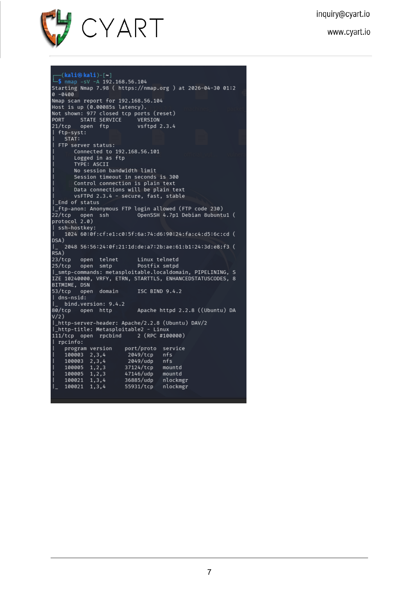
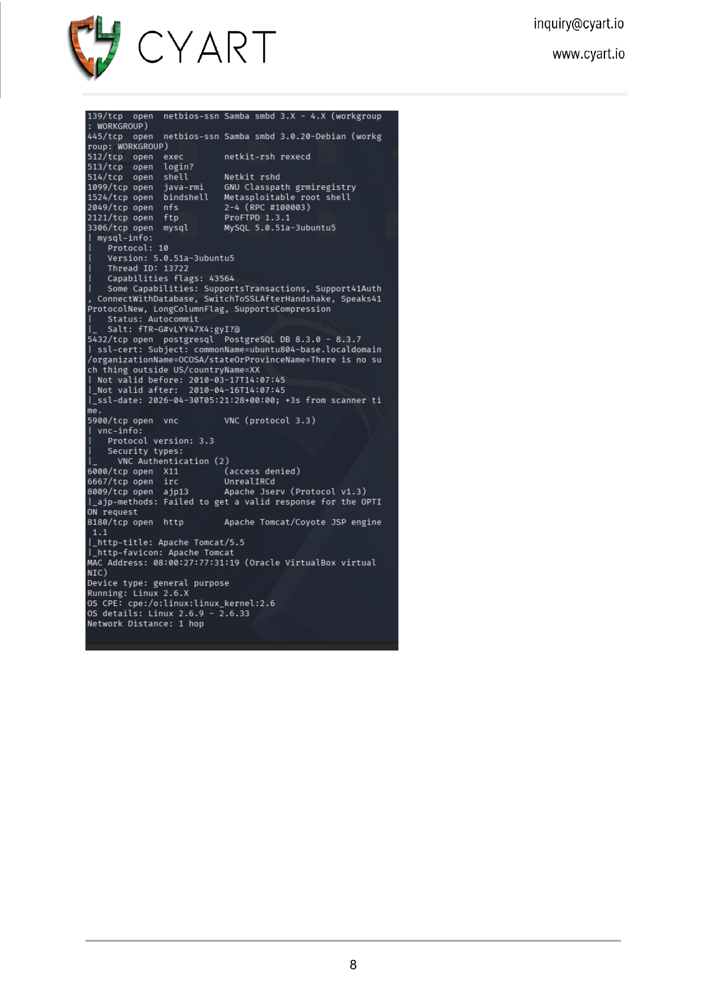
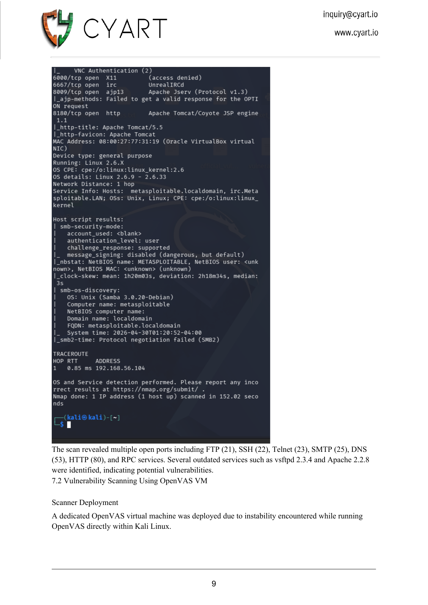
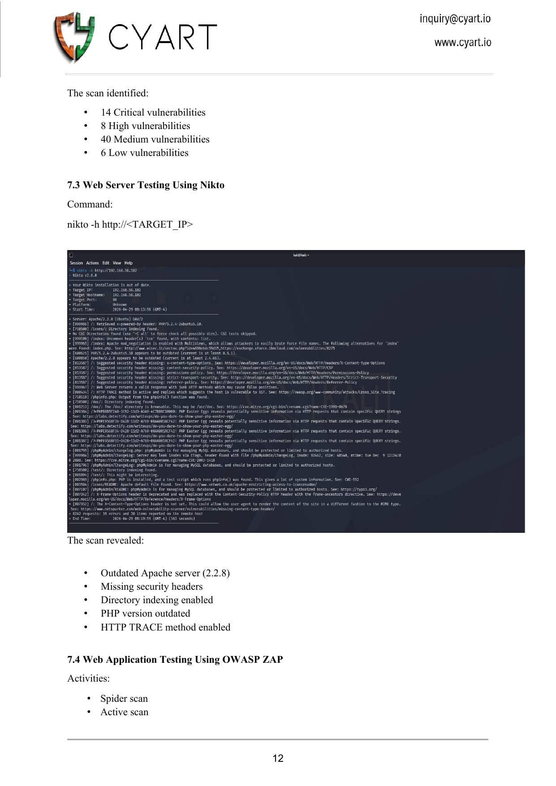
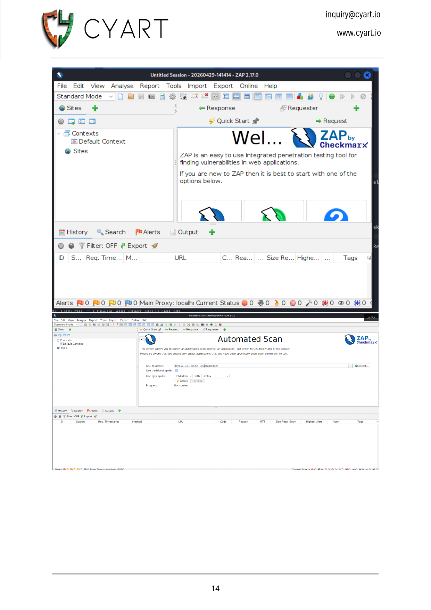
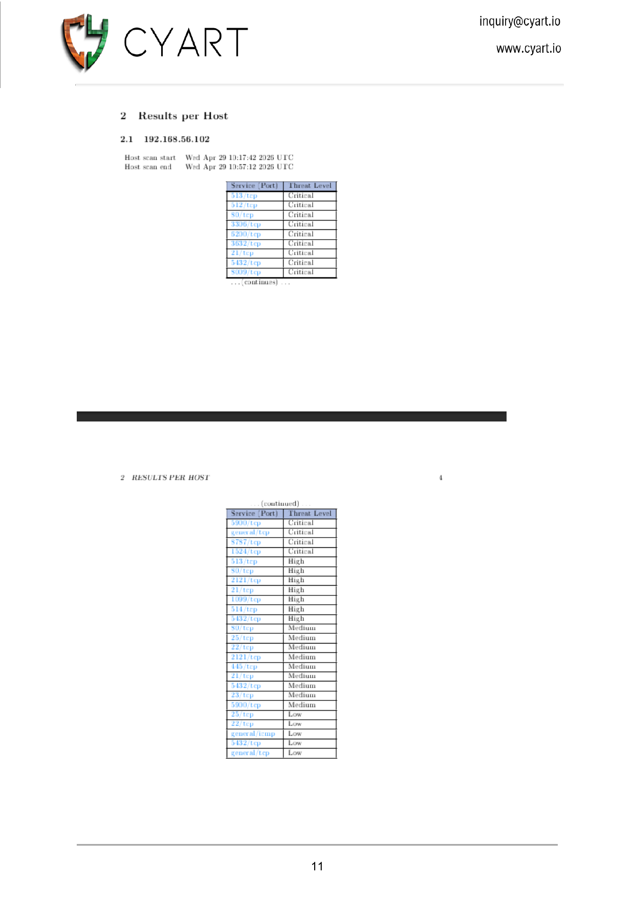

# 🕵️ Recon Logs — Week 1 VAPT

> **Phase:** Reconnaissance & Service Enumeration
> **Target:** Metasploitable2 — 192.168.56.104

---

## 1. Network Discovery

### Host Discovery
```bash
# Identify live hosts on the lab subnet
nmap -sn 192.168.56.0/24
```

**Hosts Found:**
```
192.168.56.101 — Kali Linux (Attacker)
192.168.56.103 — OpenVAS VM (Scanner)
192.168.56.104 — Metasploitable2 (Target)
```

> `[SCREENSHOT: Nmap scan — ports 21–111 confirming live host and open services]`



> `[SCREENSHOT: Nmap scan — ports 139–8180 confirming Samba, MySQL, VNC, IRC, Tomcat]`



> `[SCREENSHOT: Nmap scan completion — SMB host scripts, OS fingerprint, traceroute]`



---

## 2. Service Enumeration

### 2.1 FTP Service — Port 21

```bash
# Connect to FTP (anonymous login)
ftp 192.168.56.104

# Verify vsftpd version banner
nc -nv 192.168.56.104 21
```

**Finding:** vsftpd 2.3.4 banner returned. Anonymous FTP login allowed. Service version matches known backdoor CVE-2011-2523.

```
220 (vsFTPd 2.3.4)
Name: anonymous
331 Please specify the password.
Password: [blank]
230 Login successful.
```

> `[SCREENSHOT: Nmap output showing vsftpd 2.3.4 on port 21 with anonymous FTP login allowed]`


---

### 2.2 SSH Service — Port 22

```bash
# Enumerate SSH version
ssh -V 192.168.56.104
nc -nv 192.168.56.104 22
```

**Finding:** OpenSSH 4.7p1 Debian — outdated version. Supports protocol 2.0 only. No active exploit used in this engagement; noted for future assessment.

```
SSH-2.0-OpenSSH_4.7p1 Debian-8ubuntu1
```

---

### 2.3 Web Server — Port 80

```bash
# Identify web server and application stack
curl -I http://192.168.56.104
```

**Response Headers:**
```
HTTP/1.1 200 OK
Server: Apache/2.2.8 (Ubuntu) DAV/2
X-Powered-By: PHP/5.2.4-2ubuntu5.10
Content-Type: text/html
```

**Finding:** Apache 2.2.8 (End of Life) running PHP 5.2.4 (End of Life). PHP CGI mode active — confirms CVE-2012-1823 attack surface.

**Web Applications Discovered:**
- `/mutillidae/` — Mutillidae intentionally vulnerable web app
- `/dvwa/` — DVWA (Damn Vulnerable Web Application)
- `/phpMyAdmin/` — Database management panel
- `/tikiwiki/` — TikiWiki CMS
- `/phpinfo.php` — PHP configuration info page

> `[SCREENSHOT: Nikto scan confirming Apache 2.2.8 + PHP 5.2.4 version banners and exposed web apps]`



---

### 2.4 MySQL — Port 3306

```bash
# Test MySQL default credentials
mysql -h 192.168.56.104 -u root -p
# Password: [blank]
```

**Finding:** MySQL root account accessible with blank password. Full database access confirmed.

```sql
-- Databases accessible
SHOW DATABASES;
+--------------------+
| Database           |
+--------------------+
| information_schema |
| dvwa               |
| metasploit         |
| mysql              |
| owasp10            |
| tikiwiki           |
+--------------------+
```

---

### 2.5 DistCC — Port 3632

```bash
# Confirm distccd is running
nc -nv 192.168.56.104 3632
```

**Finding:** DistCC daemon responding. Unauthenticated RCE confirmed via CVE-2004-2687. The daemon accepts compilation jobs without any authentication.

---

### 2.6 Samba — Ports 139 & 445

```bash
# Enumerate Samba shares
smbclient -L //192.168.56.104 -N

# Check Samba version
msfconsole -q -x "use auxiliary/scanner/smb/smb_version; set RHOSTS 192.168.56.104; run; exit"
```

**Finding:** Samba 3.0.20-Debian — vulnerable to CVE-2007-2447 (username map script RCE). SMB signing disabled — relay attacks possible.

```
Sharename    Type   Comment
---------    ----   -------
print$       Disk   Printer Drivers
tmp          Disk   oh noes!
opt          Disk
IPC$         IPC    IPC Service (metasploitable server)
ADMIN$       IPC    IPC Service (metasploitable server)
```

> `[SCREENSHOT: Nmap scan showing Samba 3.0.20, SMB signing disabled, NetBIOS host scripts]`


---

### 2.7 VNC — Port 5900

```bash
# Connect to VNC
vncviewer 192.168.56.104:5900
```

**Finding:** VNC running protocol version 3.3. Authentication: None. Direct desktop access confirmed without any credential requirement.

---

### 2.8 Bindshell — Port 1524

```bash
# Direct root shell access
nc 192.168.56.104 1524
```

**Finding:** Metasploitable2's pre-installed root backdoor shell. Connecting gives immediate root shell — no exploitation required.

```
root@metasploitable:/#
```

---

### 2.9 rlogin/rexec/rsh — Ports 512-514

```bash
# Test rexec (port 512)
rexec 192.168.56.104 -l root id

# Test rlogin (port 513)
rlogin -l root 192.168.56.104

# Test rsh (port 514)
rsh 192.168.56.104 -l root id
```

**Finding:** Legacy r-services running with no encryption and minimal authentication. `rlogin` granted root shell from trusted host without password.

---

## 3. Web Application Fingerprinting

```bash
# Technology fingerprinting with whatweb
whatweb http://192.168.56.104
```

**Technologies Identified:**

| Technology | Version | Notes |
|------------|---------|-------|
| Apache | 2.2.8 | End of Life |
| PHP | 5.2.4 | End of Life |
| Ubuntu | 8.04 LTS | End of Life |
| MySQL | 5.0.51a | End of Life |
| DVWA | 1.0 | Intentionally vulnerable |
| Mutillidae | 2.x | Intentionally vulnerable |

---

> `[SCREENSHOT: OWASP ZAP automated scan — web application fingerprinting of Mutillidae stack]`



---

## 4. Enumeration Summary

| Service | Port | Version | Key Finding |
|---------|------|---------|-------------|
| FTP | 21 | vsftpd 2.3.4 | Backdoor present, anon login |
| SSH | 22 | OpenSSH 4.7p1 | Outdated, no active exploit |
| Telnet | 23 | Linux telnetd | Cleartext auth |
| HTTP | 80 | Apache 2.2.8 | Multiple web vulns |
| MySQL | 3306 | 5.0.51a | Blank root password |
| DistCC | 3632 | GNU 4.2.4 | Unauth RCE |
| Samba | 445 | 3.0.20 | Username map script RCE |
| VNC | 5900 | 3.3 | No authentication |
| Bindshell | 1524 | — | Pre-installed root shell |
| rexec/rsh | 512–514 | netkit | No authentication |

> `[SCREENSHOT: OpenVAS per-host results table — all critical/high severity ports confirmed]`



---
