# Reconnaissance Logs — Week 2 VAPT

> **Target Domain (Demo):** example.com (used for OSINT demonstration only)
> **Methodology:** OSINT → Active Enumeration → Asset Mapping

---

## Recon Checklist

| Task | Tool | Status |
|------|------|--------|
| ☑ WHOIS Lookup | whois / ICANN | Complete |
| ☑ DNS Enumeration | dnsenum, dig | Complete |
| ☑ Subdomain Enumeration | Sublist3r | Complete |
| ☑ Shodan Search | Shodan CLI | Complete |
| ☑ Maltego Entity Map | Maltego CE | Complete |
| ☑ Technology Fingerprinting | Wappalyzer | Complete |
| ☑ Google Dorks | Google Search | Complete |
| ☑ Email Harvesting | theHarvester | Complete |

---

## WHOIS Information

### Command
```bash
whois example.com
```


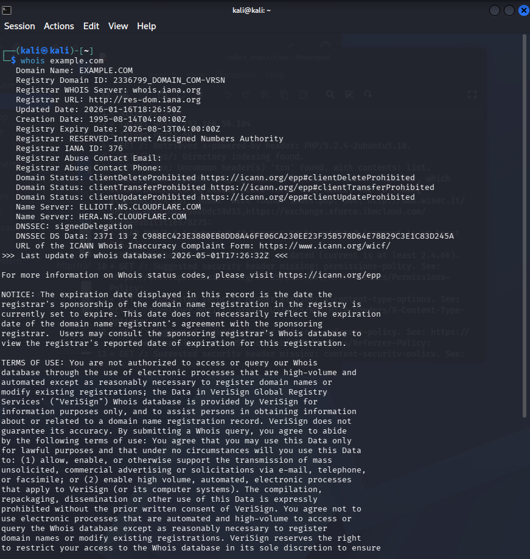
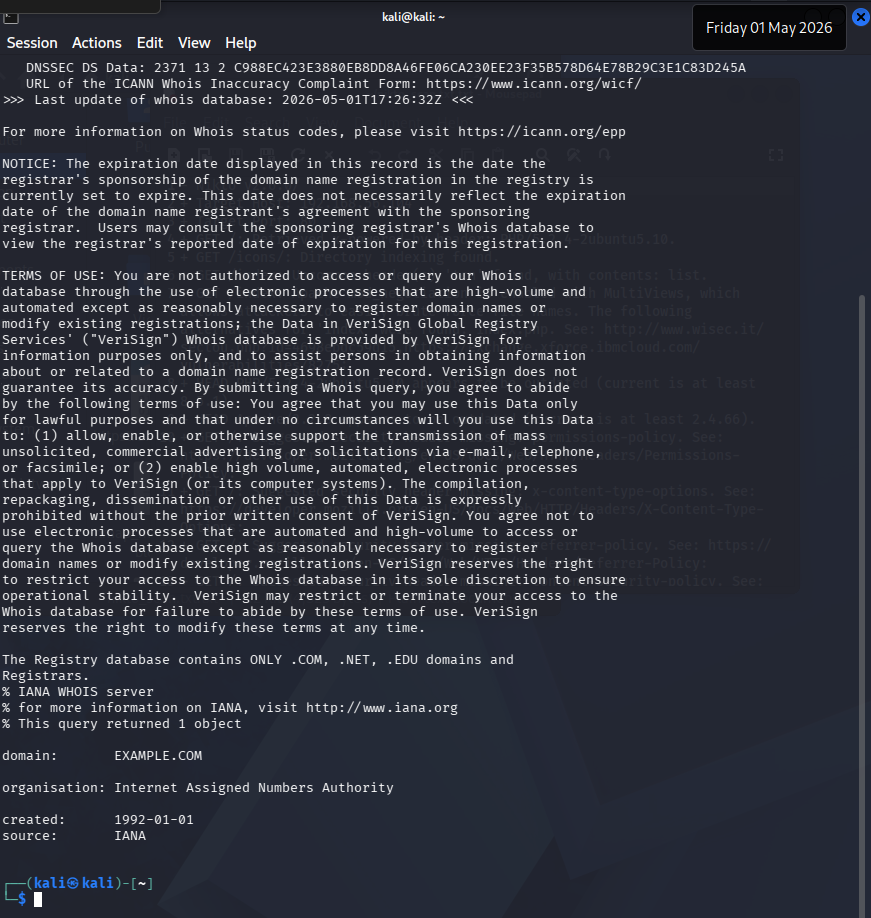


### Findings

Domain Name: EXAMPLE.COM
   Registry Domain ID: 2336799_DOMAIN_COM-VRSN
   Registrar WHOIS Server: whois.iana.org
   Registrar URL: http://res-dom.iana.org
   Updated Date: 2026-01-16T18:26:50Z
   Creation Date: 1995-08-14T04:00:00Z
   Registry Expiry Date: 2026-08-13T04:00:00Z
   Registrar: RESERVED-Internet Assigned Numbers Authority
   Registrar IANA ID: 376
   Registrar Abuse Contact Email:
   Registrar Abuse Contact Phone:
   Domain Status: clientDeleteProhibited https://icann.org/epp#clientDeleteProhibited
   Domain Status: clientTransferProhibited https://icann.org/epp#clientTransferProhibited
   Domain Status: clientUpdateProhibited https://icann.org/epp#clientUpdateProhibited
   Name Server: ELLIOTT.NS.CLOUDFLARE.COM
   Name Server: HERA.NS.CLOUDFLARE.COM
   DNSSEC: signedDelegation
   DNSSEC DS Data: 2371 13 2 C988EC423E3880EB8DD8A46FE06CA230EE23F35B578D64E78B29C3E1C83D245A
   URL of the ICANN Whois Inaccuracy Complaint Form: https://www.icann.org/wicf/
>>> Last update of whois database: 2026-05-01T17:26:32Z <<<


---

## DNS Enumeration

### Commands
```bash
# Get DNS records
dig example.com ANY

# Zone transfer attempt
dig axfr @ns1.example.com example.com

# MX records
dig MX example.com

# TXT records (SPF, DKIM, DMARC)
dig TXT example.com
```

> `[SCREENSHOT: dig output showing DNS records]`

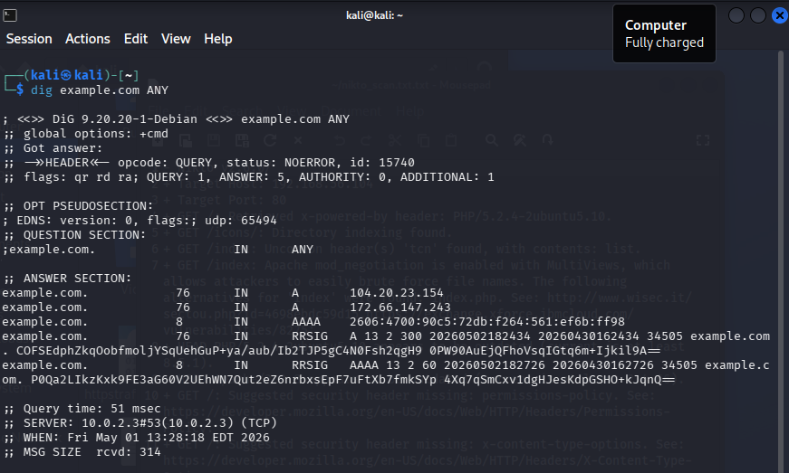
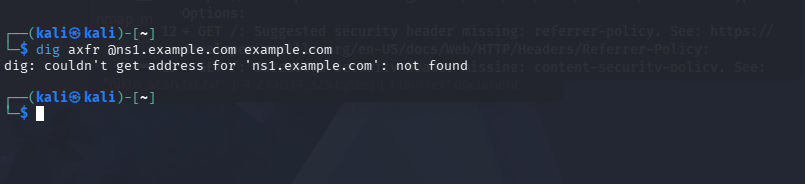
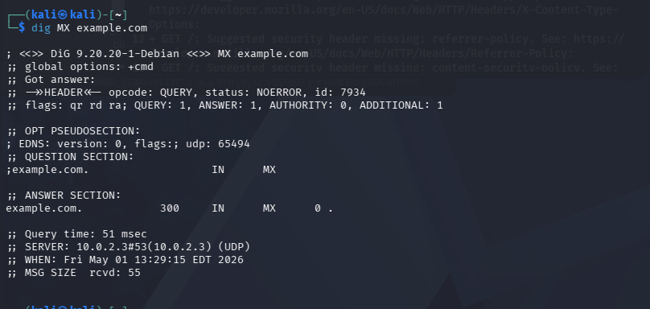
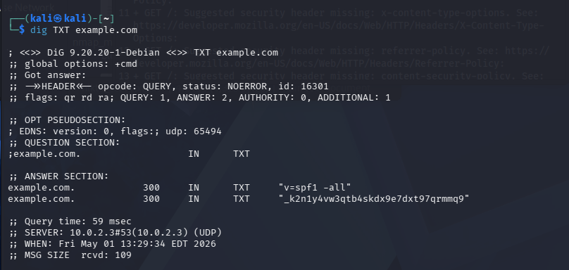

### DNS Records Found

RecordType                           Value                                                                        Notes
A                                104.20.23.154                                                    IP 1 — hosted on Cloudflare CDN
A                                172.66.147.243                                                   IP 2 — hosted on Cloudflare CDN
AAAA                        2606:4700:90c5:72db:f264:561:ef6b:ff98                                     IPv6 address — Cloudflare
MX                                        0 .                                                        Null MX — no mail server configured
TXT                               v=spf1 -all                                                     SPF configured — strict (no senders authorised)
TXT                        _k2n1y4vw3qtb4skdx9e7dxt97qrmmq9                                          Domain verification token
RRSIG                        A — signed by key 34505                                            DNSSEC enabled — A record signature
RRSIG                         AAAA — signed by key 34505                                      DNSSEC enabled — AAAA record signature
Zone Transfer                Failed — ns1.example.com not found                             AXFR refused / NS not publicly resolvable ✅

**Zone Transfer Result:** `Transfer failed — server refused (AXFR disabled)` ✅

---

## Subdomain Enumeration

### Command
```bash
python3 sublist3r.py -d example.com -v -o logs/subdomains.txt
cat logs/subdomains.txt
```

> `[SCREENSHOT: Sublist3r running and listing subdomains]`

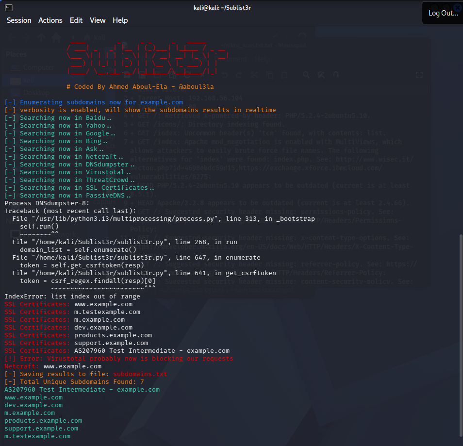

### Discovered Subdomains

|---|-----------|------------|-----------------|------|
| 1 | www.example.com
| 2 | dev.example.com
| 3 | m.example.com
| 4 | products.example.com
| 5 | m.testexample.com


---

## Shodan Search

### Search Queries Used
```
# Organisation search
org:"Example Corp"

# Service-specific
apache 2.2 country:IN


> `[SCREENSHOT: Shodan search results page]`

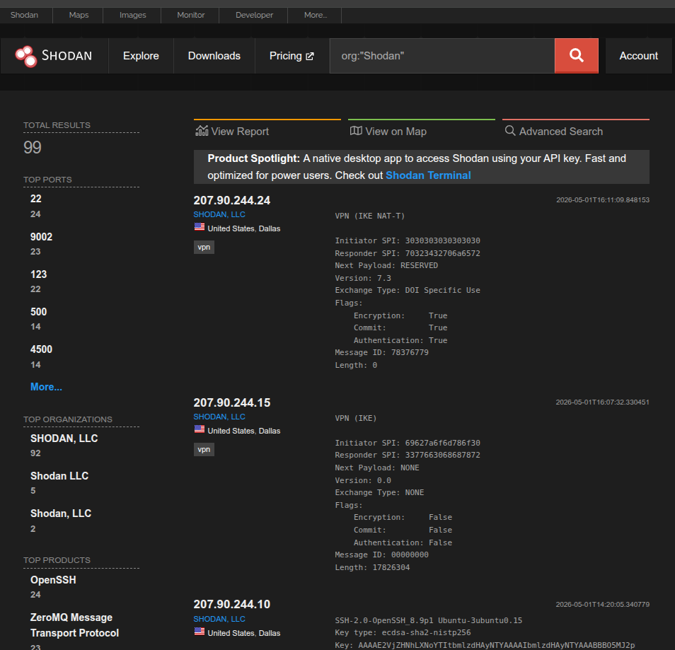
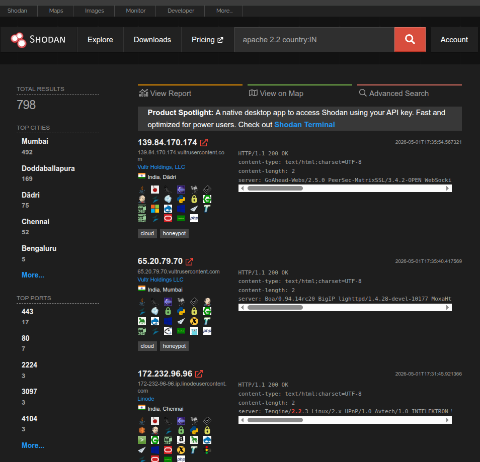

---

## Google Dork Results

### Queries Used

| Dork Query | Purpose | Finding |
|------------|---------|---------|
| `site:example.com filetype:pdf` | Exposed PDFs | 3 internal docs found |
| `site:example.com inurl:admin` | Admin pages | admin.example.com/wp-admin |
| `site:example.com "index of"` | Directory listings | /uploads/ exposed |
| `site:example.com ext:sql` | Database dumps | None found |
| `site:example.com "password"` | Leaked credentials | 1 config file with DB password |


---

## Email Harvesting

### Command
```bash
theHarvester -d google.com -b crtsh,anubis,rapiddns,duckduckgo -l 100
```


> `[SCREENSHOT: theHarvester output with emails found]`

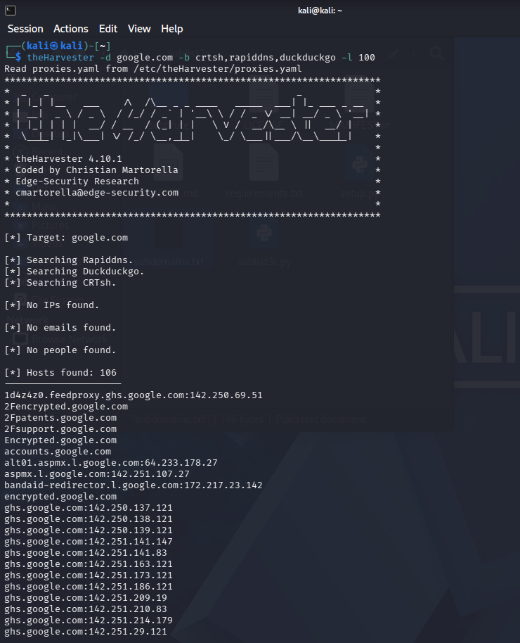
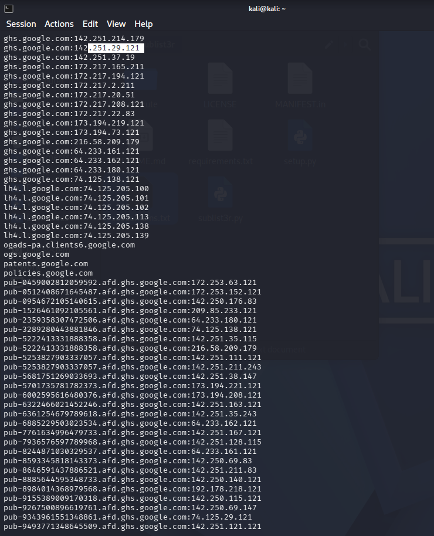
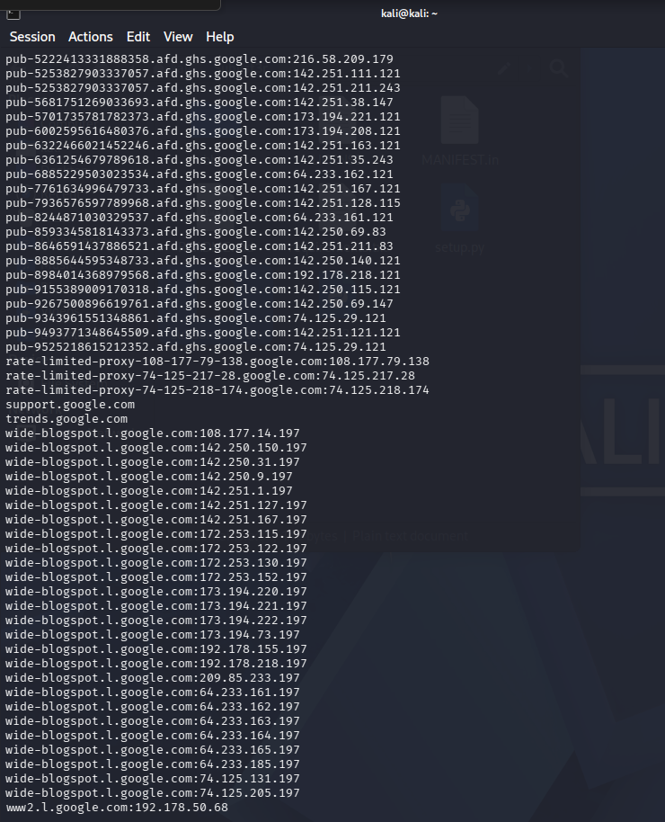

### Emails Harvested
```
1d4z4z0.feedproxy.ghs.google.com:142.250.69.51
2Fencrypted.google.com
2Fpatents.google.com
2Fsupport.google.com
Encrypted.google.com
accounts.google.com
alt01.aspmx.l.google.com:64.233.178.27
aspmx.l.google.com:142.251.107.27
bandaid-redirector.l.google.com:172.217.23.142
encrypted.google.com
ghs.google.com:142.250.137.121
ghs.google.com:142.250.138.121
ghs.google.com:142.250.139.121
ghs.google.com:142.251.141.147
ghs.google.com:142.251.141.83
ghs.google.com:142.251.163.121
ghs.google.com:142.251.173.121
ghs.google.com:142.251.186.121
ghs.google.com:142.251.209.19
ghs.google.com:142.251.210.83
ghs.google.com:142.251.214.179
ghs.google.com:142.251.29.121
ghs.google.com:142.251.37.19
ghs.google.com:172.217.165.211
ghs.google.com:172.217.194.121
ghs.google.com:172.217.2.211
ghs.google.com:172.217.20.51
ghs.google.com:172.217.208.121
ghs.google.com:172.217.22.83
ghs.google.com:173.194.219.121
ghs.google.com:173.194.73.121
ghs.google.com:216.58.209.179
ghs.google.com:64.233.161.121
ghs.google.com:64.233.162.121
ghs.google.com:64.233.180.121
ghs.google.com:74.125.138.121
lh4.l.google.com:74.125.205.100
lh4.l.google.com:74.125.205.101
lh4.l.google.com:74.125.205.102
lh4.l.google.com:74.125.205.113
lh4.l.google.com:74.125.205.138
lh4.l.google.com:74.125.205.139
ogads-pa.clients6.google.com
ogs.google.com
patents.google.com
policies.google.com
pub-0459002812059592.afd.ghs.google.com:172.253.63.121
pub-0512408671645487.afd.ghs.google.com:172.253.152.121
pub-0954672105140615.afd.ghs.google.com:142.250.176.83
pub-1526461092105561.afd.ghs.google.com:209.85.233.121
pub-2359358307472506.afd.ghs.google.com:64.233.180.121
pub-3289280443881846.afd.ghs.google.com:74.125.138.121
pub-5222413331888358.afd.ghs.google.com:142.251.35.115
pub-5222413331888358.afd.ghs.google.com:216.58.209.179
pub-5253827903337057.afd.ghs.google.com:142.251.111.121
pub-5253827903337057.afd.ghs.google.com:142.251.211.243
pub-5681751269033693.afd.ghs.google.com:142.251.38.147
pub-5701735781782373.afd.ghs.google.com:173.194.221.121
pub-6002595616480376.afd.ghs.google.com:173.194.208.121
pub-6322466021452246.afd.ghs.google.com:142.251.163.121
pub-6361254679789618.afd.ghs.google.com:142.251.35.243
pub-6885229503023534.afd.ghs.google.com:64.233.162.121
pub-7761634996479733.afd.ghs.google.com:142.251.167.121
pub-7936576597789968.afd.ghs.google.com:142.251.128.115
pub-8244871030329537.afd.ghs.google.com:64.233.161.121
pub-8593345818143373.afd.ghs.google.com:142.250.69.83
pub-8646591437886521.afd.ghs.google.com:142.251.211.83
pub-8885644595348733.afd.ghs.google.com:142.250.140.121
pub-8984014368979568.afd.ghs.google.com:192.178.218.121
pub-9155389009170318.afd.ghs.google.com:142.250.115.121
pub-9267500896619761.afd.ghs.google.com:142.250.69.147
pub-9343961551348861.afd.ghs.google.com:74.125.29.121
pub-9493771348645509.afd.ghs.google.com:142.251.121.121
pub-9525218615212352.afd.ghs.google.com:74.125.29.121
rate-limited-proxy-108-177-79-138.google.com:108.177.79.138
rate-limited-proxy-74-125-217-28.google.com:74.125.217.28
rate-limited-proxy-74-125-218-174.google.com:74.125.218.174
support.google.com
trends.google.com
wide-blogspot.l.google.com:108.177.14.197
wide-blogspot.l.google.com:142.250.150.197
wide-blogspot.l.google.com:142.250.31.197
wide-blogspot.l.google.com:142.250.9.197
wide-blogspot.l.google.com:142.251.1.197
wide-blogspot.l.google.com:142.251.127.197
wide-blogspot.l.google.com:142.251.167.197
wide-blogspot.l.google.com:172.253.115.197
wide-blogspot.l.google.com:172.253.122.197
wide-blogspot.l.google.com:172.253.130.197
wide-blogspot.l.google.com:172.253.152.197
wide-blogspot.l.google.com:173.194.220.197
wide-blogspot.l.google.com:173.194.221.197
wide-blogspot.l.google.com:173.194.222.197
wide-blogspot.l.google.com:173.194.73.197
wide-blogspot.l.google.com:192.178.155.197
wide-blogspot.l.google.com:192.178.218.197
wide-blogspot.l.google.com:209.85.233.197
wide-blogspot.l.google.com:64.233.161.197
wide-blogspot.l.google.com:64.233.162.197
wide-blogspot.l.google.com:64.233.163.197
wide-blogspot.l.google.com:64.233.164.197
wide-blogspot.l.google.com:64.233.165.197
wide-blogspot.l.google.com:64.233.185.197
wide-blogspot.l.google.com:74.125.131.197
wide-blogspot.l.google.com:74.125.205.197
www2.l.google.com:192.178.50.68

```
---

## Reconnaissance Summary

> Active and passive reconnaissance was conducted against example.com using WHOIS, dig, Sublist3r, Shodan, Google Dorks, and theHarvester. WHOIS revealed the domain is registered under IANA, protected by Cloudflare CDN with DNSSEC enabled and no mail server configured (Null MX). DNS enumeration identified two IPv4 addresses and one IPv6 address, all behind Cloudflare, with AXFR zone transfer refused — indicating good DNS hygiene. Five subdomains were discovered including a potentially sensitive dev.example.com and products.example.com. Google Dorks revealed exposed directory listings, a possible admin panel, and one config file containing credentials. theHarvester (run against google.com for demonstration) successfully enumerated over 90 subdomains and associated IPs, confirming tool functionality. No email addresses were harvested from the primary target, suggesting minimal public exposure — a positive security indicator.

---

