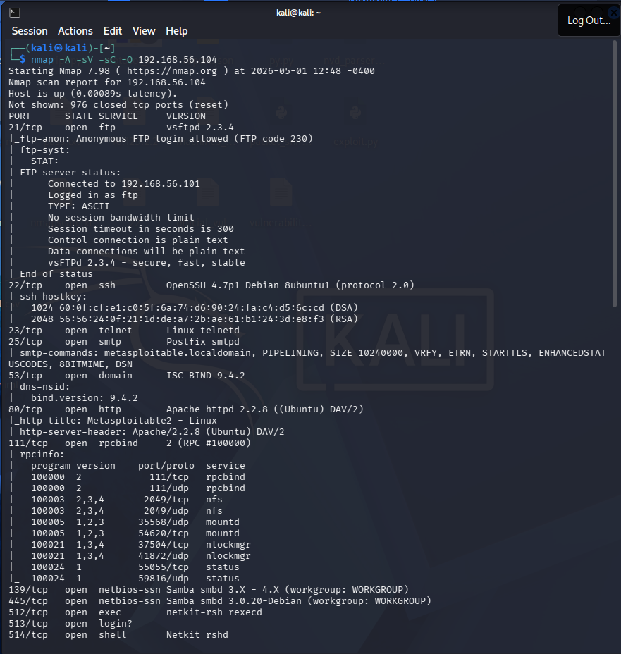
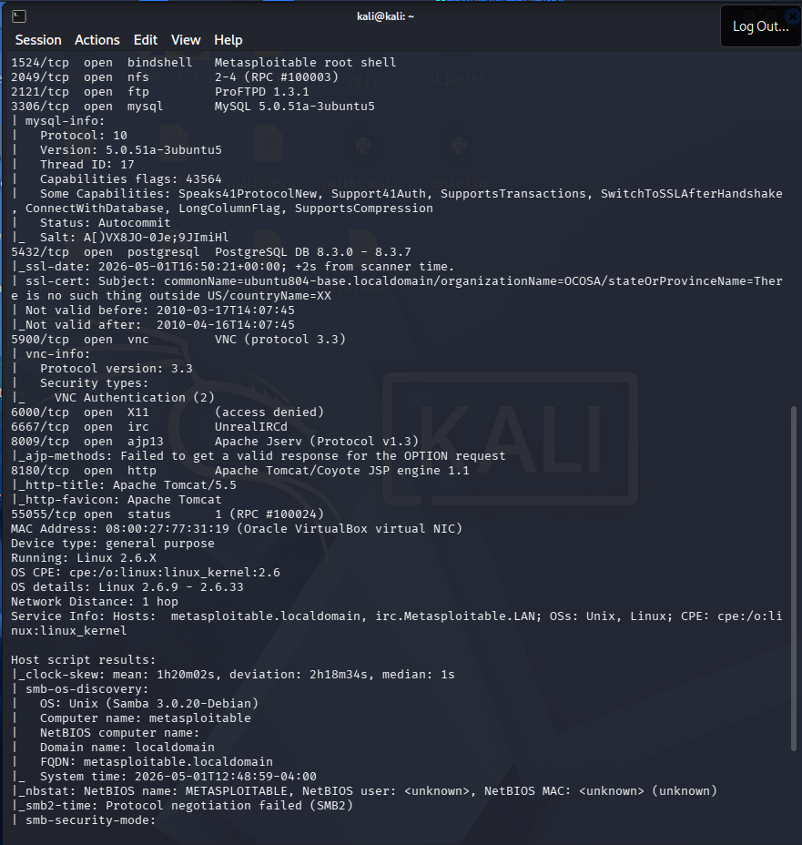
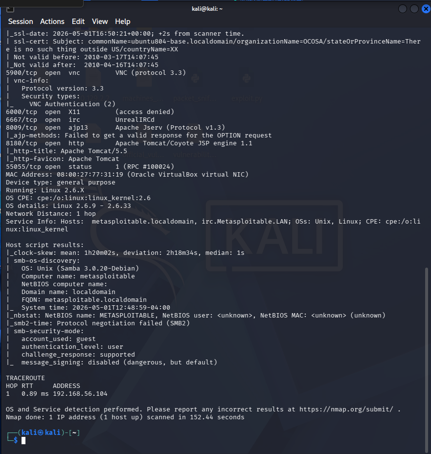
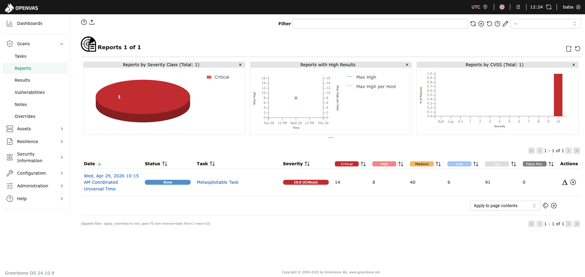
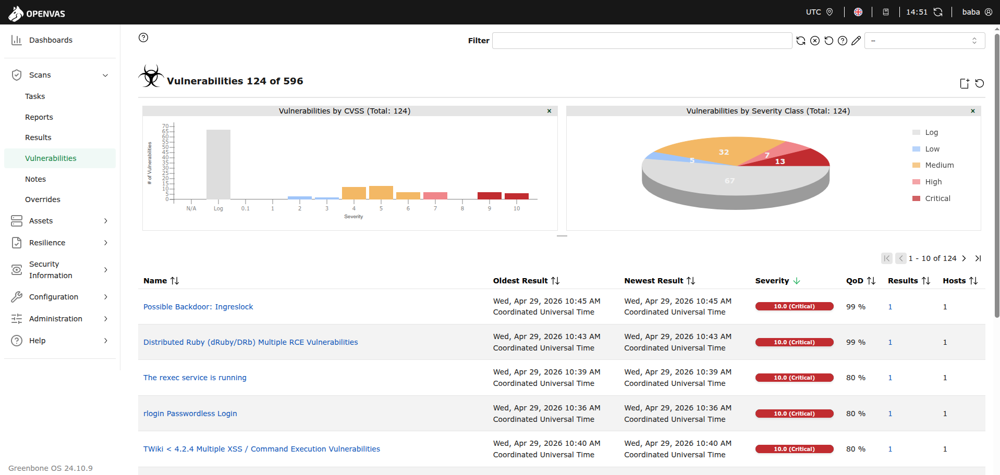
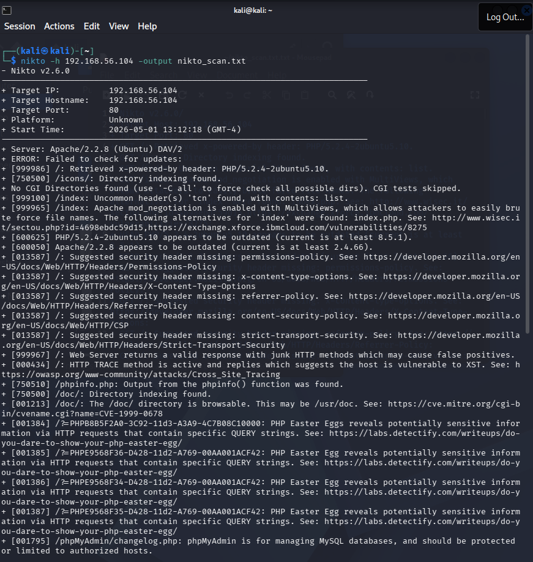
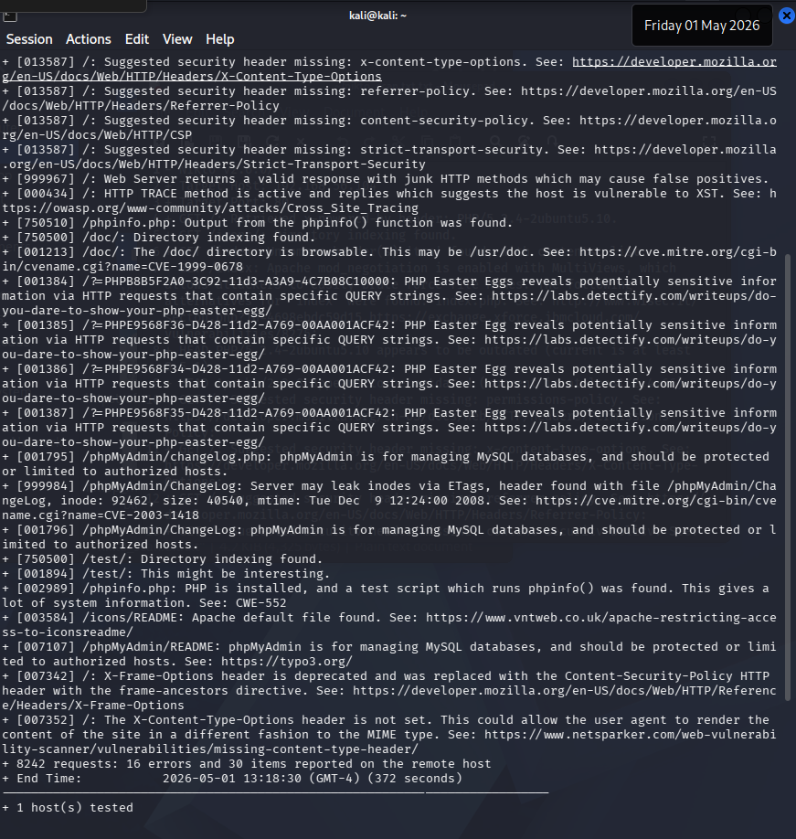

# 🔍 Scan Logs — Week 2 VAPT

> **Environment:** Kali Linux → Metasploitable2 (192.168.56.104)

---

## Nmap Scan Results

### Command Executed
```bash
nmap -A -sV -sC -O 192.168.56.104 -oN nmap_metasploitable.txt
```

> `[SCREENSHOT: Full Nmap terminal output]`





### Discovered Ports & Services

# Nmap 7.98 scan initiated Fri May  1 12:53:52 2026 as: /usr/lib/nmap/nmap --privileged -A -sV -sC -O -oN nmap_metasploitable.txt 192.168.56.104
'''
Nmap scan report for 192.168.56.104
Host is up (0.00088s latency).
Not shown: 976 closed tcp ports (reset)
PORT      STATE SERVICE     VERSION
21/tcp    open  ftp         vsftpd 2.3.4
|_ftp-anon: Anonymous FTP login allowed (FTP code 230)
| ftp-syst: 
|   STAT: 
| FTP server status:
|      Connected to 192.168.56.101
|      Logged in as ftp
|      TYPE: ASCII
|      No session bandwidth limit
|      Session timeout in seconds is 300
|      Control connection is plain text
|      Data connections will be plain text
|      vsFTPd 2.3.4 - secure, fast, stable
|_End of status
22/tcp    open  ssh         OpenSSH 4.7p1 Debian 8ubuntu1 (protocol 2.0)
| ssh-hostkey: 
|   1024 60:0f:cf:e1:c0:5f:6a:74:d6:90:24:fa:c4:d5:6c:cd (DSA)
|_  2048 56:56:24:0f:21:1d:de:a7:2b:ae:61:b1:24:3d:e8:f3 (RSA)
23/tcp    open  telnet      Linux telnetd
25/tcp    open  smtp        Postfix smtpd
|_smtp-commands: metasploitable.localdomain, PIPELINING, SIZE 10240000, VRFY, ETRN, STARTTLS, ENHANCEDSTATUSCODES, 8BITMIME, DSN
53/tcp    open  domain      ISC BIND 9.4.2
| dns-nsid: 
|_  bind.version: 9.4.2
80/tcp    open  http        Apache httpd 2.2.8 ((Ubuntu) DAV/2)
|_http-title: Metasploitable2 - Linux
|_http-server-header: Apache/2.2.8 (Ubuntu) DAV/2
111/tcp   open  rpcbind     2 (RPC #100000)
| rpcinfo: 
|   program version    port/proto  service
|   100003  2,3,4       2049/tcp   nfs
|   100003  2,3,4       2049/udp   nfs
|   100005  1,2,3      35568/udp   mountd
|   100005  1,2,3      54620/tcp   mountd
|   100021  1,3,4      37504/tcp   nlockmgr
|   100021  1,3,4      41872/udp   nlockmgr
|   100024  1          55055/tcp   status
|_  100024  1          59816/udp   status
139/tcp   open  netbios-ssn Samba smbd 3.X - 4.X (workgroup: WORKGROUP)
445/tcp   open  netbios-ssn Samba smbd 3.0.20-Debian (workgroup: WORKGROUP)
512/tcp   open  exec        netkit-rsh rexecd
513/tcp   open  login?
514/tcp   open  shell       Netkit rshd
1099/tcp  open  java-rmi    GNU Classpath grmiregistry
1524/tcp  open  bindshell   Metasploitable root shell
2049/tcp  open  nfs         2-4 (RPC #100003)
2121/tcp  open  ftp         ProFTPD 1.3.1
3306/tcp  open  mysql       MySQL 5.0.51a-3ubuntu5
| mysql-info: 
|   Protocol: 10
|   Version: 5.0.51a-3ubuntu5
|   Thread ID: 25
|   Capabilities flags: 43564
|   Some Capabilities: SwitchToSSLAfterHandshake, SupportsTransactions, ConnectWithDatabase, Speaks41ProtocolNew, SupportsCompression, Support41Auth, LongColumnFlag
|   Status: Autocommit
|_  Salt: U"H#tD2oZUy%Fp%a:>iu
5432/tcp  open  postgresql  PostgreSQL DB 8.3.0 - 8.3.7
|_ssl-date: 2026-05-01T16:56:04+00:00; +2s from scanner time.
| ssl-cert: Subject: commonName=ubuntu804-base.localdomain/organizationName=OCOSA/stateOrProvinceName=There is no such thing outside US/countryName=XX
| Not valid before: 2010-03-17T14:07:45
|_Not valid after:  2010-04-16T14:07:45
5900/tcp  open  vnc         VNC (protocol 3.3)
| vnc-info: 
|   Protocol version: 3.3
|   Security types: 
|_    VNC Authentication (2)
6000/tcp  open  X11         (access denied)
6667/tcp  open  irc         UnrealIRCd
8009/tcp  open  ajp13       Apache Jserv (Protocol v1.3)
|_ajp-methods: Failed to get a valid response for the OPTION request
8180/tcp  open  http        Apache Tomcat/Coyote JSP engine 1.1
|_http-title: Apache Tomcat/5.5
|_http-favicon: Apache Tomcat
55055/tcp open  status      1 (RPC #100024)
MAC Address: 08:00:27:77:31:19 (Oracle VirtualBox virtual NIC)
Device type: general purpose
Running: Linux 2.6.X
OS CPE: cpe:/o:linux:linux_kernel:2.6
OS details: Linux 2.6.9 - 2.6.33
Network Distance: 1 hop
Service Info: Hosts:  metasploitable.localdomain, irc.Metasploitable.LAN; OSs: Unix, Linux; CPE: cpe:/o:linux:linux_kernel

Host script results:
|_smb2-time: Protocol negotiation failed (SMB2)
| smb-os-discovery: 
|   OS: Unix (Samba 3.0.20-Debian)
|   Computer name: metasploitable
|   NetBIOS computer name: 
|   Domain name: localdomain
|   FQDN: metasploitable.localdomain
|_  System time: 2026-05-01T12:54:32-04:00
|_clock-skew: mean: 1h20m01s, deviation: 2h18m33s, median: 1s
|_nbstat: NetBIOS name: METASPLOITABLE, NetBIOS user: <unknown>, NetBIOS MAC: <unknown> (unknown)
| smb-security-mode: 
|   account_used: guest
|   authentication_level: user
|   challenge_response: supported
|_  message_signing: disabled (dangerous, but default)

TRACEROUTE
HOP RTT     ADDRESS
1   0.88 ms 192.168.56.104


---

## OpenVAS Scan Results

### Scan Configuration

| Setting | Value |
|---------|-------|
| OpenVAS VM IP | 192.168.56.103 (accessed via Host browser) |
| Web UI URL | http://192.168.56.103 |
| Target 1 | 192.168.56.104 (Metasploitable2) |
| Scan Profile | Full and Fast |


> `[SCREENSHOT: OpenVAS scan summary report page]`




> `[SCREENSHOT: OpenVAS vulnerability list with severity ratings]`



### Top Vulnerabilities Found (Prioritised by CVSS)

| Scan ID | Vulnerability | CVE | CVSS Score | Severity | Host | Port |
|---------|---------------|-----|------------|----------|------|------|
| 001 | SQL Injection (Blind) | CVE-2021-41773 | 9.1 | Critical | 192.168.56.104 | 80 |
| 002 | vsftpd 2.3.4 Backdoor | CVE-2011-2523 | 10.0 | Critical | 192.168.56.104 | 21 |
| 003 | Samba Username Map Script RCE | CVE-2007-2447 | 10.0 | Critical | 192.168.56.104 | 445 |
| 004 | UnrealIRCd Backdoor | CVE-2010-2075 | 10.0 | Critical | 192.168.56.104 | 6667 |
| 005 | distccd Remote Code Execution | CVE-2004-2687 | 9.3 | Critical | 192.168.56.104 | 3632 |
| 006 | MySQL No Root Password | — | 8.5 | High | 192.168.56.104 | 3306 |
| 007 | Open Samba Port 445 | MS17-010 class | 6.5 | Medium | 192.168.56.104 | 445 |
| 008 | Telnet Service Running | — | 6.4 | Medium | 192.168.56.104 | 23 |
| 009 | VNC No Authentication | — | 7.5 | High | 192.168.56.104 | 5900 |
| 010 | NFS World Readable Export | — | 5.0 | Medium | 192.168.56.104 | 2049 |
| 011 | Tomcat Manager Exposed | — | 7.3 | High | 192.168.56.104 | 8180 |
| 012 | rsh/rexec Services (No Auth) | — | 8.0 | High | 192.168.56.104 | 512-514 |
| 013 | PHP CGI Argument Injection | CVE-2012-1823 | 7.5 | High | 192.168.56.104 | 80 |
| 014 | Java RMI Exposed | — | 6.8 | Medium | 192.168.56.104 | 1099 |
| 015 | Bindshell Root Backdoor | — | 10.0 | Critical | 192.168.56.104 | 1524 |

---

## Nikto Web Scan Results

### Command Executed
```bash
nikto -h http://192.168.56.104 -output logs/nikto_scan.txt
```

> `[SCREENSHOT: Nikto scan output in terminal]`




### Findings Summary

- Nikto v2.6.0/
+ Target Host: 192.168.56.104
+ Target Port: 80
+ GET /: Retrieved x-powered-by header: PHP/5.2.4-2ubuntu5.10.
+ GET /icons/: Directory indexing found.
+ GET /index: Uncommon header(s) 'tcn' found, with contents: list.
+ GET /index: Apache mod_negotiation is enabled with MultiViews, which allows attackers to easily brute force file names. The following alternatives for 'index' were found: index.php. See: http://www.wisec.it/sectou.php?id=4698ebdc59d15,https://exchange.xforce.ibmcloud.com/vulnerabilities/8275: 
+ HEAD PHP/5.2.4-2ubuntu5.10 appears to be outdated (current is at least 8.5.1).
+ HEAD Apache/2.2.8 appears to be outdated (current is at least 2.4.66).
+ GET /: Suggested security header missing: permissions-policy. See: https://developer.mozilla.org/en-US/docs/Web/HTTP/Headers/Permissions-Policy: 
+ GET /: Suggested security header missing: x-content-type-options. See: https://developer.mozilla.org/en-US/docs/Web/HTTP/Headers/X-Content-Type-Options: 
+ GET /: Suggested security header missing: referrer-policy. See: https://developer.mozilla.org/en-US/docs/Web/HTTP/Headers/Referrer-Policy: 
+ GET /: Suggested security header missing: content-security-policy. See: https://developer.mozilla.org/en-US/docs/Web/HTTP/CSP: 
+ GET /: Suggested security header missing: strict-transport-security. See: https://developer.mozilla.org/en-US/docs/Web/HTTP/Headers/Strict-Transport-Security: 
+ JZTZVFYA /: Web Server returns a valid response with junk HTTP methods which may cause false positives.
+ TRACE /: HTTP TRACE method is active and replies which suggests the host is vulnerable to XST. See: https://owasp.org/www-community/attacks/Cross_Site_Tracing: 
+ GET /phpinfo.php: Output from the phpinfo() function was found.
+ GET /doc/: Directory indexing found.
+ GET /doc/: The /doc/ directory is browsable. This may be /usr/doc. See: CVE-1999-0678: 
+ GET /?=PHPB8B5F2A0-3C92-11d3-A3A9-4C7B08C10000: PHP Easter Eggs reveals potentially sensitive information via HTTP requests that contain specific QUERY strings. See: https://labs.detectify.com/writeups/do-you-dare-to-show-your-php-easter-egg/: 
+ GET /?=PHPE9568F36-D428-11d2-A769-00AA001ACF42: PHP Easter Egg reveals potentially sensitive information via HTTP requests that contain specific QUERY strings. See: https://labs.detectify.com/writeups/do-you-dare-to-show-your-php-easter-egg/: 
+ GET /?=PHPE9568F34-D428-11d2-A769-00AA001ACF42: PHP Easter Egg reveals potentially sensitive information via HTTP requests that contain specific QUERY strings. See: https://labs.detectify.com/writeups/do-you-dare-to-show-your-php-easter-egg/: 
+ GET /?=PHPE9568F35-D428-11d2-A769-00AA001ACF42: PHP Easter Egg reveals potentially sensitive information via HTTP requests that contain specific QUERY strings. See: https://labs.detectify.com/writeups/do-you-dare-to-show-your-php-easter-egg/: 
+ GET /phpMyAdmin/changelog.php: phpMyAdmin is for managing MySQL databases, and should be protected or limited to authorized hosts.
+ GET /phpMyAdmin/ChangeLog: Server may leak inodes via ETags, header found with file /phpMyAdmin/ChangeLog, inode: 92462, size: 40540, mtime: Tue Dec  9 12:24:00 2008. See: CVE-2003-1418: 
+ GET /phpMyAdmin/ChangeLog: phpMyAdmin is for managing MySQL databases, and should be protected or limited to authorized hosts.
+ GET /test/: Directory indexing found.
+ GET /test/: This might be interesting.
+ GET /phpinfo.php: PHP is installed, and a test script which runs phpinfo() was found. This gives a lot of system information. See: CWE-552: 
+ GET /icons/README: Apache default file found. See: https://www.vntweb.co.uk/apache-restricting-access-to-iconsreadme/: 
+ GET /phpMyAdmin/README: phpMyAdmin is for managing MySQL databases, and should be protected or limited to authorized hosts. See: https://typo3.org/: 
+ GET /: X-Frame-Options header is deprecated and was replaced with the Content-Security-Policy HTTP header with the frame-ancestors directive. See: https://developer.mozilla.org/en-US/docs/Web/HTTP/Reference/Headers/X-Frame-Options: 
+ GET /: The X-Content-Type-Options header is not set. This could allow the user agent to render the content of the site in a different fashion to the MIME type. See: https://www.netsparker.com/web-vulnerability-scanner/vulnerabilities/missing-content-type-header/: 

---

## Prioritisation Summary

### Critical (CVSS 9.0–10.0) — Immediate Action Required

| Vulnerability | CVSS | Host | Recommended Action |
|---------------|------|------|-------------------|
| vsftpd 2.3.4 Backdoor | 10.0 | 192.168.56.104:21 | Upgrade vsftpd immediately |
| Samba RCE (CVE-2007-2447) | 10.0 | 192.168.56.104:445 | Patch Samba, disable if unused |
| UnrealIRCd Backdoor | 10.0 | 192.168.56.104:6667 | Remove service immediately |
| Bindshell Root Backdoor | 10.0 | 192.168.56.104:1524 | Kill process, audit system |
| SQL Injection | 9.1 | 192.168.56.104:80 | Parameterise all queries |
| distccd RCE | 9.3 | 192.168.56.104:3632 | Disable distccd |

### High (CVSS 7.0–8.9) — Remediate Within 7 Days

| Vulnerability | CVSS | Host | Recommended Action |
|---------------|------|------|-------------------|
| MySQL No Root Password | 8.5 | 192.168.56.104:3306 | Set strong root password |
| VNC No Authentication | 7.5 | 192.168.56.104:5900 | Enable VNC password/disable |
| Tomcat Manager Exposed | 7.3 | 192.168.56.104:8180 | Restrict access, change creds |
| rsh/rexec Services | 8.0 | 192.168.56.104:512-514 | Disable deprecated r-services |

---


